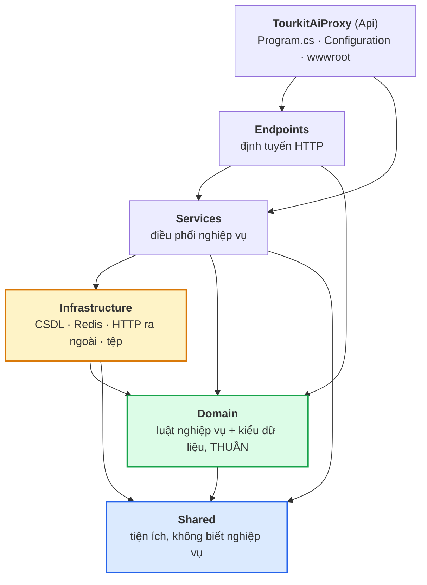

# Kiến trúc tourkit-ai-proxy

**Cập nhật:** 25/08/2026 · **Trạng thái:** Đã thi hành 6 project; nợ còn lại ghi rõ ở §6

> Đây là **luật**, không phải mô tả. Đọc §2 để biết file mới viết ra thì để đâu.
> Muốn biết một hàm làm gì thì đọc code hoặc hỏi CodeGraph.

---

## 1. Sơ đồ tầng

**Bảng phụ thuộc — biên dịch viên ép, sai là hỏng build:**

| Project | Được tham chiếu | TUYỆT ĐỐI KHÔNG |
|---|---|---|
| `Shared` | *(không gì cả, kể cả NuGet)* | mọi project khác của dự án |
| `Domain` | `Shared` | Dapper · HttpClient · ASP.NET · Services · Infrastructure |
| `Infrastructure` | `Domain`, `Shared` | `Services` · `Endpoints` |
| `Services` | `Infrastructure`, `Domain`, `Shared` | `Endpoints` · `Api` |
| `Endpoints` | `Services`, `Domain`, `Shared` | `Api` |
| `Api` | tất cả | — |

---

## 2. Vai trò từng tầng — và LUẬT KẾT NẠP

> Phần dùng hằng ngày. Câu hỏi cần trả lời: **"file này để đâu?"**
> Đi từ trên xuống, dừng ở tầng ĐẦU TIÊN khớp.

### `Shared` — tiện ích, không biết gì về TourKit

**Vào được:** xử lý chuỗi/ngày/JSON tổng quát.
**Phép thử:** *bê nguyên sang một dự án khác ngành, vẫn dùng được không?* Có → `Shared`.

**KHÔNG vào:** bất cứ thứ gì nhắc tới tour, khách, chat, thư, cơ hội, visa, bản tin, NCC.

**Hiện có:** `VietnameseText` (bỏ dấu tiếng Việt) · `PlainText` (HTML → chữ) · `LooseJson` (bóc JSON từ output AI).

⚠️ **Tầng dễ hỏng nhất, vì cái tên mời gọi.** Một project tên `Shared`/`Common`/`Helper` không có luật kết nạp sẽ thành `Services/` thứ hai — nhanh hơn, vì "chưa biết để đâu thì bỏ vào đây" nghe rất hợp lý. Nửa đầu luật do biên dịch viên ép (không tham chiếu gì); nửa sau do `RanhGioiTangTests` canh (không chứa danh từ nghiệp vụ).

### `Domain` — luật nghiệp vụ TourKit, thuần

**Vào được:** (a) luật trả lời đúng/sai mà **không cần** CSDL, mạng, đồng hồ hệ thống — nhận đủ dữ kiện qua tham số; (b) kiểu dữ liệu nghiệp vụ (record/enum/DTO).
**Phép thử:** *viết được test chạy trong mili giây, không dựng gì?* Có → `Domain`.

**KHÔNG vào:** Dapper, HttpClient, ASP.NET, đọc/ghi tệp, gọi AI. Cần một trong số đó → `Services` (điều phối) hoặc `Infrastructure` (cài đặt).

**Hiện có (50 file):** `ChatRules` · `MailTaxonomy` · `DigestDue` · `DigestPhone` · `NotifyThrottle` · `SaleBriefBuilder` · `CeoBriefBuilder` · `PaymentWatchdogRule` · `TourReadinessRule` · `AutoCareRule` · `ChatTools` · `ActionTool` · `ReviewPrompt` · `DealHeuristic` · `PriceCatalogRules` · toàn bộ `Models/`.

### `Infrastructure` — mọi thứ chạm ra ngoài tiến trình

**Vào được:** repository/store Dapper (SQL Server + PostgreSQL), lớp mở kết nối, Redis, kho tệp (R2/S3/đĩa), client HTTP gọi TourKit.Api và các nhà cung cấp AI, adapter kênh chat, mã hoá, ghi log xuống CSDL.
**Phép thử:** *lớp này có mở kết nối, gọi mạng, hay đọc/ghi tệp không?* Có → `Infrastructure`.

**KHÔNG vào:** quyết định nghiệp vụ. Nếu một lớp ở đây bắt đầu trả lời "khi nào thì gửi", "có được trả lời không", "ai được xem" — nó thuộc `Services` hoặc `Domain`.

**Hiện có: 46 file.**

### `Services` — điều phối: gọi ai, theo thứ tự nào, khi nào

**Vào được:** luồng việc nối nhiều mảnh (nhận tin → nhận diện khách → gọi bot → xếp hàng đợi gửi), tác vụ nền, dựng prompt và gọi AI, đăng ký DI.
**Phép thử:** *lớp này chủ yếu **gọi** thứ khác theo một trình tự?* Có → `Services`.

**KHÔNG vào:** câu SQL. Truy vấn thuộc `Infrastructure`.

**Hiện có: 120 file.**

### `Endpoints` — HTTP: định tuyến, đọc phiên, dựng JSON

**Vào được:** khai route, đọc/kiểm phiên và quyền, đọc tham số, dựng thân trả về, SSE.
**KHÔNG vào:** mở kết nối CSDL; luật nghiệp vụ dài hơn vài dòng.

**Hiện có: 28 file.**

### `Api` — bootstrap và tài nguyên tĩnh

`Program.cs`, `Configuration/`, `wwwroot/`. Không ai tham chiếu ngược lên đây.

---

## 3. Quyết định lớn và cái giá

### QĐ-1: Chiều phụ thuộc là `Services → Infrastructure`, CHƯA đảo

Clean Architecture sách vở đảo chiều: `Application` khai `interface`, `Infrastructure` cài. Ở đây **chưa làm** — nói rõ kẻo tưởng đã xong.

- **Đã đạt:** mã chạm CSDL nằm gọn một assembly. `Domain` và `Endpoints` **không với tới Dapper được nữa** — biên dịch viên chặn. Đó là "tách CSDL khỏi nghiệp vụ" theo nghĩa vật lý.
- **Chưa đạt:** nghiệp vụ cầm **kiểu cụ thể** của repository, nên chưa thay được cài đặt và chưa test nghiệp vụ mà không có CSDL.
- **Vì sao hoãn:** cần rút ~30 giao diện và sửa constructor khắp nơi, mà repo **chưa có test tích hợp chạm CSDL** — làm bây giờ là đổi hành vi không ai bắt được. Làm theo từng tính năng, sau khi có test.

### QĐ-2: Chuyển file thì GIỮ NGUYÊN namespace

`Models/`, các repository, `WorkflowTrace`… đổi chỗ vật lý mà **không** đổi namespace → không phải sửa một dòng `using` nào trong hơn 250 file.

**Cái giá:** namespace thôi nói lên tầng — `TourkitAiProxy.Services.Chat.Inbox.ChatRepository` thật ra nằm ở `Infrastructure`. Đổi tên namespace là **việc dọn riêng**: trộn vào đợt di chuyển thì lúc hỏng không phân biệt được do di chuyển hay do đổi tên.

⚠️ **Ưu đãi này CHỈ dành cho file DI CHUYỂN. File MỚI phải đặt namespace theo TẦNG.**
Giữ namespace cũ là để khỏi sửa `using` ở hàng trăm chỗ — file mới không có gì để tiết kiệm, nên
viết đúng ngay. Ví dụ: [`SaleBriefRepository`](../TourkitAiProxy.Infrastructure/Digest/SaleBriefRepository.cs)
là file mới, mang `TourkitAiProxy.Infrastructure.Digest` dù nằm cạnh các repository còn mang
`Services.*`. Không làm thế thì nợ namespace **lớn thêm mỗi lần thêm file**, và cái tạm bợ trở
thành vĩnh viễn.

### QĐ-3: Cái gì biên dịch viên không kiểm được thì viết test guard

[`RanhGioiTangTests`](../TourkitAiProxy.Tests/KienTruc/RanhGioiTangTests.cs) canh 5 luật: `Shared` không chứa danh từ nghiệp vụ · `Shared` không tham chiếu gì · `Domain` không chạm CSDL/mạng · `Services` không tự mở kết nối · `Endpoints` không tự mở kết nối.

⚠️ **Guard phải bỏ chú thích/`using`/`namespace` trước khi soi.** Bản đầu soi văn bản thô và **báo nhầm cả 5**: "Tour" khớp vào chính `namespace TourkitAiProxy…`, "Dapper" nằm trong một câu giải thích. **Guard hay kêu oan thì sớm muộn có người tắt nó** — lúc đó tệ hơn không có, vì vẫn tạo cảm giác đang được canh.

---

## 4. Hai CSDL — ràng buộc kiến trúc, không phải chi tiết

| Kho | Ai sở hữu | Luật |
|---|---|---|
| SQL Server (27 bảng) | `Infrastructure` | chung instance với TourKit Push |
| PostgreSQL (chat) | `Infrastructure` | riêng, vì cần `pgvector` |
| Redis | `Infrastructure` | **tuỳ chọn** — mất Redis không được làm mất dữ liệu |
| Tệp (R2/S3/đĩa) | `Infrastructure` | đường dẫn neo vào **thư mục app**, không phải thư mục làm việc |

⚠️ **Hai CSDL KHÔNG có giao dịch chung.** Mọi luồng chạm cả hai phải chịu được nửa chừng: ghi bên nào trước, bên kia hỏng thì sao, thử lại có nhân đôi không.

---

## 5. Viết code mới thì làm gì

1. **Hỏi "file này để đâu"** — đi theo §2 từ trên xuống, dừng ở tầng đầu tiên khớp.
2. **Viết test trước.** Ở `Domain` thì test thật (chạy logic); tầng khác thì ít nhất một guard.
3. **`codegraph impact <Symbol>`** trước khi sửa symbol có sẵn.
4. **Chạy `dotnet test` toàn bộ**, không chỉ filter.
5. Thêm route thuộc cụm chat → thêm tiền tố vào `ChatInboxEndpoints.DuongRieng`.

---

## 6. Nợ kỹ thuật — danh sách đóng, có tên

Mỗi dòng là một việc phải làm, **không phải ngoại lệ vĩnh viễn**. Thêm dòng mới phải kèm lý do.

| Nợ | Ở đâu | Vì sao chưa trả |
|---|---|---|
| Đảo chiều phụ thuộc bằng `interface` | `Services` ↔ `Infrastructure` | cần test tích hợp trước (QĐ-1) |
| ~~3 câu SQL trong `SaleBriefWorkflow`~~ | ~~`Services/Workflows`~~ | **ĐÃ TRẢ 25/08** → `Infrastructure/Digest/SaleBriefRepository` |
| `WorkflowEndpoints` tự mở kết nối | `Endpoints` | còn trong danh sách miễn trừ của guard |
| **Chưa có test tích hợp chạm CSDL** | — | việc lớn; là **điều kiện** cho mọi nợ còn lại |
| Namespace không khớp tầng | `Models`, repository, `WorkflowTrace` | cố ý (QĐ-2), dọn riêng |
| `JsonPlannerAgent` 1.845 dòng | `Services/Chat` | cần hiểu nghiệp vụ planner trước; đừng trộn vào đợt di chuyển |
| `Program.cs` 467 dòng | `Api` | mỗi tính năng nên tự đăng ký DI |
| 27 `CREATE TABLE` trong một hằng | `Infrastructure/Db/TourkitAiDb.cs` | mỗi tính năng nên sở hữu mảnh schema riêng |

---

## 7. Vì sao lại là kiến trúc này — chẩn đoán gốc

Dự án **không thiếu luật, nó thiếu CƠ CHẾ**.

`CLAUDE.md` từng dài hơn 1.000 dòng quy ước viết rõ ràng, có lý do, có cảnh báo ⚠️. Vậy mà **ngày 25/08/2026, chính phiên làm việc viết ra tài liệu này đã vi phạm** một quy ước đặt tên trong vòng vài giờ sau khi đọc nó. Không gì báo. Test vẫn xanh. Chỉ người dùng nhìn ra.

Trước khi tách project, **không tồn tại ranh giới nào có thể làm hỏng build**. `Services/` phình lên 200 file trên 30 thư mục con không phải vì ai quyết định thế, mà vì nó là **chỗ mặc định** — bỏ gì vào cũng được, không lực nào đẩy ra.

**Bằng chứng cơ chế hoạt động:** ngay khi ranh giới tồn tại thật, biên dịch viên lôi ra 5 phụ thuộc chéo mà nhiều tháng chung một assembly không ai thấy — 14 file endpoint phụ thuộc ngược lên `Program`; bốn thành viên `internal` bị dùng xuyên tầng; một repository gọi vào luật nghiệp vụ; một store gọi client HTTP.

**Hai dự đoán trong chính tài liệu này đã sai và bị thi hành bác bỏ** — ghi lại để nhớ rằng đo bằng công cụ đáng tin hơn suy luận trên giấy:

1. *"`Models/` phần lớn là DTO của endpoint nên về `Api`"* → **sai**: 16/16 file đều thuần, và chúng là **nút thắt** — sáu file luật nghiệp vụ kẹt lại chỉ vì cần kiểu trong đó.
2. *"17/30 thư mục vừa chứa nghiệp vụ vừa chạm CSDL"* → **phóng đại**: đo theo *thư mục*. Đo theo *file* thì 30/33 đã là repository thuần tuý, chỉ **3** file thật sự trộn.

Cũng vì thế: **đo "thuần" bằng cách quét `using` là KHÔNG ĐỦ** — nó bỏ sót phụ thuộc **kiểu**. Sáu file lọt qua bộ lọc rồi mới gãy lúc biên dịch.
