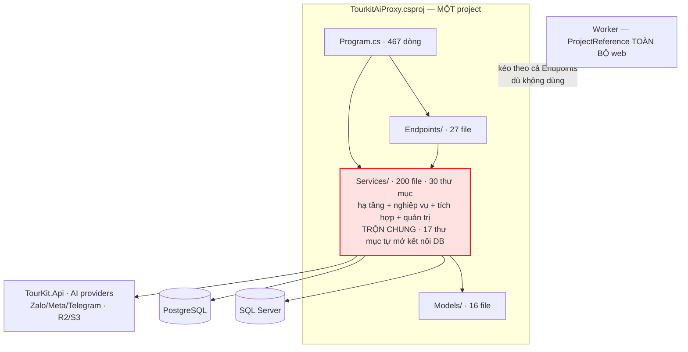
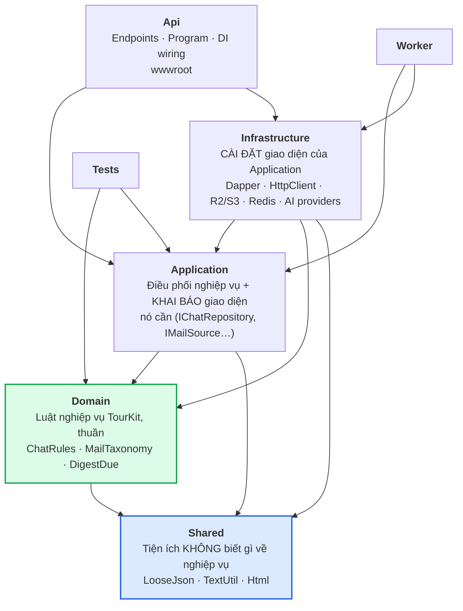

# Kiến trúc tourkit-ai-proxy

**Ngày:** 25/08/2026 · **Trạng thái:** Đã chốt hướng (Clean Architecture + project dùng chung), chưa thi hành

> Tài liệu này ghi **quyết định và cái giá của nó**, không mô tả từng lớp làm gì.
> Muốn biết một hàm làm gì thì đọc code hoặc hỏi CodeGraph. Đọc đây để biết **vì sao ranh giới nằm
> ở đó** và **đụng vào thì hỏng cái gì**.

> **Lịch sử quyết định.** Bản 25/08 đầu tiên đề xuất phương án tối thiểu (chỉ tách một lõi thuần,
> giữ nguyên phần còn lại). Chủ dự án bác bỏ và chọn **chuẩn hoá Clean Architecture đầy đủ, kèm một
> project dùng chung**, lý do: hiện trạng đã khó quản lý, và phương án tối thiểu **không trả lời
> được câu hỏi hằng ngày "file này để đâu"** — nó chỉ ép được lõi thuần, còn 30 thư mục trong
> `Services/` vẫn nguyên. Lập luận đó đúng: chi phí của việc *không* làm đang cộng dồn mỗi tuần.
> Bản này thay thế bản trước; cái giá của phương án đầy đủ được ghi thẳng ở §4 và §7.

---

## 1. Bối cảnh và mục tiêu

Proxy AI cho TourKit: một tiến trình web ASP.NET Core 8 phục vụ ~10 tính năng (trợ lý số liệu, hộp
thư AI, hộp thư chat đa kênh, bản tin, chấm cơ hội, thẩm định visa, tính giá tour, nhập NCC, giọng
nói, widget) cộng một worker chạy tác vụ nền.

**Ba ràng buộc định hình mọi thứ:**

1. **Frontend không có bundler khi chạy dev** — React qua Babel trong trình duyệt; bundle bằng
   esbuild chỉ khi publish. Mọi phụ thuộc JS mới phải khai ở **hai** nơi (`index.html` và
   `bundle-entry.js`), và hai danh sách đó **đã lệch nhau một lần, 12 file**.
2. **Hai loại CSDL, cố ý:** SQL Server (27 bảng, dùng chung với TourKit Push) và PostgreSQL riêng
   cho chat (vì `pgvector`). **Không JOIN được với nhau, không có giao dịch chung.**
3. **Không có CI chạy CSDL.** Test chỉ phủ logic thuần và guard mã nguồn. Mọi thứ chạm DB phải kiểm
   tay trên staging. ← *ràng buộc nguy hiểm nhất cho việc tái cấu trúc, xem §7.*

---

## 2. Vấn đề thật: dự án không thiếu luật, nó thiếu CƠ CHẾ

Chẩn đoán trung tâm. Mọi quyết định bên dưới bắt nguồn từ đây.

`CLAUDE.md` hiện dài **hơn 700 dòng** quy ước viết rõ ràng, có lý do, có cảnh báo ⚠️. Vậy mà **ngày
25/08/2026, chính phiên làm việc viết ra tài liệu này đã vi phạm** một quy ước đặt tên trong vòng
vài giờ sau khi đọc nó: thêm hai phương thức tiếng Việt vào `ChatRepository` — file có sẵn 26 tên
tiếng Anh. Không có gì báo. Test vẫn xanh. Chỉ người dùng nhìn ra.

Đó là **tính chất của quy ước bằng lời**: nó chỉ hoạt động khi người đọc nhớ đúng dòng đúng lúc.
Càng nhiều luật, xác suất nhớ đủ càng thấp.

**Số liệu hiện trạng** (đo 25/08/2026):

| Chỉ số | Giá trị | Ý nghĩa |
|---|---|---|
| File `.cs` trong `Services/` | **200** | 81% toàn bộ mã C# |
| Thư mục con cấp 1 | **30** | Không còn là một tầng, là một thùng chứa |
| File nằm trần ngay tại `Services/` | 7 | Không thuộc nhóm nào |
| **Thư mục vừa chứa nghiệp vụ vừa chạm thẳng DB** | **17/30** | Chia tầng phải **tách đôi từng thư mục**, không phải chuyển chỗ |
| `Services/Workflow` **và** `Services/Workflows` | 6 + 14 file | Khác nhau **một chữ cái** |
| `CREATE TABLE` trong MỘT hằng | **27** (file 792 dòng) | Mọi tính năng sửa chung một file |
| File lớn nhất (`JsonPlannerAgent.cs`) | **1.845 dòng** | Vượt xa mức đọc-hết-trong-đầu |
| `Program.cs` | 467 dòng | CLAUDE.md gọi nó là "thin bootstrap" |
| Project C# | **3** (web/worker/test) | **Không ranh giới tầng nào có thể làm hỏng build** |

Dòng cuối là gốc rễ. `Services/` phình ra không vì ai quyết định thế, mà vì nó là **chỗ mặc định** —
bỏ gì vào cũng được, không lực nào đẩy ra.

Theo chiều ngược lại, một tin tốt đáng ghi: quét toàn bộ `Endpoints/` chỉ thấy **một** file chạm
thẳng Dapper (`WorkflowEndpoints.cs`). Quy ước "endpoint không chạm DB" gần như được giữ — nhưng
bằng **kỷ luật**, không bằng cơ chế, và một file đã lọt.

---

## 3. Sơ đồ thành phần

### 3.1 Hiện tại

Mũi tên nào cũng hợp lệ vì **không có gì cấm**.

### 3.2 Đích — Clean Architecture, 5 project + worker + test

**Luật phụ thuộc — biên dịch viên ép, không phải quy ước:**

| Project | Được tham chiếu | Tuyệt đối KHÔNG |
|---|---|---|
| `Shared` | *(không gì ngoài BCL)* | Mọi project khác của dự án |
| `Domain` | `Shared` | Dapper · HttpClient · ASP.NET · Application · Infrastructure |
| `Application` | `Domain`, `Shared` | Dapper · ASP.NET · **Infrastructure** |
| `Infrastructure` | `Application`, `Domain`, `Shared` | ASP.NET (trừ phần thật sự cần, xem §4 QĐ-3) |
| `Api` | tất cả | — |
| `Worker` | `Application`, `Infrastructure`, `Domain`, `Shared` | **`Api`** |

Mũi tên `Infrastructure → Application` **ngược chiều gọi**, và đó là điểm cốt lõi của Clean
Architecture: `Application` khai `interface IChatRepository`, `Infrastructure` cài nó bằng Dapper.
Nhờ vậy nghiệp vụ **không biết** dữ liệu nằm ở SQL Server hay PostgreSQL — đúng thứ dự án này cần,
vì nó đang có **hai** CSDL và một cái có thể đổi.

---

## 4. Quyết định và cái giá

### QĐ-1: Năm project, luật phụ thuộc do biên dịch viên ép

**Chọn:** `Shared` · `Domain` · `Application` · `Infrastructure` · `Api`, theo bảng ở §3.2.

**Vì sao đủ 5 chứ không gộp `Domain` + `Application` làm một "Core":** hai thứ đó **hỏng theo hai
kiểu khác nhau**. `Domain` là luật thuần, test được không cần gì (`ChatRules.KhongLui` chạy 10 test
trong 40ms). `Application` điều phối — nó cần CSDL, cần AI, cần mạng, nên **không** test kiểu đó
được. Gộp lại thì phần thuần bị kéo theo phụ thuộc của phần không thuần, và mất luôn thứ quý nhất:
một tầng chạy được trong mili giây.

**Cái giá — thật, không nhỏ:**
- Thêm 4 `.csproj` phải bảo trì; build lâu hơn (**chưa đo**, xem §7).
- ~200 file phải đổi namespace; **mọi `git blame` mất dấu** ở file bị chuyển.
- Giai đoạn lai kéo dài nhiều tháng: `Services/` cũ và các project mới **cùng tồn tại**.
- Tầng gián tiếp mới: mỗi repository nay có thêm một `interface`. Với repo chỉ có **một** cài đặt
  thì đó là chi phí thuần — trả để lấy ranh giới ép được và khả năng test, không phải để lấy
  "linh hoạt đổi CSDL" (thứ gần như không bao giờ xảy ra).

### QĐ-2: `Shared` có LUẬT KẾT NẠP, nếu không nó thành `Services/` thứ hai

**Chọn:** `Shared` chỉ nhận thứ **không biết gì về nghiệp vụ TourKit** và **không chạm I/O**.
`LooseJson`, `TextUtil`, `Html` vào được. `ChatRules`, `MailTaxonomy`, `DigestDue` **không** — chúng
là luật TourKit, thuộc `Domain`.

**Vì sao phải viết luật này ra trước khi tạo project:** đây **chính xác là cách `Services/` hỏng**.
Không ai quyết định biến `Services/` thành thùng chứa; nó thành thùng chứa vì là chỗ mặc định và
không có tiêu chí từ chối. Một project tên "Shared"/"Common"/"Helper" **không có luật kết nạp** sẽ
đi đúng con đường đó, chỉ nhanh hơn — vì cái tên đã mời gọi sẵn.

**Cách ép:** ranh giới `Shared` không tham chiếu gì thì biên dịch viên tự ép **một nửa** (không gọi
được Dapper, không gọi được Domain). Nửa còn lại — "không biết gì về nghiệp vụ" — biên dịch viên
không thấy, nên phải là **test guard**: chặn file trong `Shared` chứa danh từ nghiệp vụ (`Tour`,
`Chat`, `Mail`, `Deal`, `Visa`, `Khach`, `Digest`…).

**Cái giá:** sẽ có lúc phân vân "cái này là tiện ích hay nghiệp vụ" và phải quyết. Đó là cái giá
đúng — hiện tại không ai phải phân vân, và **đó chính là vấn đề**.

### QĐ-3: `Infrastructure` được biết HTTP, `Application` thì không

**Chọn:** `Application` không tham chiếu ASP.NET. Adapter kênh chat cần `IHeaderDictionary` để kiểm
chữ ký webhook → chúng thuộc `Infrastructure`.

**Vì sao đáng nói riêng:** đo thật thấy **20+ file trong `Services/` nhắc tới kiểu HTTP**. Phần lớn
hợp lệ (`HttpClient`, `IHttpContextAccessor` cho ghi log lượt AI), nhưng trộn chung khiến **không
phân biệt được** chỗ nào hợp lệ chỗ nào là rò rỉ tầng. Tách ra thì mỗi lần `Application` cần đến
HTTP là hỏng build ngay — buộc phải nghĩ.

**Cái giá:** vài chỗ hiện đang tiện sẽ phải thêm một `interface`. Cụ thể `AiCallContext` (đọc
`HttpContext` để ghi log tenant/feature) phải tách đôi: phần khai báo ở `Application`, phần đọc
`HttpContext` ở `Infrastructure`.

### QĐ-4: Mỗi tính năng sở hữu mảnh schema của mình

**Chọn:** bỏ hằng `SchemaSql` gộp 27 bảng trong `TourkitAiDb.cs` (792 dòng). Mỗi tính năng khai
`static string Schema` riêng; `TourkitAiDb` chỉ **ghép và chạy** theo thứ tự phụ thuộc khai tường minh.

**Vì sao:** thêm một bảng cho chat hiện phải sửa cùng file với bảng của mail, visa, quota — điểm
tranh chấp merge. Tệ hơn: **thứ tự lệnh trong đó là thứ sai được**, và đã sai thật hai lần trong
tháng 8. Một lần `ALTER TABLE` đặt sau `CREATE INDEX` dùng chính cột đó (hỏng đúng ở máy chưa nâng
cấp — chỗ cần nó chạy nhất). Một lần `ON CONFLICT` lệch biểu thức chỉ mục (lỗi lúc chạy, không phải
lúc biên dịch).

**Cái giá:** khoá ngoại giữa bảng của hai tính năng khác nhau sẽ lộ ra và phải khai thứ tự — lộ ra
là tốt, nhưng là việc thật phải làm.

### QĐ-5: Cái gì biên dịch viên không kiểm được thì viết test guard

**Chọn:** mỗi ranh giới không ép được bằng kiểu dữ liệu thì có **một test đọc mã nguồn** canh.

**Vì sao:** repo **đã dùng cách này và nó đã cứu thật**. `ChatFeatureFlagCoverageTests` bắt việc
quên khai đường dẫn khi tắt cờ tính năng — lỗi mà triệu chứng là trả `index.html` kèm **200** thay
vì 404. `BundledPlainJsStripTests` chặn đúng cái lệch 12 file giữa `index.html` và `bundle-entry.js`.

Bốn guard cần có: `Shared` không chứa danh từ nghiệp vụ (QĐ-2) · endpoint không mở kết nối DB
(hiện 1 vi phạm) · tên định danh theo file (lỗi 25/08) · không file `.cs` trần ở gốc project.

**Cái giá:** test đọc mã nguồn **giòn** — đổi tên hàm là phải sửa test — và chỉ bắt được thứ diễn
đạt được bằng chuỗi/regex. Đây là **hàng rào, không phải bằng chứng đúng đắn**.

### QĐ-6: Worker thôi tham chiếu `Api`

**Chọn:** worker tham chiếu `Application` + `Infrastructure`, không tham chiếu `Api`.

**Vì sao:** hiện worker tham chiếu **toàn bộ** project web — chính chú thích trong `.csproj` thừa
nhận "kéo theo cả Endpoints (không dùng)". Ngoài chuyện thừa, nó **xoá mất một tín hiệu**: nghiệp vụ
lỡ phụ thuộc HTTP thì worker không hề báo. Sau QĐ-1 điều này thành **miễn phí** — chỉ là bớt một
dòng `ProjectReference`.

---

## 5. Mô hình dữ liệu — ai được chạm cái gì

| Kho | Ai sở hữu | Luật |
|---|---|---|
| SQL Server (27 bảng) | `Infrastructure` | Chỉ lớp `*Repository` mở kết nối |
| PostgreSQL (chat) | `Infrastructure` | **Không JOIN được sang SQL Server** — ghi tin trước, cập nhật CRM sau, cho thử lại |
| Redis | `Infrastructure` | **Tuỳ chọn.** Mất Redis không được làm mất dữ liệu |
| Tệp (R2/S3/đĩa) | `Infrastructure` | Đường dẫn neo vào **thư mục app**, không phải thư mục làm việc |

**Luật một dòng:** *chỉ `Infrastructure` được mở kết nối CSDL.* Sau QĐ-1 đây là luật **biên dịch
viên ép** (`Application` không tham chiếu Dapper), không còn là nguyện vọng.

⚠️ Hai CSDL **không có giao dịch chung** là ràng buộc kiến trúc, không phải chi tiết kỹ thuật. Mọi
luồng chạm cả hai phải chịu được nửa chừng: ghi bên nào trước, bên kia hỏng thì sao, thử lại có
nhân đôi không.

---

## 6. Hỏng thì sao

| Hỏng ở đâu | Hiện tại | Sau khi chia tầng |
|---|---|---|
| Thiếu chuỗi kết nối chat | Cụm chat tự tắt, app vẫn sống ✅ | Giữ nguyên |
| Mất Redis | Tự lùi về bộ nhớ trong ✅ | Giữ nguyên — **phải log rõ chế độ đang chạy** |
| Nhà cung cấp AI hỏng | Rơi về provider mặc định ✅ | Giữ nguyên (có chủ đích) |
| Thiếu khoá R2/S3 | **Tắt hẳn kèm lý do**, không lùi ngầm ✅ | Giữ nguyên |
| Webhook kênh chat | Ghi thân thô rồi trả 200; worker xử lý ✅ | Giữ nguyên |
| **Schema chạy nửa chừng** | Cả khối SQL dừng, phần sau không chạy ⚠️ | QĐ-4 sửa: hỏng một mảnh không kéo cả cụm |
| **Một tính năng ném lỗi lúc khởi động** | `Program.cs` 467 dòng nối tiếp ⚠️ | Mỗi tính năng tự đăng ký; hỏng thì tắt tính năng đó, không sập app |

Hai dòng ⚠️ là **lỗ hổng thật**: cả hai dẫn tới "một tính năng phụ làm chết cả hệ".

---

## 7. Thứ tự thi hành — và rủi ro lớn nhất

> ⚠️ **Rủi ro số một, phải đọc trước khi bắt đầu.** Repo **không có test tích hợp chạm CSDL**.
> Nghĩa là: di chuyển file thì biên dịch viên bắt được, nhưng **đổi hành vi thì không ai bắt**.
> 17/30 thư mục hiện trộn nghiệp vụ với truy cập DB, nên việc này là **tách đôi ~200 file**, không
> phải kéo-thả thư mục. Đó là chỗ dễ làm hỏng nhất.
>
> **Vì thế bước 0 không phải tạo project — mà là dựng lưới an toàn.**

**Bước 0 — lưới an toàn (làm trước, không bỏ qua):**

0a. Bốn test guard của QĐ-5 (vài giờ, rủi ro ~0, có giá trị ngay cả khi dừng ở đây).
0b. Test tích hợp cho **ít nhất** đường chat trên PostgreSQL (Testcontainers). Không cần phủ hết —
    cần đủ để biết "vẫn ghi/đọc đúng" sau khi chuyển.

**Bước 1 — dựng khung, chưa chuyển gì (một buổi):**

1. Tạo 5 project rỗng + khai luật phụ thuộc ở `.csproj`.
2. Chuyển ngay hai nhóm **rẻ và an toàn nhất**:
   - `Domain` ← các file đã sẵn thuần: `ChatRules`, `ChatAttachment`, `MailTaxonomy`, `DigestDue`,
     `DigestPhone`, `NotifyThrottle` (**đo thật: 0 câu `using`**, hoặc chỉ `System.Text.Json`).
   - `Shared` ← `LooseJson`, `TextUtil`, `Html`.
3. `Services/` cũ **để nguyên**, tạm coi là "chưa phân loại".

> **Đây là chỗ lãi nhất của cả kế hoạch.** Từ giây phút khung dựng xong, **mọi code MỚI buộc phải
> vào đúng chỗ** — biên dịch viên chặn. Cái đống cũ vẫn còn, nhưng nó **thôi lớn thêm**. Big-bang
> biến thành bánh cóc: chỉ tiến, không lùi.

**Bước 2 — chuyển dần, mỗi lần một tính năng:**

4. Chỉ chuyển khi **đang sửa** tính năng đó. Mỗi tính năng ra **một commit "chỉ di chuyển, không đổi
   logic"** rồi mới commit phần sửa thật — để review và `git bisect` còn dùng được.
5. Thứ tự đề nghị: Chat (vừa làm, thuộc nhất) → Mail → Digest → Deals → Reviews → Visa → còn lại.
6. QĐ-4 (schema theo tính năng) làm **cùng lúc** với từng tính năng, không tách đợt riêng.

**Bước 3 — thu dọn (chỉ khi bước 2 gần xong):**

7. QĐ-6: cắt `ProjectReference` `Api` khỏi worker.
8. Gộp `Services/Workflow` vào `Services/Workflows`; tìm nhà cho 7 file trần.
9. Xoá `Services/` khi rỗng.

### Chưa giải quyết — nói thẳng

- **File 1.845 dòng (`JsonPlannerAgent`) không nằm trong kế hoạch này.** Tách nó cần hiểu nghiệp vụ
  planner trước. **Đừng gộp vào cùng đợt di chuyển thư mục** — trộn hai loại thay đổi vào một commit
  là mất khả năng review.
- **Chưa đo build time.** QĐ-1 tăng từ 3 lên 7 project. Nếu build chậm đi đáng kể thì cái giá đổi
  khác — **đo ngay ở bước 1**, khi mới có 2 project mới và còn lùi được rẻ.
- **`Models/` (16 file) chưa phân loại.** Phần lớn là DTO của endpoint (→ `Api`), nhưng chưa soi
  từng file nên chưa dám khẳng định.
- **Chưa quyết `Application` có dùng MediatR/CQRS không.** Clean Architecture không bắt buộc. Đề
  nghị: **không**, cho tới khi có nhu cầu cụ thể — thêm một tầng gián tiếp nữa lúc này là trả giá
  trước khi biết mình mua gì.
- **Tài liệu này chưa thi hành dòng nào.** Nếu ba tháng nữa đọc lại mà §2 vẫn đúng nguyên si, kết
  luận không phải "cần viết lại tài liệu" mà là **cơ chế vẫn chưa có**.

---

## Phụ lục: những phương án KHÔNG chọn

| Không chọn | Vì sao |
|---|---|
| **Chỉ tách một "Core" thuần, giữ nguyên phần còn lại** | Bản đầu của tài liệu này đề xuất thế và **đã bị bác**. Nó ép được lõi thuần với 1/10 công sức, nhưng **không trả lời được câu hỏi hằng ngày "file này để đâu"** — 30 thư mục trong `Services/` vẫn nguyên, và cái thùng chứa vẫn tiếp tục lớn. |
| **Gộp `Domain` + `Application` thành một project** | Mất tầng chạy được trong mili giây: luật thuần bị kéo theo phụ thuộc CSDL/mạng của phần điều phối. |
| **Tách microservice theo tính năng** | Hai CSDL đã đủ đau vì không có giao dịch chung. Thêm ranh giới mạng là nhân đôi loại lỗi đó, đổi lấy một vấn đề quy mô mà dự án **chưa hề gặp**. |
| **Big-bang: chuyển hết trong một đợt** | Không có test tích hợp thì không có cách nào biết đã làm hỏng gì. Bước 1 + bánh cóc lấy được phần lớn lợi ích mà không đánh cược. |
| **Thêm quy ước vào CLAUDE.md rồi thôi** | Chính xác là thứ đã hỏng. Xem §2. |
