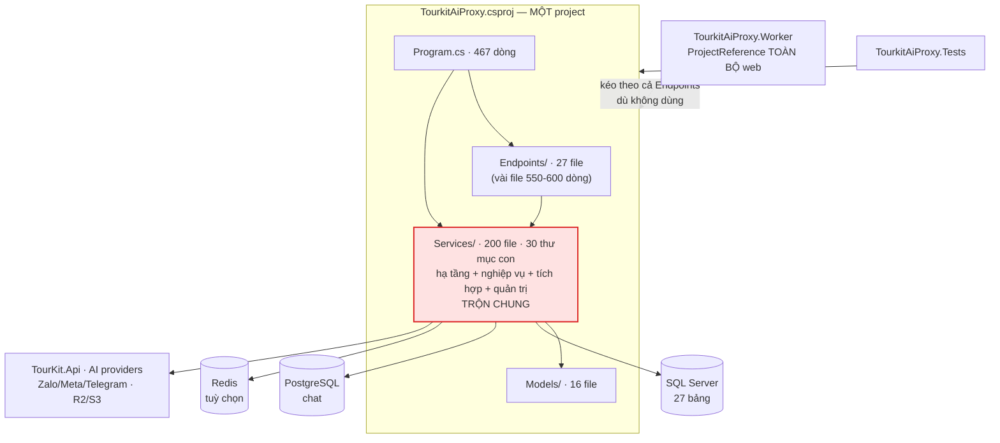
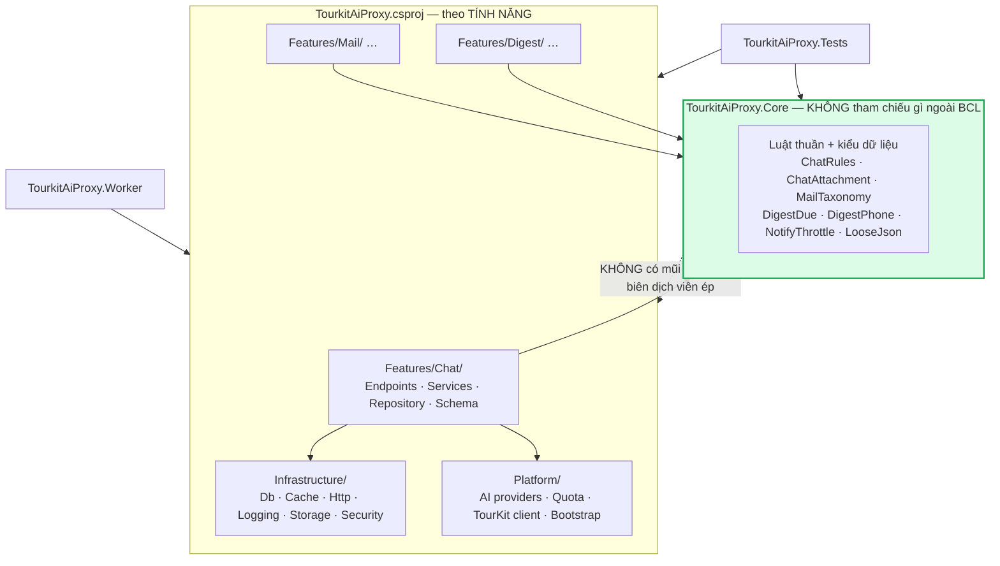

# Kiến trúc tourkit-ai-proxy

**Ngày:** 25/08/2026 · **Trạng thái:** Đề xuất, chưa thi hành

> Tài liệu này ghi **quyết định và cái giá của nó**, không phải mô tả từng lớp làm gì.
> Muốn biết một hàm làm gì thì đọc code hoặc hỏi CodeGraph. Đọc tài liệu này để biết
> **vì sao ranh giới nằm ở đó** và **đụng vào thì hỏng cái gì**.

---

## 1. Bối cảnh và mục tiêu

Proxy AI cho TourKit: một tiến trình web ASP.NET Core 8 phục vụ ~10 tính năng (trợ lý số liệu,
hộp thư AI, hộp thư chat đa kênh, bản tin, chấm điểm cơ hội, thẩm định visa, tính giá tour,
nhập NCC, giọng nói, widget) cộng một worker chạy tác vụ nền.

**Ba ràng buộc định hình mọi thứ:**

1. **Frontend KHÔNG có bundler khi chạy dev** — React qua Babel trong trình duyệt, dựng bundle
   bằng esbuild chỉ khi publish. Nên mọi phụ thuộc JS mới phải khai ở **hai** nơi (`index.html`
   và `bundle-entry.js`), và hai danh sách đó **đã lệch nhau một lần, 12 file**.
2. **Hai loại CSDL, cố ý:** SQL Server (27 bảng, dùng chung với TourKit Push) và PostgreSQL riêng
   cho chat (vì `pgvector`). **Không JOIN được với nhau, không có giao dịch chung.**
3. **Không có CI chạy CSDL.** Test chỉ phủ được logic thuần và guard mã nguồn. Mọi thứ chạm DB
   phải kiểm tay trên staging.

**Mục tiêu của tài liệu này:** dựng ranh giới **có cơ chế ép**, thay cho quy ước bằng lời.

---

## 2. Vấn đề thật: dự án không thiếu luật, nó thiếu CƠ CHẾ

Đây là chẩn đoán trung tâm, mọi quyết định bên dưới đều bắt nguồn từ nó.

`CLAUDE.md` hiện dài **hơn 700 dòng** toàn quy ước viết rõ ràng, có lý do, có cảnh báo ⚠️.
Vậy mà **ngày 25/08/2026, chính phiên làm việc viết ra tài liệu này đã vi phạm** một quy ước
đặt tên trong vòng vài giờ sau khi đọc nó: thêm hai phương thức tiếng Việt vào `ChatRepository`
— file có sẵn 26 tên tiếng Anh. Không có gì báo. Test vẫn xanh. Chỉ người dùng nhìn ra.

Đó không phải chuyện cẩu thả cá biệt. Đó là **tính chất của quy ước bằng lời**: nó chỉ hoạt động
khi người đọc nhớ đúng dòng đúng lúc. Càng nhiều luật, xác suất nhớ đủ càng thấp.

**Số liệu hiện trạng** (đo ngày 25/08/2026):

| Chỉ số | Giá trị | Ý nghĩa |
|---|---|---|
| File `.cs` trong `Services/` | **200** | Chiếm 81% toàn bộ mã C# |
| Thư mục con cấp 1 của `Services/` | **30** | Không còn là một tầng, là một thùng chứa |
| File `.cs` nằm trần ngay tại `Services/` | 7 | Không thuộc nhóm nào |
| `Services/Workflow` **và** `Services/Workflows` | 6 + 14 file | Hai thư mục khác nhau **một chữ cái** |
| `CREATE TABLE` trong MỘT hằng của `TourkitAiDb.cs` | **27** | Mọi tính năng sửa chung một file 792 dòng |
| File lớn nhất (`JsonPlannerAgent.cs`) | **1.845 dòng** | Vượt xa mức đọc-hết-trong-đầu |
| `Program.cs` | 467 dòng | Không còn là "thin bootstrap" như CLAUDE.md mô tả |
| Project C# | **3** (web / worker / test) | Không có ranh giới tầng nào được biên dịch viên kiểm |

Dòng cuối là gốc rễ: **không tồn tại ranh giới nào có thể HỎNG BUILD.** `Services/` phình ra
không phải vì ai đó quyết định thế, mà vì nó là **chỗ mặc định** — thêm gì cũng bỏ vào đó được,
và không có lực nào đẩy ra.

Đáng chú ý theo chiều ngược lại: tầng đã được tôn trọng khá tốt **trong thực tế** — quét toàn bộ
`Endpoints/` chỉ thấy **một** file chạm thẳng Dapper (`WorkflowEndpoints.cs`). Nghĩa là quy ước
"endpoint không chạm DB" gần như được giữ. Nhưng nó được giữ bằng **kỷ luật**, không bằng cơ chế —
và một file đã lọt.

---

## 3. Sơ đồ thành phần

### 3.1 Hiện tại

Mũi tên nào cũng hợp lệ vì **không có gì cấm**. Worker kéo theo cả `Endpoints/` dù không dùng.

### 3.2 Đề xuất

---

## 4. Quyết định và cái giá

### QĐ-1: Tách `TourkitAiProxy.Core` — lõi thuần, biên dịch viên ép

**Chọn:** một project mới **không tham chiếu bất cứ gói nào** ngoài BCL. Chứa luật thuần và kiểu
dữ liệu. Mọi project khác tham chiếu vào nó; **nó không tham chiếu ai**.

**Vì sao đây là việc đầu tiên, và vì sao nó rẻ:** lõi đó **đã tồn tại trên thực tế**. Đo thật:
`ChatRules.cs`, `MailTaxonomy.cs`, `DigestDue.cs`, `DigestPhone.cs` có **0 câu `using`**;
`ChatAttachment.cs` và `LooseJson.cs` chỉ dùng `System.Text.Json`. Chúng cũng chính là những file
**đã có test thật** — không phải test guard mã nguồn, mà test chạy logic.

Nên đây không phải tái cấu trúc, mà là **ghi nhận một ranh giới đã có** và bắt biên dịch viên
canh giữ. Từ đó trở đi, ai lỡ gọi Dapper hay `HttpClient` trong luật thuần sẽ **hỏng build ngay**,
không cần ai nhớ quy ước nào.

**Cái giá:** thêm một `.csproj` phải bảo trì; ~15 file phải sửa namespace và mọi nơi gọi phải thêm
`using`; build lâu thêm chút. Và **ranh giới này chỉ chặn được một chiều** — nó ngăn lõi gọi ra
ngoài, **không** ngăn nghiệp vụ nhét luật vào chỗ khác.

### QĐ-2: Xếp theo TÍNH NĂNG, không theo TẦNG

**Chọn:** `Features/{Chat,Mail,Digest,…}/` — mỗi tính năng chứa endpoint, service, repository và
**mảnh schema** của chính nó. Bỏ dần `Endpoints/*` + `Services/*` xếp theo tầng.

**Vì sao:** đo một thay đổi thật của đợt 3 (vòng đời tin nhắn) — nó chạm **5 chỗ ở 3 thư mục gốc
khác nhau**: `Endpoints/ChatInboxEndpoints.cs`, `Services/Chat/Inbox/*`, `Services/Chat/Channels/*`,
`Services/Bootstrap/*`, `Program.cs`. Không có thư mục nào trả lời được câu "chat gồm những gì".
Xếp theo tầng tối ưu cho câu hỏi "tất cả endpoint ở đâu" — mà **gần như không ai hỏi câu đó**;
người ta hỏi "sửa chat thì đụng gì".

**Cái giá — và đây là cái giá THẬT, không nhỏ:** di chuyển 200 file làm **mọi lệnh `git blame`
mất dấu**, và tạo một commit khổng lồ không ai review nổi. Vì thế:

> **KHÔNG di chuyển hàng loạt.** Chỉ chuyển một tính năng **khi đang sửa nó**, thành một commit
> riêng "chỉ di chuyển, không đổi logic". Dự án sẽ ở trạng thái **lai trong nhiều tháng** —
> chấp nhận điều đó. Một big-bang refactor trên codebase **không có test tích hợp** là canh bạc
> không ai bảo được là thắng hay thua.

### QĐ-3: Mỗi tính năng sở hữu mảnh schema của mình

**Chọn:** bỏ hằng `SchemaSql` gộp 27 bảng trong `TourkitAiDb.cs` (792 dòng). Mỗi tính năng khai
`static string Schema` của riêng nó; `TourkitAiDb` chỉ **ghép và chạy** theo thứ tự phụ thuộc.

**Vì sao:** hiện tại thêm một bảng cho chat phải sửa cùng file với bảng của mail, visa, quota.
Đó là điểm tranh chấp merge, và tệ hơn — **thứ tự lệnh trong đó là thứ sai được**. Đã dính thật
hai lần trong tháng 8: một lần `ALTER TABLE` đặt sau `CREATE INDEX` dùng chính cột đó (hỏng đúng
ở máy chưa nâng cấp, chỗ cần nó chạy nhất), một lần `ON CONFLICT` lệch biểu thức chỉ mục (lỗi lúc
chạy, không phải lúc biên dịch).

**Cái giá:** thứ tự chạy giữa các tính năng phải khai tường minh (khoá ngoại giữa các bảng của
hai tính năng khác nhau sẽ lộ ra — mà lộ ra là tốt). Và trong lúc chuyển tiếp, schema nằm ở hai
nơi.

### QĐ-4: Cái gì biên dịch viên không kiểm được thì viết test guard

**Chọn:** mỗi ranh giới không ép được bằng kiểu dữ liệu thì có **một test đọc mã nguồn** canh.

**Vì sao:** repo **đã dùng cách này và nó đã cứu thật**. `ChatFeatureFlagCoverageTests` bắt được
việc quên khai đường dẫn khi tắt cờ tính năng — lỗi mà triệu chứng là trả `index.html` kèm **200**
thay vì 404, cực khó lần. `BundledPlainJsStripTests` chặn đúng cái lệch 12 file giữa `index.html`
và `bundle-entry.js`.

Ba guard nên thêm ngay, đều rẻ:
- **Endpoint không chạm DB** — hiện có đúng 1 vi phạm (`WorkflowEndpoints.cs`), sửa rồi khoá lại.
- **Tên định danh theo file** — chặn đúng lỗi đã xảy ra ngày 25/08.
- **Không có file `.cs` nào trần ở gốc `Services/`** — hiện 7 file, buộc phải chọn nhà cho chúng.

**Cái giá:** test đọc mã nguồn **giòn** — đổi tên hàm là phải sửa test. Và nó chỉ bắt được thứ
diễn đạt được bằng chuỗi/regex. Đây là **hàng rào, không phải bằng chứng đúng đắn**.

### QĐ-5: Worker KHÔNG kéo theo `Endpoints/`

**Chọn:** worker tham chiếu phần nghiệp vụ + hạ tầng, không tham chiếu tầng HTTP.

**Vì sao:** hiện `TourkitAiProxy.Worker.csproj` tham chiếu **toàn bộ** project web — chính chú
thích trong file đó thừa nhận "kéo theo cả Endpoints (không dùng)". Nghĩa là worker nền mang theo
toàn bộ routing, CORS, static files. Ngoài chuyện thừa, nó **xoá mất một tín hiệu**: nếu nghiệp vụ
lỡ phụ thuộc vào HTTP, worker sẽ không hề báo.

**Cái giá:** cắt được ràng buộc này chỉ sau khi QĐ-2 đi đủ xa. **Đây là hệ quả, không phải bước
làm ngay.**

---

## 5. Mô hình dữ liệu — ai được chạm cái gì

| Kho | Ai sở hữu | Luật |
|---|---|---|
| SQL Server (27 bảng) | `Infrastructure/Db` + repository của từng tính năng | Chỉ lớp `*Repository` mở kết nối |
| PostgreSQL (chat) | `Features/Chat/…/ChatDb` | **Không JOIN được sang SQL Server** — ghi tin trước, cập nhật CRM sau, cho thử lại |
| Redis | `Infrastructure/Cache` | **Tuỳ chọn.** Mất Redis không được làm mất dữ liệu |
| Tệp (R2/S3/đĩa) | `Infrastructure/Storage` | Đường dẫn neo vào **thư mục app**, không phải thư mục làm việc |

**Luật một dòng:** *chỉ `*Repository` được mở kết nối CSDL.* Diễn đạt được bằng test (QĐ-4), nên
nó là luật thật chứ không phải nguyện vọng.

⚠️ Hai CSDL **không có giao dịch chung** là ràng buộc kiến trúc, không phải chi tiết kỹ thuật.
Mọi luồng chạm cả hai phải chịu được nửa chừng: ghi bên nào trước, bên kia hỏng thì sao, thử lại
có nhân đôi không.

---

## 6. Hỏng thì sao

| Hỏng ở đâu | Hiện tại | Đúng ra phải |
|---|---|---|
| Thiếu chuỗi kết nối chat | Cụm chat tự tắt, app vẫn sống ✅ | Giữ nguyên |
| Mất Redis | Tự lùi về bộ nhớ trong ✅ | Giữ nguyên — nhưng **phải log rõ chế độ đang chạy** |
| Nhà cung cấp AI hỏng | Rơi về provider mặc định ✅ | Giữ nguyên (có chủ đích, xem CLAUDE.md) |
| Thiếu khoá R2/S3 | **Tắt hẳn kèm lý do**, không lùi ngầm về đĩa ✅ | Giữ nguyên |
| Webhook kênh chat | Ghi thân thô rồi trả 200; worker xử lý ✅ | Giữ nguyên |
| **Schema chạy nửa chừng** | Cả khối SQL dừng, phần sau **không chạy** ⚠️ | QĐ-3: mỗi tính năng một mảnh, hỏng một mảnh không kéo cả cụm |
| **Một tính năng ném lỗi lúc khởi động** | `Program.cs` 467 dòng nối tiếp — chưa rõ có cô lập không ⚠️ | Mỗi tính năng tự đăng ký, hỏng thì tắt tính năng đó chứ không sập app |

Hai dòng ⚠️ là **lỗ hổng thật**, không phải chuyện thẩm mỹ: cả hai đều dẫn tới "một tính năng phụ
làm chết cả hệ".

---

## 7. Thứ tự làm, và cái gì chưa giải quyết

**Làm được ngay, rẻ, không phá gì:**

1. **QĐ-4** — ba test guard. Vài giờ, giá trị ngay, rủi ro gần bằng không.
2. **QĐ-1** — tách `Core`. ~15 file đã sẵn thuần. Nửa ngày.
3. Gộp `Services/Workflow` vào `Services/Workflows`, và tìm nhà cho 7 file trần.

**Làm dần, mỗi lần chạm một tính năng:**

4. **QĐ-2** — chuyển sang `Features/`, một tính năng một commit "chỉ di chuyển".
5. **QĐ-3** — schema theo tính năng, chuyển cùng lúc với QĐ-2.

**Chỉ khi 4 và 5 đã đi đủ xa:**

6. **QĐ-5** — cắt phụ thuộc `Endpoints/` của worker.

### Chưa giải quyết — nói thẳng

- **File 1.845 dòng (`JsonPlannerAgent`) không có trong kế hoạch này.** Tách nó là việc riêng,
  cần hiểu nghiệp vụ planner trước. Đừng gộp vào cùng đợt di chuyển thư mục.
- **Không có test tích hợp chạm CSDL.** Đây là rủi ro lớn nhất của mọi việc trên: di chuyển file
  thì biên dịch viên bắt được, nhưng **đổi hành vi thì không ai bắt**. Cân nhắc Testcontainers
  cho PostgreSQL trước khi động vào QĐ-3.
- **`Models/` (16 file) chưa có chỗ đứng** trong sơ đồ đề xuất. Phần lớn là DTO của endpoint,
  nên có thể về theo tính năng — nhưng chưa kiểm từng file, chưa dám khẳng định.
- **Chưa đo build time.** QĐ-1 và QĐ-5 làm tăng số project; nếu build chậm đi đáng kể thì cái giá
  đổi khác, phải đo lại rồi mới kết luận.
- **Tài liệu này chưa được thi hành dòng nào.** Nó là đề xuất. Nếu ba tháng nữa đọc lại mà mục 2
  vẫn đúng nguyên si, thì kết luận không phải "cần viết lại tài liệu" mà là **cơ chế vẫn chưa có**.

---

## Phụ lục: những quyết định KHÔNG chọn, và vì sao

| Không chọn | Vì sao |
|---|---|
| **Clean Architecture đủ 4 tầng** (Domain/Application/Infrastructure/Api) | Đúng sách, nhưng với ~250 file và **không có test tích hợp**, chi phí di chuyển vượt xa lợi ích thấy được. Ranh giới đắt giá nhất — "lõi thuần không gọi I/O" — đã đạt được bằng QĐ-1 với 1/10 công sức. |
| **Tách microservice theo tính năng** | Hai CSDL đã đủ đau vì không có giao dịch chung. Thêm ranh giới mạng nữa là nhân đôi loại lỗi đó, đổi lấy một vấn đề quy mô mà dự án **chưa hề gặp**. |
| **Big-bang refactor một lần cho xong** | Không có test tích hợp thì không có cách nào biết đã làm hỏng gì. Đau kéo dài nhưng kiểm soát được vẫn hơn một cú không đo được. |
| **Thêm quy ước vào CLAUDE.md rồi thôi** | Chính xác là thứ đã hỏng. Xem mục 2. |
