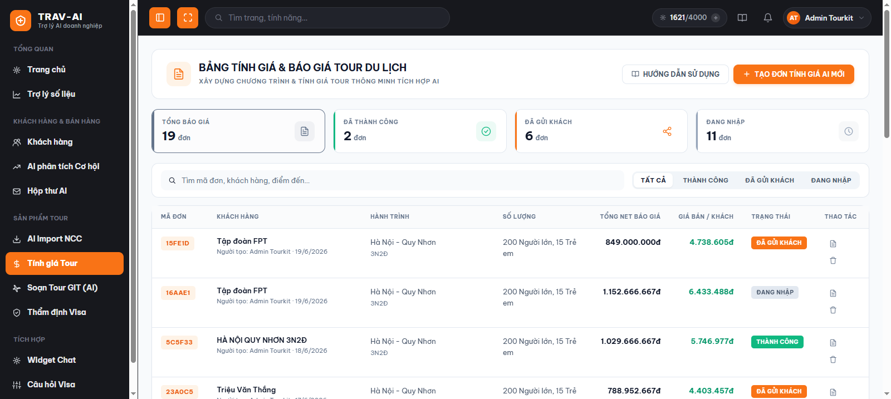
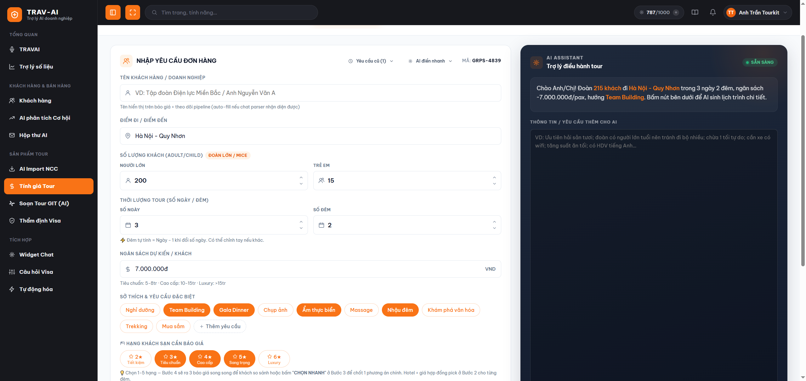
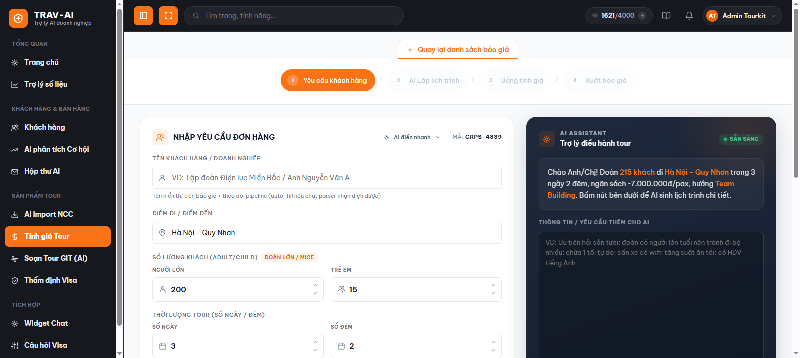
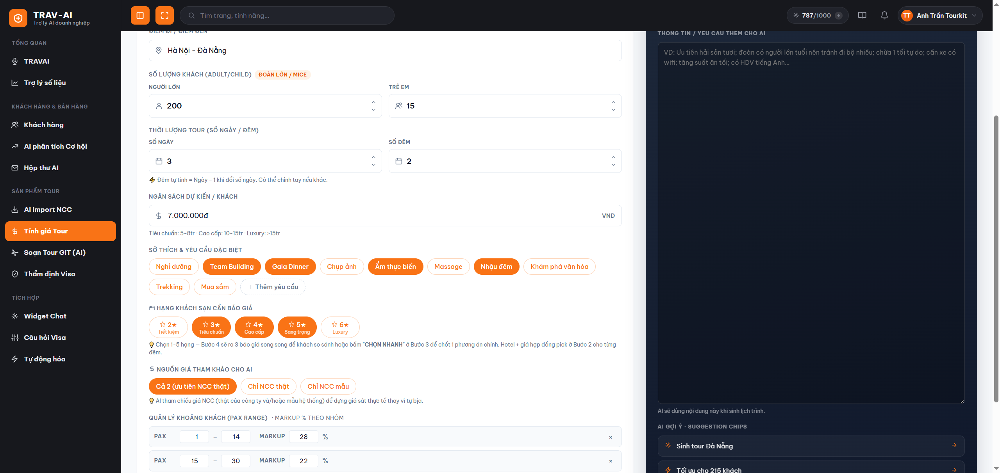
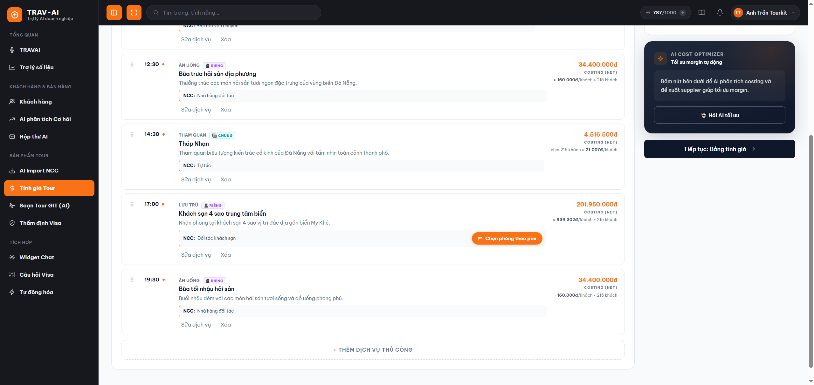
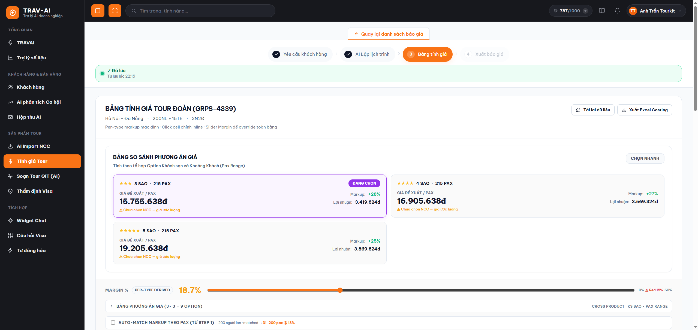
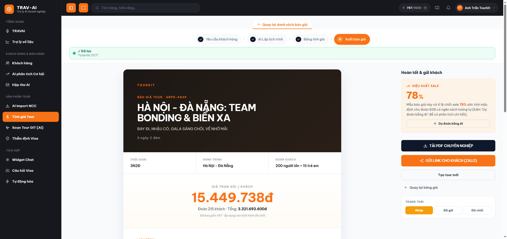

# Hướng dẫn sử dụng — Trình tạo báo giá tour bằng AI

## 1. Tính năng này làm gì

Đây là công cụ giúp bạn dựng một **bảng báo giá tour hoàn chỉnh** chỉ từ vài thông tin cơ bản của khách: điểm đến, số ngày, số khách, ngân sách... Bạn nhập yêu cầu, AI sẽ tự soạn lịch trình từng ngày, bạn chỉnh sửa lại cho vừa ý, hệ thống tự tính giá bán (đã gồm lợi nhuận) cho từng hạng khách sạn, và cuối cùng bạn có ngay một bảng báo giá đẹp để tải về hoặc gửi link cho khách xem.

Đây là công cụ "xương sống" đầu tiên và lâu đời nhất của hệ thống — bạn sẽ đi qua đúng 4 bước theo thứ tự: **nhập yêu cầu → AI dựng lịch trình → tính giá → xuất báo giá**, và có thể quay lại chỉnh sửa bất kỳ bước nào trước đó.

## 2. Ai nên dùng

- Nhân viên sale cần báo giá nhanh cho khách hỏi tour, thay vì tự gõ tay từng dòng lịch trình và tính giá bằng Excel.
- Điều hành tour muốn có sẵn khung lịch trình + giá tham khảo nhiều hạng khách sạn để tư vấn khách chọn.
- Bất kỳ ai cần một bảng báo giá chuyên nghiệp (có thể tải PDF hoặc gửi link) để gửi khách xem trong vài phút.

## 3. Hướng dẫn sử dụng từng bước

### Bước 1 — Mở trang "Tính giá Tour"

Ở menu bên trái, bấm vào mục **"Tính giá Tour"** để vào trang. Trang mở ra sẽ hiện **danh sách các đơn báo giá bạn đã tạo trước đó** (nếu chưa tạo đơn nào thì danh sách sẽ trống), kèm vài con số tổng quan: tổng số đơn, số đơn đã gửi khách, số đơn đã chốt thành công, số đơn đang soạn dở.

> 📸 Cần chụp: toàn màn hình trang "Tính giá Tour" ở chế độ danh sách — có ô KPI tổng quan trên cùng, thanh tìm kiếm/lọc, bảng các đơn đã tạo, và nút "Tạo đơn tính giá AI mới".

### Bước 2 — Bắt đầu một đơn báo giá mới

Bấm nút **"Tạo đơn tính giá AI mới"** để mở trình tạo 4 bước. Nếu muốn sửa lại một đơn đã tạo trước đó, chỉ cần bấm vào dòng tương ứng trong danh sách để mở lại đúng đơn đó (hệ thống tự lưu lại đơn bạn đang soạn dở, không lo mất dữ liệu khi thoát ra giữa chừng).

Phía trên cùng của trình tạo luôn có một **thanh 4 bước**: Yêu cầu khách hàng → Lịch trình AI → Bảng tính giá → Xuất báo giá, giúp bạn biết mình đang ở đâu và bấm quay lại bước trước bất cứ lúc nào (chỉ không đi tắt lên bước chưa hoàn thành).

> 📸 Cần chụp: thanh chỉ báo 4 bước ở đầu trang khi vừa mở trình tạo, đang đứng ở Bước 1.

### Bước 3 — Nhập yêu cầu của khách (Bước 1: Yêu cầu khách hàng)

Điền các thông tin cơ bản: tên khách/đoàn, điểm đi – điểm đến, số người lớn/trẻ em, số ngày – số đêm, ngân sách mỗi khách. Bạn cũng chọn các **sở thích của khách** (nghỉ dưỡng, team building, khám phá văn hóa...) bằng cách bấm vào các thẻ gợi ý có sẵn, hoặc tự thêm yêu cầu riêng. Nếu muốn báo giá nhiều mức khách sạn để khách chọn, tick chọn thêm các hạng sao khách sạn mong muốn (3 sao, 4 sao, 5 sao...).

Nếu bạn có sẵn một đoạn ghi chú dài do khách gửi (ví dụ email hoặc tin nhắn), có thể dán vào ô ghi chú và bấm **"AI điền nhanh"** — hệ thống sẽ tự dò tìm và điền các ô thông tin phù hợp giúp bạn đỡ gõ tay, nhưng bạn nên xem lại các ô đã điền cho chắc chắn vì đây là điền tự động, không phải hiểu ý khách một cách hoàn hảo.

> 📸 Cần chụp: form Bước 1 đầy đủ — các ô tên khách/route/số khách/ngân sách, các thẻ sở thích, ô chọn hạng khách sạn, và khung "AI điền nhanh" bên phải.

### Bước 4 — Cho AI dựng lịch trình

Ở khung bên phải, bạn có thể gõ thêm ghi chú riêng cho AI (ví dụ "ưu tiên khách sạn gần biển", "không xếp lịch quá dày"), rồi bấm nút **"SINH TOUR BẰNG AI"**. Hệ thống sẽ hiển thị tiến trình đang soạn lịch trình ngay trên màn hình, chỉ mất vài chục giây tới khoảng một phút tùy số ngày tour.

> 📸 Cần chụp: khung AI bên phải Bước 1, đang hiển thị tiến trình sinh lịch trình sau khi bấm "SINH TOUR BẰNG AI".

### Bước 5 — Xem và chỉnh sửa lịch trình (Bước 2: Lịch trình AI)

Sau khi AI soạn xong, bạn sẽ được chuyển sang **Bước 2**, xem lịch trình theo từng ngày (mỗi ngày là một tab riêng). Mỗi hoạt động trong ngày (ăn uống, tham quan, di chuyển, khách sạn...) đều có thể **sửa lại, xóa, hoặc thêm mới** cho đúng ý bạn — bấm vào một hoạt động để mở form chỉnh sửa: thời gian, tên, mô tả, nhà cung cấp thực tế của công ty (nếu có sẵn hợp đồng giá), và giá tiền.

Với các hoạt động là khách sạn, bạn có thể bấm **"Chọn phòng theo pax"** để chọn đúng loại phòng phù hợp với số khách của đoàn.

> 📸 Cần chụp: Bước 2 với các tab ngày ở trên, danh sách hoạt động của một ngày, và form chỉnh sửa một hoạt động đang mở (có phần chọn nhà cung cấp thực tế).

### Bước 6 — Tham khảo gợi ý tối ưu chi phí (tuỳ chọn)

Nếu muốn, bạn có thể bấm vào khu vực **"AI Cost Optimizer"** để AI xem qua lịch trình và gợi ý các chỗ có thể tiết kiệm chi phí hoặc thay đổi hợp lý hơn. Đây chỉ là gợi ý tham khảo — bạn quyết định có áp dụng hay không.

Khi lịch trình đã ưng ý, bấm **"Tiếp tục: Bảng tính giá"** để sang bước tính giá.

### Bước 7 — Kiểm tra và tinh chỉnh bảng giá (Bước 3: Bảng tính giá)

Ở bước này, hệ thống tự tính ra giá bán cho từng khoản mục dựa trên lịch trình bạn vừa duyệt, tách riêng phần **chi phí tính theo đầu khách** (ăn uống, phòng...) và **chi phí chung cả đoàn** (xe, hướng dẫn viên...). Mọi con số trong bảng đều có thể **bấm vào để sửa tay** nếu bạn muốn điều chỉnh giá gốc hoặc phần trăm lợi nhuận.

Có một **thanh điều khiển lợi nhuận** ở trên bảng — kéo thanh trượt để tăng/giảm phần trăm lợi nhuận áp dụng chung cho toàn bộ báo giá. Nếu mức lợi nhuận bị đẩy xuống quá thấp (dưới 15%), hệ thống sẽ cảnh báo bằng màu đỏ để bạn biết đang bán gần vốn.

Nếu Bước 1 bạn có chọn nhiều hạng khách sạn, ở đây sẽ hiện **bảng so sánh các phương án giá** theo từng hạng (3 sao/4 sao/5 sao...) để bạn dễ tư vấn khách chọn mức phù hợp túi tiền.

> 📸 Cần chụp: Bước 3 — bảng chi phí chi tiết, thanh trượt lợi nhuận ở trên (kèm cảnh báo đỏ nếu có), và bảng so sánh phương án giá theo hạng khách sạn.

Xem xong ưng ý, bấm **"Sinh báo giá đẹp"** để chuyển sang bước cuối.

### Bước 8 — Xuất và gửi báo giá cho khách (Bước 4: Xuất báo giá)

Bước cuối cùng hiển thị **bản xem trước báo giá** dạng trình bày đẹp, sẵn sàng gửi khách. Tại đây bạn có thể:
- Bấm **"Tải PDF"** để tải báo giá về máy dưới dạng file PDF (lần đầu tải cần có mạng để hệ thống chuẩn bị công cụ xuất PDF).
- Bấm **"Gửi link cho khách"** để tạo một đường link xem báo giá online, gửi qua Zalo/email/SMS cho khách xem trực tiếp trên điện thoại mà không cần tải file.
- Đánh dấu trạng thái đơn: **Nháp / Đã gửi khách / Đã chốt** để theo dõi tiến độ từng đơn trong danh sách ở Bước 1.

> 📸 Cần chụp: Bước 4 — bản xem trước báo giá đẹp, nút "Tải PDF", nút "Gửi link cho khách", và các nút đổi trạng thái Nháp/Đã gửi/Đã chốt.

Ngoài ra, ở bước này còn có khung **"Dự đoán khả năng chốt"** — bấm "Dự đoán bằng AI" để xem AI ước tính khả năng khách sẽ đồng ý báo giá này, giúp bạn cân nhắc có nên điều chỉnh giá thêm hay không trước khi gửi.

## 4. Lưu ý quan trọng / giới hạn

- **Đi từng bước, không nhảy cóc.** Bạn chỉ có thể quay lại các bước đã hoàn thành trước đó (ví dụ từ Bước 3 quay về Bước 2 để sửa lịch trình); không thể bấm thẳng vào Bước 4 khi chưa hoàn thành Bước 1–3.
- **"AI điền nhanh" chỉ dò chữ theo mẫu quen thuộc**, không hiểu ý khách sâu như trò chuyện — luôn kiểm tra lại các ô đã được điền tự động trước khi đi tiếp.
- **Hệ thống tự lưu đơn đang soạn dở**, nên bạn có thể thoát giữa chừng và quay lại sau từ danh sách ở Bước 1 mà không mất dữ liệu.
- **Tải PDF cần có mạng ở lần dùng đầu tiên** trong phiên làm việc (để tải công cụ xuất PDF); những lần tải sau trong cùng phiên sẽ nhanh hơn.
- **Nút "Hướng dẫn sử dụng"** hiện trên trang danh sách hiện **chưa hoạt động** (đang được biên soạn) — bạn dùng chính tài liệu này để tham khảo thay thế.
- **Danh sách "Báo giá đã lưu" (trang riêng, không có trong menu chính)**: các báo giá bạn đã tạo link chia sẻ (bấm "Gửi link cho khách") còn được lưu lại ở một trang riêng, truy cập bằng đường link trực tiếp (thêm `/quotes` vào cuối địa chỉ trang chủ). Trang này chỉ để **xem lại** các báo giá đã gửi, không dùng để tạo báo giá mới — bạn vẫn tạo báo giá mới từ trang "Tính giá Tour" như Bước 1–2 ở trên.
- **Giá và lợi nhuận chỉ mang tính tham khảo do hệ thống tự tính** — bạn nên rà lại các con số quan trọng (đặc biệt phần lợi nhuận) trước khi gửi báo giá chính thức cho khách.

## 5. Câu hỏi thường gặp (FAQ)

**Q: AI sinh lịch trình sai hoặc không đúng ý tôi thì sao?**
A: Bạn không cần bắt đầu lại — cứ sang Bước 2, sửa trực tiếp từng hoạt động (đổi giờ, đổi địa điểm, xóa/thêm), hệ thống sẽ tự tính lại giá tương ứng ở Bước 3.

**Q: Tôi muốn báo giá nhiều mức khách sạn (3 sao, 4 sao, 5 sao) cho khách chọn, làm sao?**
A: Ở Bước 1, tick chọn nhiều hạng khách sạn cùng lúc trong phần chọn hạng sao. Đến Bước 3 và Bước 4, hệ thống sẽ tự hiện bảng so sánh giá theo từng hạng để bạn gửi khách so sánh.

**Q: Mức lợi nhuận bao nhiêu là an toàn?**
A: Hệ thống cảnh báo bằng màu đỏ khi lợi nhuận dưới 15% — đây là mức tối thiểu nên tránh xuống dưới, trừ khi bạn có lý do đặc biệt để bán giá thấp hơn.

**Q: Gửi link báo giá cho khách rồi, khách xem trên điện thoại có cần cài gì không?**
A: Không cần. Khách chỉ cần bấm vào link được gửi (Zalo/email/SMS) là xem được ngay trên trình duyệt điện thoại, không cần đăng nhập hay cài ứng dụng.

**Q: Tôi tạo nhầm/không cần đơn báo giá nữa thì xóa được không?**
A: Được. Ở danh sách tại Bước 1, mỗi đơn báo giá đều có tùy chọn xóa ngay trên dòng tương ứng.

**Q: Trang "Báo giá đã lưu" (`/quotes`) khác gì trang danh sách chính?**
A: Trang danh sách chính (mở khi bạn vào "Tính giá Tour") quản lý **tất cả** đơn báo giá bạn đang soạn/đã tạo, kể cả đơn còn nháp. Trang `/quotes` chỉ liệt kê những báo giá **đã có link chia sẻ gửi khách**, dùng để tra cứu nhanh khi cần xem lại một báo giá đã gửi trước đó.

**Q: Vì sao đôi lúc AI sinh lịch trình mất hơi lâu?**
A: Thời gian phụ thuộc số ngày tour và độ phức tạp của yêu cầu — tour càng nhiều ngày, càng nhiều yêu cầu đặc biệt thì AI cần thời gian soạn lâu hơn. Bạn sẽ thấy tiến trình hiển thị ngay trên màn hình, không cần tải lại trang trong lúc chờ.

**Q: Giá nhà cung cấp thực tế (khách sạn, dịch vụ) tôi chọn ở Bước 2 có tự cập nhật giá mới nhất không?**
A: Có — khi bạn chọn một nhà cung cấp thực tế từ danh sách trong form chỉnh sửa hoạt động, hệ thống lấy đúng mức giá đang có trong hợp đồng của công ty với nhà cung cấp đó tại thời điểm bạn chọn.
