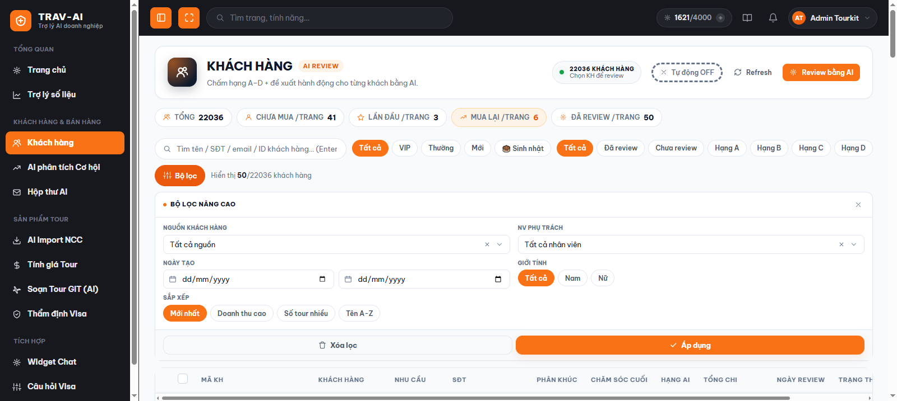
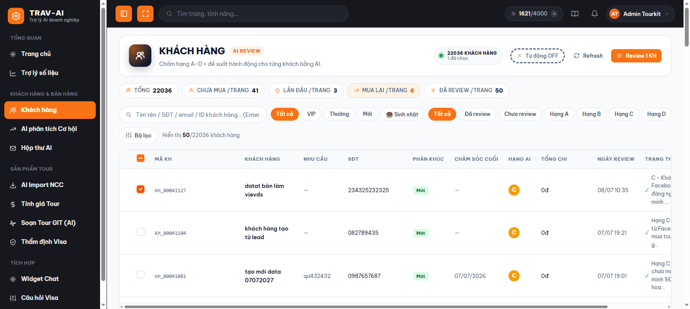
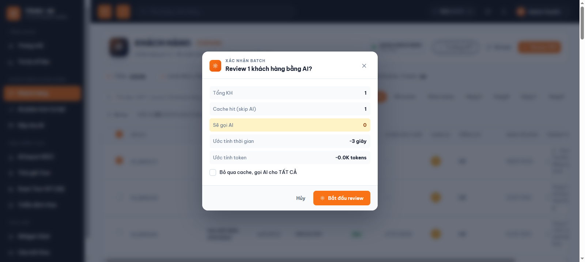
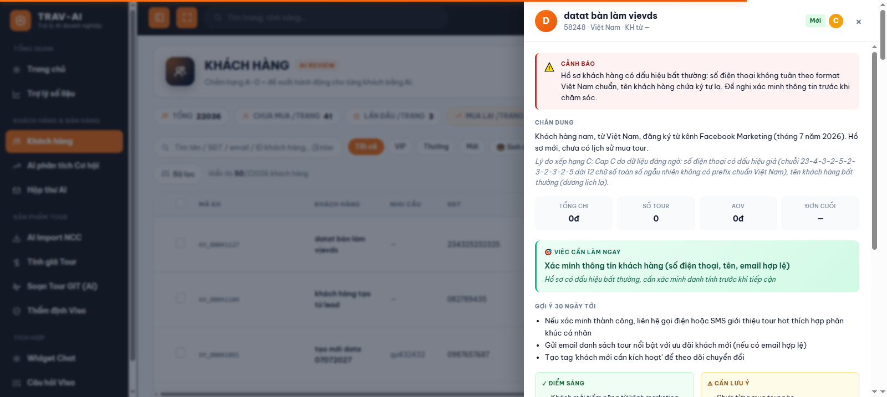
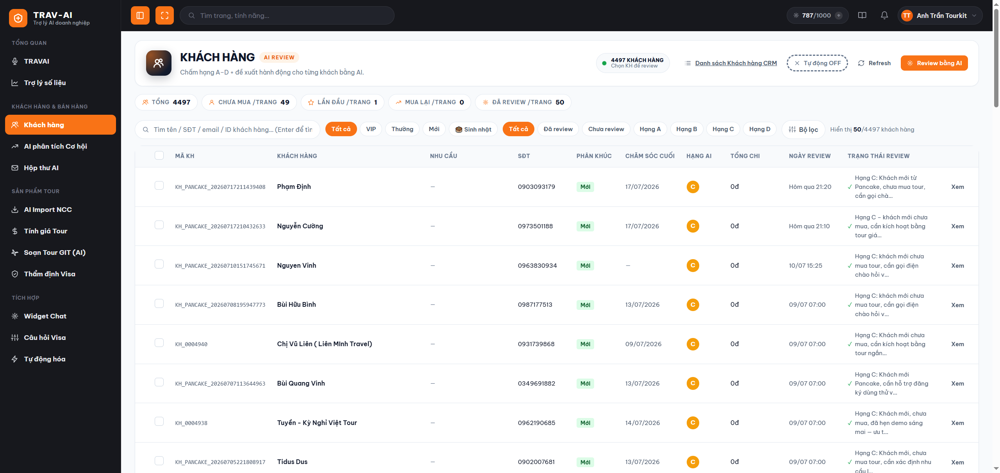

# Hướng dẫn sử dụng — Đánh giá khách hàng bằng AI

## 1. Tính năng này làm gì

Tính năng này dùng AI để **tự động chấm hạng khách hàng** (từ A đến D) dựa trên lịch sử mua tour, chi tiêu, và cách chăm sóc trước đó — giúp bạn nhanh chóng biết khách nào cần ưu tiên chăm sóc mà không phải tự ngồi rà từng đơn hàng.

Với mỗi khách hàng, AI sẽ đưa ra: hạng đánh giá (A/B/C/D), mức độ cần lưu ý (nếu có dấu hiệu bất thường), một đoạn "chân dung" mô tả khách hàng, việc nên làm ngay, vài gợi ý chăm sóc trong 30 ngày tới, điểm mạnh/điểm cần lưu ý, sở thích của khách và gợi ý sản phẩm/tour phù hợp.

Bạn có thể chấm từng khách một hoặc chọn nhiều khách để AI chấm hàng loạt cùng lúc, có thanh tiến trình để theo dõi.

## 2. Ai nên dùng

- **Nhân viên sale** cần biết nên ưu tiên gọi/chăm sóc khách nào trước.
- **Nhân viên chăm sóc khách hàng** muốn nắm nhanh "chân dung" và sở thích của một khách trước khi liên hệ.
- **Quản lý/điều hành** muốn có cái nhìn tổng quan về chất lượng tệp khách hàng (bao nhiêu khách hạng A, bao nhiêu khách cần chú ý).

## 3. Hướng dẫn sử dụng từng bước

### Bước 1 — Vào trang Khách hàng

Ở menu bên trái, chọn mục **"Khách hàng"** (nhóm "Khách hàng & Bán hàng"). Bạn cần đã đăng nhập vào hệ thống trước đó thì mới xem được danh sách khách hàng thật.

> 📸 Cần chụp: toàn màn hình trang Khách hàng với bảng danh sách, thanh lọc phía trên, và các cột (Mã KH, Khách hàng, Hạng AI, Trạng thái review...).

### Bước 2 — Tìm và lọc khách hàng cần xem

Bạn có thể:
- Gõ tên / số điện thoại / email / mã khách hàng vào ô tìm kiếm rồi nhấn Enter.
- Bấm các nhãn nhanh: **Tất cả / VIP / Thường / Mới** (theo phân khúc), **🎂 Sinh nhật** (khách có sinh nhật trong tháng).
- Bấm nhãn theo trạng thái review: **Tất cả / Đã review / Chưa review / Hạng A / Hạng B / Hạng C / Hạng D**.
- Bấm nút **"Bộ lọc"** để mở thêm bộ lọc nâng cao: nguồn khách hàng, nhân viên phụ trách, khoảng ngày tạo, giới tính, cách sắp xếp.

> 📸 Cần chụp: thanh tìm kiếm + các nhãn lọc nhanh (phân khúc, sinh nhật, hạng AI) + bảng lọc nâng cao đang mở.

### Bước 3 — Chọn khách hàng cần AI chấm

Tick vào ô vuông ở đầu mỗi dòng khách hàng bạn muốn AI chấm (có thể chọn nhiều khách cùng lúc). Muốn chọn hết khách trên trang đang xem, tick vào ô vuông ở đầu bảng (dòng tiêu đề).

Sau đó bấm nút **"Review [số khách] KH bằng AI"** ở góc trên bên phải.

> Lưu ý: với khách hàng **chưa từng được review**, bạn phải tick chọn và bấm nút này trước — chỉ khách đã có hạng AI mới bấm được trực tiếp vào dòng để xem chi tiết.

> 📸 Cần chụp: bảng danh sách với vài dòng đã tick chọn (checkbox xanh) + nút "Review N KH bằng AI" ở góc trên đang sáng.

### Bước 4 — Xác nhận trước khi chạy

Một hộp thoại hiện ra cho bạn xem trước: tổng số khách đã chọn, số khách sẽ **dùng lại kết quả cũ** (không tốn thêm gì vì dữ liệu chưa đổi), số khách sẽ thực sự được AI chấm mới, thời gian ước tính.

Nếu muốn AI chấm lại **toàn bộ** kể cả những khách đã có sẵn kết quả gần đây, tick vào ô **"Bỏ qua cache, gọi AI cho TẤT CẢ"**. Sau đó bấm **"Bắt đầu review"**.

> 📸 Cần chụp: hộp thoại xác nhận với các dòng số liệu (Tổng KH, Cache hit, Sẽ gọi AI, ước tính thời gian) + ô tick "Bỏ qua cache".

### Bước 5 — Theo dõi tiến trình

Trong lúc AI đang chấm, một thanh tiến trình hiện phía trên bảng, cho biết đang ở giai đoạn nào (Chờ → Đọc dữ liệu → AI đang chấm → Đang xử lý kết quả → Xong), tỉ lệ phần trăm hoàn thành, và danh sách khách đang được AI xử lý.

Bạn có thể bấm **"Hiện log"** để xem nhật ký chi tiết từng khách, hoặc bấm **"Dừng"** nếu muốn hủy giữa chừng.

> ⚠️ Nếu bạn rời trang (đóng tab, bấm nút quay lại, chuyển sang trang khác) trong lúc đang chạy, hệ thống sẽ hỏi xác nhận vì rời trang sẽ **dừng luôn tiến trình đang chạy dở**. Những khách đã chấm xong trước đó vẫn được lưu lại bình thường.

> 📸 Cần chụp: thanh pipeline 5 giai đoạn (Chờ/Đọc DL/AI/Parse/Xong) + thanh progress bar phần trăm + danh sách khách đang "Đang gọi AI".

### Bước 6 — Xem kết quả chi tiết một khách hàng

Sau khi chấm xong, khách hàng nào đã có hạng sẽ hiện huy hiệu màu (A xanh lá, B xanh dương, C cam, D đỏ) ở cột "Hạng AI". Bấm vào dòng khách đó (hoặc nút "Xem") để mở bảng chi tiết bên phải màn hình, gồm:

- Hạng và mức cảnh báo (nếu AI phát hiện điều cần chú ý đặc biệt).
- Đoạn mô tả "Chân dung" khách hàng và lý do xếp hạng.
- 4 số liệu nhanh: tổng chi tiêu, số tour đã mua, giá trị đơn trung bình, số ngày kể từ lần mua gần nhất.
- Ô **"Việc cần làm ngay"** — hành động ưu tiên AI gợi ý.
- Danh sách **gợi ý chăm sóc trong 30 ngày tới**.
- Hai cột **Điểm sáng** và **Cần lưu ý** về khách hàng.
- Sở thích & thói quen (nếu có đủ dữ liệu).
- Các **gợi ý sản phẩm/tour** phù hợp với khách.

> 📸 Cần chụp: bảng chi tiết (drawer) bên phải mở đầy đủ — từ phần cảnh báo, chân dung, 4 số liệu, việc cần làm ngay, đến điểm sáng/cần lưu ý.

### Bước 7 — Gửi phản hồi về đánh giá

Ở cuối bảng chi tiết, bấm **"👍 Hữu ích"** nếu đánh giá đúng thực tế, hoặc **"👎 Chưa chính xác"** nếu chưa đúng (khi bấm sẽ mở ô ghi lý do, không bắt buộc, rồi bấm "Gửi feedback"). Mỗi review chỉ gửi phản hồi được một lần.

### Bước 8 — Chấm lại khi dữ liệu khách hàng đã thay đổi

Nếu khách hàng có đơn hàng mới hoặc thông tin chăm sóc mới, cột "Trạng thái review" sẽ hiện **"Cần cập nhật"**. Mở chi tiết khách đó và bấm nút **"Cập nhật review"** ở cuối bảng để AI chấm lại theo dữ liệu mới nhất.

### Bước 9 — (Tùy chọn) Bật tự động chấm

Bấm nút **"Tự động"** ở góc trên cùng của trang để bật/tắt. Khi bật, mỗi lần bạn mở trang Khách hàng, hệ thống sẽ tự tìm và chấm những khách chưa có review — bạn không cần tick chọn thủ công. Cài đặt này được ghi nhớ riêng cho tài khoản của bạn.

> 📸 Cần chụp: nút "Tự động ON/OFF" ở góc trên cùng của trang, cạnh nút "Review bằng AI".

### Bước 10 — Mở khách hàng bên CRM để thao tác tiếp

Sau khi xem đánh giá, nếu bạn muốn cập nhật thông tin khách, xem lịch sử đơn hàng hay ghi chú chăm sóc thì đó là việc bên CRM TourKit. Có 2 lối tắt nhảy thẳng sang, đều **mở ra tab (thẻ) mới** nên vẫn giữ nguyên màn hình đánh giá đang xem:

- **Mở cả danh sách:** bấm nút **"Danh sách Khách hàng CRM"** ở góc trên bên phải trang — mở thẳng trang Khách hàng trên CRM.
- **Mở đúng khách đang xem:** khi đã mở bảng chi tiết đánh giá của một khách, bấm nút **"Xem khách hàng"** ở cuối bảng — CRM sẽ mở đúng hồ sơ khách đó để bạn thao tác ngay.

> 📸 Cần chụp: nút "Danh sách Khách hàng CRM" ở góc trên trang + nút "Xem khách hàng" trong bảng chi tiết đánh giá.

## 4. Lưu ý quan trọng / giới hạn

- **Cần đăng nhập trước.** Trang này lấy dữ liệu khách hàng thật từ hệ thống CRM — nếu phiên đăng nhập hết hạn, bạn cần đăng nhập lại mới xem/dùng tiếp được.
- **Chấm hàng loạt tối đa 200 khách hàng mỗi lần.** Nếu muốn chấm nhiều hơn, hãy chia thành nhiều đợt.
- **Kết quả được lưu lại (không chấm lại vô ích).** Nếu dữ liệu khách hàng chưa thay đổi kể từ lần chấm gần nhất, hệ thống sẽ dùng lại kết quả cũ thay vì gọi AI lần nữa — vừa nhanh hơn vừa không tốn thêm chi phí, trừ khi bạn chủ động tick "Bỏ qua cache" hoặc bấm "Cập nhật review".
- **Rời trang giữa chừng sẽ dừng tiến trình hàng loạt đang chạy.** Khách đã chấm xong vẫn được lưu, khách chưa tới lượt sẽ cần chấm lại sau.
- **Chỉ đánh giá được khách hàng có sẵn trong hệ thống CRM** — không hỗ trợ nhập tay thông tin khách để đánh giá.
- **Kết quả AI mang tính tham khảo, hỗ trợ ra quyết định** — không thay thế đánh giá và nghiệp vụ thực tế của nhân viên/quản lý.
- **Mỗi khách chỉ gửi phản hồi hữu ích/chưa chính xác được một lần** cho mỗi lần review — muốn gửi phản hồi mới, cần bấm "Cập nhật review" trước.
- Nếu công ty đã dùng hết lượt sử dụng AI trong kỳ, thao tác review có thể báo lỗi — liên hệ bộ phận quản trị/IT để được bổ sung thêm lượt dùng.
- **Nút "Danh sách Khách hàng CRM" / "Xem khách hàng" chỉ hiện khi bạn đã đăng nhập** — vì hệ thống dựa vào tài khoản đang đăng nhập để mở đúng CRM của công ty bạn. Nút mở CRM trong tab mới; nếu trình duyệt chặn cửa sổ bật lên (pop-up), hãy cho phép mở tab từ trang này.

## 5. Câu hỏi thường gặp (FAQ)

**Q: Vì sao tôi không bấm vào được dòng khách hàng để xem chi tiết?**
A: Khách hàng đó chưa từng được AI chấm nên chưa có gì để xem. Bạn cần tick chọn khách đó rồi bấm "Review bằng AI" trước, sau khi có hạng thì mới bấm vào dòng để mở chi tiết được.

**Q: Chấm lại cho khách đã có sẵn review thì có tốn thêm gì không?**
A: Không, nếu dữ liệu khách hàng chưa thay đổi thì hệ thống dùng lại kết quả cũ (không gọi AI mới), trừ khi bạn tick "Bỏ qua cache" khi chấm hàng loạt, hoặc bấm "Cập nhật review" trong bảng chi tiết.

**Q: Trạng thái "Cần cập nhật" ở cột trạng thái review nghĩa là gì?**
A: Nghĩa là khách hàng có thông tin mới (đơn hàng mới, chăm sóc mới...) kể từ lần AI chấm gần nhất. Bạn nên chấm lại để có đánh giá đúng với tình hình hiện tại.

**Q: Tôi có thể chấm nhiều khách hàng cùng lúc không?**
A: Có. Tick chọn nhiều dòng (hoặc tick ô "chọn tất cả" ở đầu bảng để chọn hết khách trên trang đang xem), rồi bấm "Review [số khách] KH bằng AI". Tối đa 200 khách một lần.

**Q: Tôi lỡ đóng tab lúc đang chấm hàng loạt thì có sao không?**
A: Trình duyệt sẽ hỏi xác nhận trước khi rời trang lúc đang chạy. Nếu bạn đồng ý rời, tiến trình dừng lại; các khách đã chấm xong trước đó vẫn được lưu, chỉ những khách chưa tới lượt là cần chấm lại.

**Q: Nút "Tự động" ở góc trên là gì?**
A: Khi bật, mỗi lần bạn mở trang Khách hàng, hệ thống tự tìm và chấm hạng cho những khách chưa có review, không cần bạn tự tick chọn. Cài đặt này lưu riêng theo tài khoản đăng nhập của bạn.

**Q: Mức cảnh báo trong bảng chi tiết là gì?**
A: Đây là lưu ý AI đưa ra khi phát hiện dấu hiệu cần chú ý đặc biệt ở khách hàng đó (ví dụ lâu chưa mua lại, có dấu hiệu không hài lòng...), giúp bạn ưu tiên chăm sóc khách đó trước.

**Q: Làm sao mở hồ sơ khách này bên CRM để cập nhật/chăm sóc tiếp?**
A: Bấm vào dòng khách (hoặc nút "Xem") để mở bảng chi tiết bên phải, rồi bấm nút **"Xem khách hàng"** ở cuối bảng — CRM TourKit sẽ mở đúng hồ sơ khách đó trong một tab mới. Nếu chỉ muốn xem cả danh sách khách bên CRM, bấm **"Danh sách Khách hàng CRM"** ở góc trên bên phải trang.

**Q: Tôi không thấy nút mở CRM đâu cả?**
A: Nút chỉ hiện khi bạn đã đăng nhập (hệ thống cần biết bạn thuộc công ty nào để mở đúng CRM). Nếu vẫn không thấy sau khi đăng nhập, kiểm tra xem trình duyệt có đang chặn mở tab mới từ trang này không.

**Q: Nếu tôi thấy đánh giá của AI không đúng thì làm gì?**
A: Bấm "👎 Chưa chính xác" ở cuối bảng chi tiết, ghi lý do (không bắt buộc) rồi gửi. Phản hồi của bạn giúp cải thiện chất lượng đánh giá về sau.
