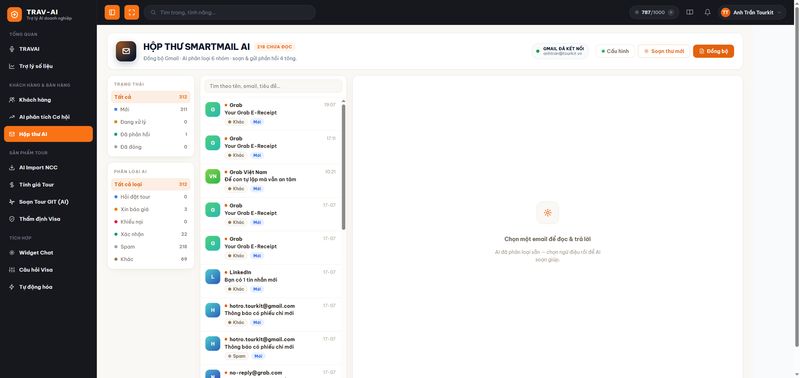
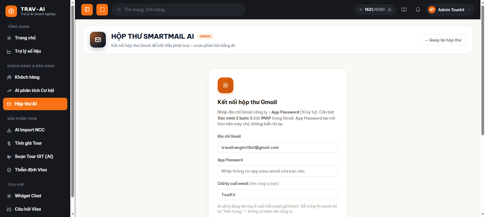
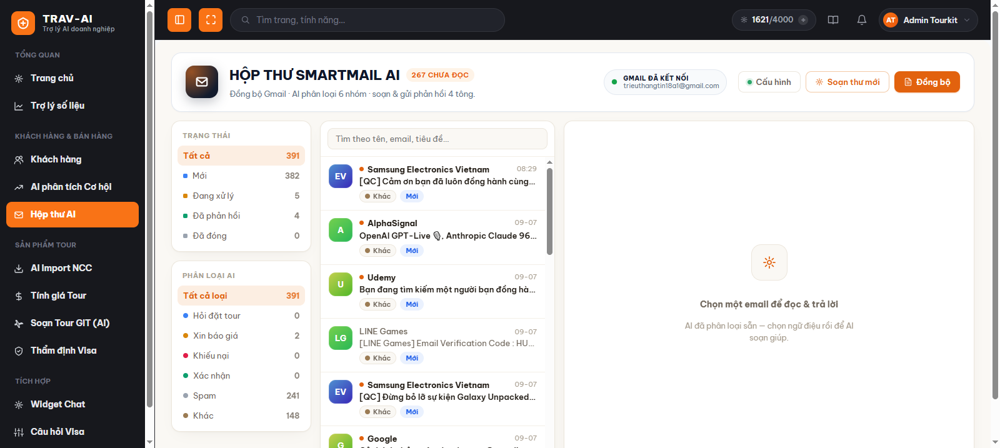
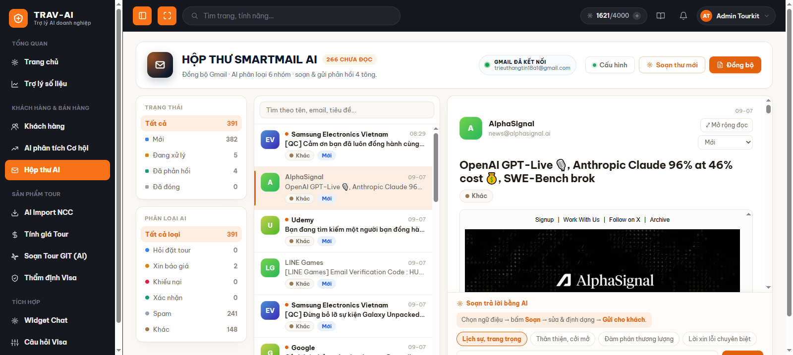
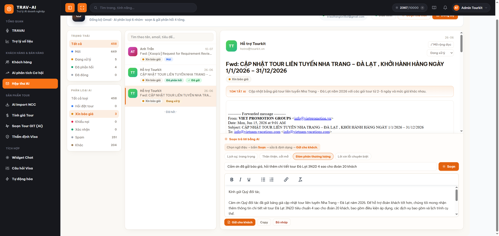
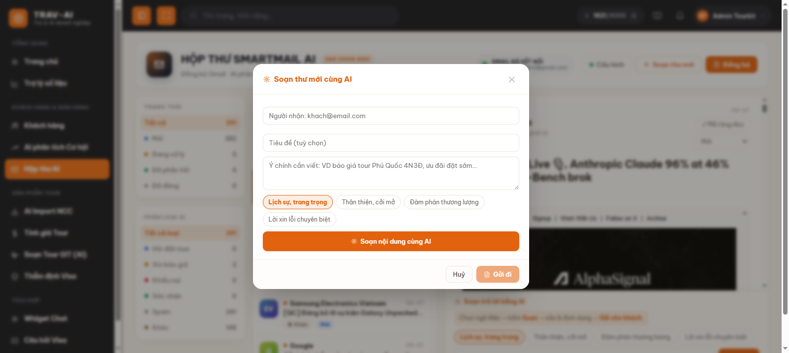

# Hướng dẫn sử dụng Hộp thư AI (SmartMail)

## 1. Tính năng này làm gì

Hộp thư AI kết nối với hộp thư Gmail công ty bạn, tự kéo email khách hàng gửi tới về, và **AI tự đọc + xếp loại từng email** vào 6 nhóm quen thuộc (hỏi đặt tour, xin báo giá, khiếu nại, xác nhận, spam, khác) — bạn không cần mở từng email để đoán xem cái nào cần xử lý trước. Khi cần trả lời, chỉ cần chọn ngữ điệu (lịch sự, thân thiện, đàm phán, xin lỗi) và gõ thêm vài chỉ thị, AI sẽ soạn sẵn một bản nháp để bạn xem lại, sửa rồi gửi — thay vì phải tự gõ từ đầu. Bạn cũng có thể nhờ AI soạn hẳn một email hoàn toàn mới để gửi cho khách.

Nói ngắn gọn: đỡ mất công lọc email thủ công, đỡ mất công soạn thư trả lời từ đầu — vẫn là bạn quyết định gửi gì, AI chỉ giúp bạn làm nhanh hơn.

## 2. Ai nên dùng

- Nhân viên sale, chăm sóc khách hàng, điều hành tour — những người hàng ngày nhận nhiều email hỏi tour, xin báo giá, khiếu nại và cần trả lời nhanh, đúng giọng điệu.
- Người phụ trách hộp thư chung của công ty (ví dụ `booking@congty.com`) muốn AI hỗ trợ phân loại và soạn nháp thay vì đọc thủ công từng email.
- Mỗi nhân viên kết nối **hộp thư Gmail của riêng mình** (hoặc hộp thư chung được cấp) — hộp thư của người này không lẫn với người khác dù cùng công ty.

## 3. Hướng dẫn sử dụng từng bước

### Bước 1 — Vào trang Hộp thư AI

Ở menu bên trái, chọn **"Hộp thư AI"** (nhóm Tích hợp), hoặc vào thẳng đường link `/mail`.

> 📸 Cần chụp: menu bên trái với mục "Hộp thư AI" được khoanh vùng.

### Bước 2 — Kết nối hộp thư Gmail (chỉ làm 1 lần)

Lần đầu vào trang, hệ thống sẽ hiện màn hình **"Kết nối hộp thư Gmail"**. Bạn cần:

1. Nhập **địa chỉ Gmail** công ty (ví dụ `booking@congty.com`).
2. Nhập **App Password** — đây KHÔNG PHẢI mật khẩu Gmail bạn dùng để đăng nhập hàng ngày, mà là một mã 16 ký tự riêng do Google cấp cho việc kết nối ứng dụng ngoài (xem mục Lưu ý bên dưới về cách tạo). Bấm vào link **"Tạo App Password ↗"** ngay dưới ô nhập nếu chưa có.
3. (Tùy chọn) Nhập **chữ ký cuối email** — ví dụ "Công ty Du lịch ABC · Hotline 1900 xxxx". AI sẽ tự ký đúng tên này ở cuối mỗi email soạn giúp bạn. Để trống thì email chỉ ký "Trân trọng," mà không có tên công ty.
4. Bấm **"Lưu & kết nối"**.

> 📸 Cần chụp: form "Kết nối hộp thư Gmail" đầy đủ 3 ô nhập (địa chỉ, App Password, chữ ký) + nút "Lưu & kết nối" + link "Tạo App Password ↗".

### Bước 3 — Đồng bộ email từ Gmail

Sau khi kết nối xong, bạn vào thẳng hộp thư (danh sách còn trống). Bấm nút **"Đồng bộ"** ở góc trên bên phải để kéo email mới nhất về.

Trong lúc đồng bộ, một thanh tiến trình sẽ hiện lên cho biết đang làm gì: đang kết nối Gmail → đang kéo email → đang phân loại từng email mới (kèm tên email đang xử lý) → hoàn tất. Xong việc, hệ thống báo cho bạn biết đã kéo về bao nhiêu email và có bao nhiêu email mới vừa được phân loại.

> 📸 Cần chụp: nút "Đồng bộ" đang bấm + thanh tiến trình hiện "Đang phân loại x/y · <tên email>".

### Bước 4 — Xem danh sách email đã phân loại

Danh sách email nằm ở cột giữa màn hình. Mỗi dòng cho bạn biết: người gửi, thời gian nhận, tiêu đề, **nhãn phân loại AI** (ví dụ "Hỏi đặt tour"), **trạng thái xử lý** (Mới / Đang xử lý / Đã phản hồi / Đã đóng), và có nháp trả lời chưa. Email chưa đọc được in đậm kèm chấm cam.

Ở cột trái, bạn có thể **lọc nhanh** theo trạng thái hoặc theo nhãn phân loại — mỗi mục đều có số lượng email đi kèm để bạn biết việc nào đang tồn đọng nhiều. Ô tìm kiếm phía trên danh sách giúp tìm theo tên người gửi, địa chỉ email hoặc tiêu đề.

> 📸 Cần chụp: toàn bộ 3 cột — bộ lọc trạng thái/phân loại bên trái, danh sách email ở giữa (có vài email chưa đọc in đậm), khung phải đang trống (chưa chọn email nào).

### Bước 5 — Mở một email để đọc

Bấm vào một email trong danh sách, nội dung sẽ hiện ở cột phải: người gửi, thời gian, tiêu đề, nhãn phân loại, một dòng **tóm tắt nhanh do AI viết**, và toàn bộ nội dung email. Email sẽ tự được đánh dấu **đã đọc** ngay khi bạn mở.

Nếu nội dung email dài, bấm **"⤢ Mở rộng đọc"** ở góc phải để ẩn tạm khung soạn trả lời, đọc thoải mái hơn; bấm lại **"⤡ Thu gọn"** để hiện lại khung soạn.

Bạn cũng có thể tự đổi **trạng thái xử lý** của email (Mới / Đang xử lý / Đã phản hồi / Đã đóng) bằng ô chọn ngay cạnh giờ nhận, không cần chờ AI soạn/gửi mới đổi được.

> 📸 Cần chụp: khung đọc bên phải hiện đầy đủ người gửi, tóm tắt AI, nội dung email, và ô chọn trạng thái.

### Bước 6 — Nhờ AI soạn nháp trả lời

Ở khung **"Soạn trả lời bằng AI"** phía dưới nội dung email:

1. Chọn một trong 4 **ngữ điệu**: Lịch sự trang trọng / Thân thiện cởi mở / Đàm phán thương lượng / Lời xin lỗi chuyên biệt.
2. (Tùy chọn) Gõ thêm **chỉ thị riêng** cho AI, ví dụ: "giảm 5%", "tặng thêm tour đảo", "hẹn khách chiều mai gọi lại".
3. Bấm nút **"Soạn"**. AI sẽ viết nội dung trả lời dần trên màn hình.

Khi AI viết xong, nội dung hiện trong một khung soạn thảo có định dạng (in đậm, gạch đầu dòng, chèn liên kết...) — bạn có thể **sửa trực tiếp** trước khi gửi.

> 📸 Cần chụp: khung "Soạn trả lời bằng AI" với 4 nút ngữ điệu, ô chỉ thị đã gõ nội dung, và bản nháp AI vừa soạn xong hiện trong khung soạn thảo.

### Bước 7 — Gửi trả lời cho khách

Xem lại và sửa nội dung nếu cần, sau đó bấm **"Gửi cho khách"**. Hệ thống sẽ hỏi xác nhận một lần nữa trước khi gửi thật. Sau khi gửi, email tự chuyển trạng thái sang **"Đã phản hồi"**.

Nếu chưa muốn gửi, bạn có thể **"Copy"** nội dung nháp để dùng nơi khác, hoặc bấm **"Bỏ nháp"** để xóa bản nháp AI vừa soạn (khi bỏ nháp, trạng thái email quay lại "Mới" nếu trước đó đang ở "Đang xử lý").

> 📸 Cần chụp: hộp xác nhận "Gửi email trả lời tới ..." cùng 3 nút Gửi cho khách / Copy / Bỏ nháp.

### Bước 8 — Soạn một email hoàn toàn mới

Ngoài trả lời email có sẵn, bạn có thể chủ động soạn email mới gửi cho bất kỳ ai. Bấm **"Soạn thư mới"** ở góc trên, một cửa sổ hiện ra:

1. Nhập **người nhận**, **tiêu đề** (tùy chọn).
2. Gõ **ý chính cần viết** — ví dụ "báo giá tour Phú Quốc 4 ngày 3 đêm, ưu đãi đặt sớm".
3. Chọn ngữ điệu, bấm **"Soạn nội dung cùng AI"**.
4. Xem, sửa nội dung nếu cần, rồi bấm **"Gửi đi"**.

> 📸 Cần chụp: cửa sổ "Soạn thư mới cùng AI" với các ô người nhận/tiêu đề/ý chính, nút ngữ điệu, và nội dung AI đã soạn.

## 4. Lưu ý quan trọng / giới hạn

- **Bắt buộc dùng App Password, không dùng mật khẩu Gmail thường.** Để lấy App Password, hộp thư Gmail của bạn phải **bật Xác minh 2 bước (2-Step Verification)** trước — vào phần bảo mật tài khoản Google để bật nếu chưa có. Sau đó vào trang "Mật khẩu ứng dụng" (App Passwords) của Google để tạo mã 16 ký tự. Link "Tạo App Password ↗" trên trang đã dẫn thẳng tới đúng bước này cho địa chỉ Gmail bạn vừa nhập.
- **App Password được mã hóa khi lưu trên hệ thống, không hiển thị lại được** — kể cả người quản trị cũng không xem lại được mã cũ, chỉ có thể nhập lại mã mới nếu cần đổi.
- **Mỗi nhân viên một hộp thư riêng.** Cấu hình Gmail bạn nhập chỉ áp dụng cho tài khoản đăng nhập của bạn — đồng nghiệp khác (dù cùng công ty) sẽ có hộp thư của họ, không nhìn thấy email của bạn và ngược lại.
- **Đồng bộ là thao tác chủ động, không tự động chạy nền theo mặc định.** Bạn cần bấm nút "Đồng bộ" mỗi khi muốn kéo email mới về (hoặc nhờ bộ phận IT/quản trị bật tính năng tự động đồng bộ định kỳ trong trang "Tự động hóa" — nếu công ty có bật tính năng này, một số email có thể được AI tự động soạn/gửi trả lời mà không cần bạn thao tác; nếu việc tự động này gặp lỗi, bạn sẽ thấy nhãn "Auto-reply lỗi" trên email đó).
- **Lần đồng bộ đầu tiên** sẽ kéo về khoảng 200 email gần nhất; các lần sau chỉ kéo email **mới hơn lần trước**, nên sẽ nhanh hơn nhiều và không bỏ sót.
- **AI chỉ phân loại email mới**, email đã phân loại từ lần đồng bộ trước sẽ không bị xếp loại lại (giữ nguyên nhãn cũ).
- **Cần đăng nhập hệ thống trước** — nếu phiên đăng nhập hết hạn, bạn cần đăng nhập lại mới thao tác được với hộp thư.
- **Nội dung email và số điện thoại khách hàng là thông tin nhạy cảm** — chỉ nên thao tác trên máy tính công ty, tránh để lộ khi màn hình đang mở cho người ngoài xem.
- Việc gửi trả lời/gửi thư mới đi qua **đúng địa chỉ Gmail bạn đã kết nối** — khách hàng nhận được email từ đúng hộp thư công ty, không phải một địa chỉ lạ.

## 5. Câu hỏi thường gặp (FAQ)

**Q: App Password là gì, tôi lấy ở đâu?**
A: Đó là một mã 16 ký tự do Google cấp riêng để các ứng dụng bên ngoài (như Hộp thư AI) kết nối vào Gmail của bạn một cách an toàn, khác với mật khẩu đăng nhập Gmail hàng ngày. Bạn cần bật "Xác minh 2 bước" cho tài khoản Gmail trước, sau đó bấm link "Tạo App Password ↗" ngay trên màn hình kết nối để Google dẫn bạn tới đúng trang tạo mã cho địa chỉ Gmail đã nhập.

**Q: Tôi bấm "Đồng bộ" nhưng báo lỗi, phải làm sao?**
A: Thường do App Password sai hoặc đã bị thu hồi (revoke) bên phía Google, hoặc hộp thư chưa bật IMAP. Vào lại mục "Cấu hình" (góc trên bên phải), nhập lại App Password mới. Nếu vẫn lỗi, kiểm tra Gmail đã bật "Truy cập IMAP" trong phần cài đặt Gmail chưa.

**Q: AI xếp sai nhóm cho một email, tôi có sửa được không?**
A: Hiện tại chưa có nút sửa nhãn phân loại thủ công — bạn vẫn có thể lọc/tìm email đó bằng ô tìm kiếm hoặc theo trạng thái, và tự đổi **trạng thái xử lý** (Mới/Đang xử lý/Đã phản hồi/Đã đóng) để theo dõi công việc bình thường dù nhãn phân loại chưa đúng ý.

**Q: Bản nháp AI soạn không đúng ý tôi, tôi có phải dùng nguyên văn không?**
A: Không. Sau khi AI soạn xong, bạn sửa trực tiếp trong khung soạn thảo (thêm/bớt chữ, định dạng in đậm, gạch đầu dòng...) trước khi bấm "Gửi cho khách" — bản nháp chỉ là gợi ý để bạn viết nhanh hơn, không bắt buộc giữ nguyên.

**Q: Tôi ngắt kết nối hộp thư, email cũ có bị mất không?**
A: Có 2 lựa chọn khi ngắt kết nối: **"Ngắt kết nối (giữ lịch sử)"** — chỉ xóa App Password, toàn bộ email đã đồng bộ vẫn còn, đăng nhập App Password mới sẽ thấy lại; hoặc **"Ngắt kết nối + xóa toàn bộ lịch sử mail"** — xóa luôn tất cả email đã lưu, không hoàn tác được. Hãy chọn đúng ý bạn, và nhớ vào Google · App passwords để thu hồi (revoke) App Password cũ cho an toàn.

**Q: Vì sao có email hiện nhãn "Auto-reply lỗi"?**
A: Nếu công ty bạn có bật tính năng tự động trả lời (cấu hình riêng trong trang "Tự động hóa"), một số email thuộc nhóm được chọn sẽ được AI tự soạn hoặc tự gửi mà không cần bạn thao tác. Nhãn này báo cho bạn biết lần tự động đó bị lỗi (ví dụ AI soạn thất bại) — bạn nên mở email đó và soạn/gửi trả lời thủ công như bình thường.

**Q: Tôi có thể trả lời một email bằng cách gõ tay hoàn toàn, không cần AI soạn không?**
A: Được. Bạn không bắt buộc bấm "Soạn" — nếu muốn, hãy liên hệ bộ phận kỹ thuật để xác nhận cách gõ tay trực tiếp phù hợp với quy trình công ty bạn; mặc định khung soạn thảo hiện ra ngay sau khi AI soạn xong lần đầu và cho phép sửa toàn bộ, kể cả xóa hết để viết lại từ đầu.

**Q: Hộp thư của tôi và đồng nghiệp có bị lẫn email của nhau không?**
A: Không. Mỗi người dùng kết nối hộp thư Gmail và thao tác riêng theo tài khoản đăng nhập của mình — email, nháp, trạng thái xử lý đều tách biệt theo từng người.
