# Hướng dẫn sử dụng Hộp thư chat đa kênh

## 1. Tính năng này làm gì

**Hộp thư chat** gom tin nhắn khách gửi từ **sáu nơi khác nhau** — Zalo OA, Facebook Messenger, Instagram, WhatsApp, TikTok và Telegram — về **một màn hình duy nhất**. Bạn không phải mở sáu ứng dụng, không phải chuyền tay nhau điện thoại công ty: mọi tin đều nằm cùng một chỗ và bạn trả lời ngay tại đó.

Kèm theo là một **trợ lý tự trả lời**: khách nhắn lúc nửa đêm hay lúc cả phòng đang bận, trợ lý vẫn chào hỏi và giữ chân khách; bạn vào sau và tiếp quản bất cứ lúc nào. Vừa gõ một câu là trợ lý tự im để khỏi nói đè lên bạn.

Ngoài ra bạn còn nhận việc / giao việc cho nhau, gắn nhãn khách, ghi chú nội bộ và nối hội thoại với hồ sơ khách hàng trong CRM — để lần sau ai mở lên cũng biết khách này là ai, đã nói tới đâu.

## 2. Ai nên dùng

- **Nhân viên sale, chăm sóc khách hàng** trực tin nhắn hằng ngày — muốn thấy hết khách đang chờ ở một chỗ, không sót ai.
- **Trưởng nhóm / quản lý bán hàng** muốn biết hội thoại nào đã có người nhận, hội thoại nào còn bỏ ngỏ, và ai đang xử lý cái gì.
- **Người quản trị hệ thống của công ty** — người khai kết nối kênh, viết lời dặn cho trợ lý và tạo mẫu trả lời nhanh cho cả đội (những việc này cần quyền cấu hình hệ thống).
- Công ty **chạy quảng cáo Facebook / TikTok / Zalo** và nhận tin từ nhiều nơi cùng lúc — đây chính là chỗ để gom lại.

## 3. Hướng dẫn sử dụng từng bước

### Bước 1 — Mở trang "Hộp thư chat"

Ở menu bên trái, nhóm **"Khách hàng & Bán hàng"**, chọn **"Hộp thư chat"** (địa chỉ `/chat-inbox`).

Màn hình chia làm bốn phần, từ trái sang phải:

- **Dải kênh** (cột hẹp ngoài cùng bên trái) — bấm một biểu tượng để chỉ xem tin của kênh đó, bấm lại để bỏ lọc.
- **Danh sách hội thoại** — ô tìm kiếm, các nút lọc, và từng khách một.
- **Khung chat** — nội dung trò chuyện với khách đang chọn.
- **Hồ sơ khách** (bên phải) — nhãn, ghi chú, thông tin khách. Ẩn/hiện bằng nút chữ **i** ở góc.

Ngay đầu trang có dòng đếm nhanh: bao nhiêu tin **chưa đọc**, tổng bao nhiêu **hội thoại** — chấm bên cạnh sáng lên khi còn tin chưa đọc.

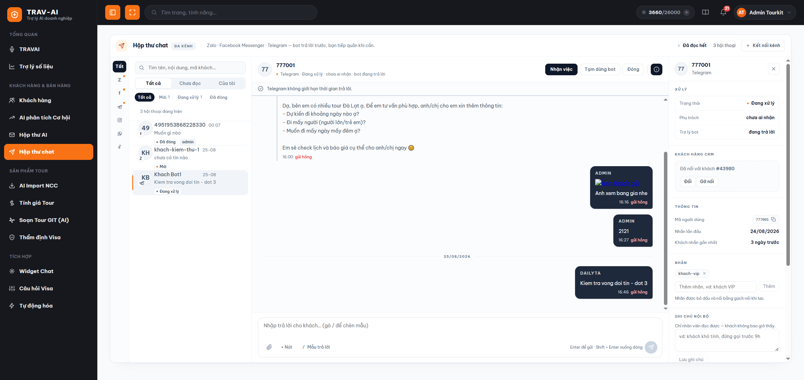

### Bước 2 — Mở "Cài đặt hộp thư"

Bấm nút **"Kết nối kênh"** ở góc trên bên phải. Một cửa sổ **"Cài đặt hộp thư"** hiện ra với **ba mục**:

- **Kênh** — nối Zalo, Facebook, Instagram, WhatsApp, TikTok, Telegram.
- **Trợ lý** — bật/tắt và dạy trợ lý về công ty bạn.
- **Mẫu trả lời** — soạn sẵn những câu hay dùng.

Đóng cửa sổ bằng nút **X** hoặc phím **Esc**.

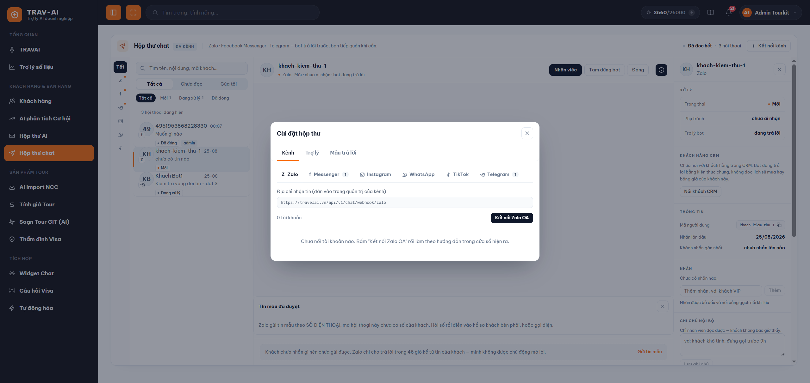

### Bước 3 — Nối Zalo, Facebook, WhatsApp hoặc TikTok (chỉ một nút)

Trong mục **Kênh**, chọn tab kênh bạn muốn nối rồi bấm nút xanh: **"Kết nối Zalo OA"**, **"Kết nối Facebook"**, **"Kết nối WhatsApp"** hoặc **"Kết nối TikTok"**.

1. Một cửa sổ nhỏ hiện ra — **đăng nhập tài khoản** của công ty bạn trên kênh đó.
2. Bấm **đồng ý** cho phép TourKit đọc và trả lời tin nhắn.
3. Riêng Facebook: chọn **Trang** bạn muốn nối (nối được nhiều Trang liên tiếp, không phải đăng nhập lại từ đầu). Riêng Zalo: chọn **OA**.
4. Quay lại cửa sổ Cài đặt, bấm mở lại tab kênh đó — tài khoản vừa nối đã có trong danh sách.

Bạn **không phải chép mã nào**, không phải vào trang dành cho lập trình viên của Zalo hay Facebook.

> Mỗi kênh nối được **nhiều tài khoản**: nhiều Trang Facebook cho từng chi nhánh, nhiều OA Zalo, nhiều bot Telegram cho từng đội sale. Đặt cho mỗi tài khoản một **Tên gợi nhớ** (ví dụ "Trang chi nhánh Q1") để sau này khỏi nhầm.

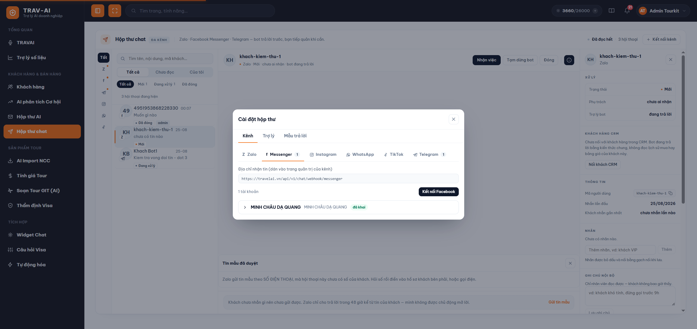

### Bước 4 — Nối Instagram (đi theo Trang Facebook)

Instagram **không nối riêng**. Bạn cứ nối Trang Facebook như Bước 3, hệ thống sẽ tự tìm tài khoản Instagram liên kết với Trang đó và đưa vào luôn — không thêm nút nào.

Để việc này chạy được, tài khoản Instagram của bạn phải đủ **ba điều kiện**:

- Là tài khoản **Instagram Professional** (không phải tài khoản cá nhân thường).
- Đã **liên kết với đúng Trang Facebook** mà bạn vừa nối.
- Đã bật **"Cho phép truy cập tin nhắn"** trong phần cài đặt của Instagram.

Thiếu một trong ba thì Facebook không trả tài khoản Instagram nào về, và tab Instagram vẫn trống.

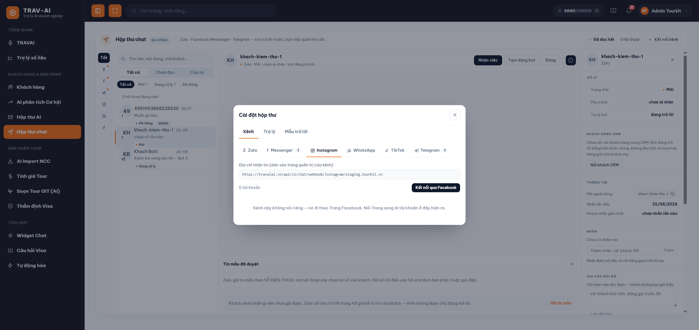

### Bước 5 — Nối Telegram (dán mã bot)

Telegram đi đường riêng, nhưng cũng chỉ mất một phút. Ngay trong tab Telegram có sẵn ba bước hướng dẫn:

1. Mở **@BotFather** trong ứng dụng Telegram.
2. Gửi lệnh **/newbot**, đặt tên hiển thị rồi đặt tên đăng nhập kết thúc bằng **bot**.
3. BotFather trả về **một dòng mã** — chép rồi dán vào ô **"Bot token"**.
4. (Nên làm) Điền **Tên gợi nhớ**, ví dụ "Bot đội sale lẻ".
5. Bấm **"Thêm tài khoản"**.

Bấm Lưu là xong — hệ thống tự kiểm tra mã và tự nối phần còn lại. Bạn **không phải gõ lệnh nào** bên ngoài trình duyệt.

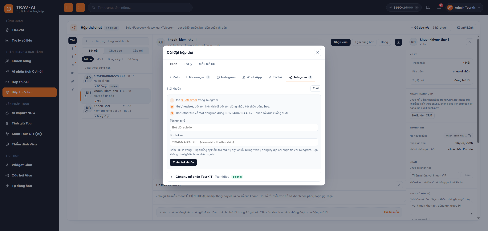

### Bước 6 — Dạy trợ lý về công ty bạn

Vào **Cài đặt hộp thư → Trợ lý**. Ở đây bạn khai:

1. **Trợ lý tự trả lời khách** — công tắc đầu tiên. Tắt thì tin vẫn vào hộp thư bình thường, chỉ là không ai trả lời hộ, nhân viên trực toàn bộ.
2. **Trợ lý cần biết gì về công ty bạn** — viết bằng tiếng Việt đời thường, mỗi ý một dòng. Ví dụ: *"Bên em chuyên tour Nhật – Hàn – Đài, khởi hành từ Hà Nội và TP.HCM. Xưng em, gọi khách là anh/chị. Không nhận đoàn dưới 10 khách. Khách hỏi visa thì hướng dẫn nộp hồ sơ trước 20 ngày."*
3. **Câu chào khách nhắn lần đầu** — bỏ trống thì vào thẳng phần trả lời.
4. **Nhân viên trả lời xong thì trợ lý im (phút)** — mặc định **30 phút**. Đây là khoảng thời gian trợ lý nhường hẳn cho bạn sau khi bạn gõ một câu.
5. **Trợ lý nhớ lại bao nhiêu tin gần nhất** — từ **2 đến 40** tin. Nhớ ít thì trợ lý không hiểu câu hỏi nối tiếp kiểu *"thế còn tháng 10?"*; nhớ nhiều thì tốn lượt AI hơn và dễ bám vào chuyện cũ.

Bấm **"Lưu"**.

> ⚠️ **Phần bạn viết là THÊM VÀO, không thay thế các luật an toàn.** Trợ lý **vẫn không bao giờ tự báo giá, lịch khởi hành hay số chỗ còn** — nó chưa đọc dữ liệu thật của công ty. Gặp câu hỏi cần số liệu, nó sẽ hẹn kiểm tra rồi báo lại, để bạn vào trả lời con số chính xác. Viết "tour Nhật 25 triệu" vào ô này cũng không làm trợ lý báo giá đâu.

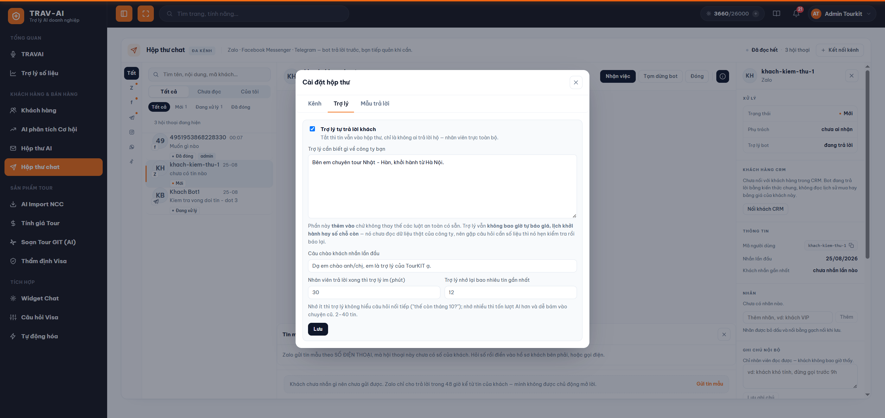

### Bước 7 — Soạn sẵn mẫu trả lời nhanh

Vào **Cài đặt hộp thư → Mẫu trả lời**, bấm **"+ Thêm mẫu"**:

1. **Gõ gì để gọi mẫu** — một chữ ngắn không dấu, ví dụ `gia`.
2. **Nội dung** — cả câu trả lời bạn hay dùng.
3. (Tùy chọn) Thêm **nút bấm** kèm theo: điền chữ trên nút, và đường dẫn nếu muốn nút mở một trang.
4. Bấm **"Lưu mẫu"**.

Từ đó, trong ô soạn tin, bạn chỉ cần gõ **`/gia`** là cả câu hiện ra sẵn, kèm nút nếu có. Mẫu dùng chung cho cả đội — một người sửa là cả đội đổi theo.

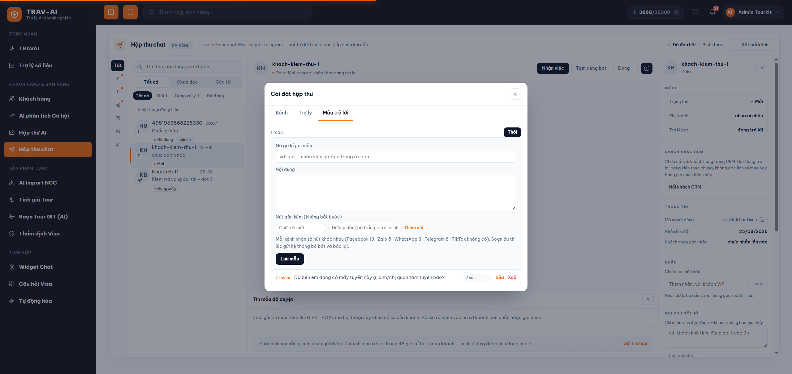

### Bước 8 — Tìm và lọc hội thoại

Ở cột danh sách, bạn có bốn cách thu hẹp:

- **Ô tìm kiếm** — gõ tên khách, nội dung tin hoặc mã khách.
- **Ba nút nhóm**: **Tất cả** · **Chưa đọc** (kèm số) · **Của tôi** (những hội thoại bạn đang nhận).
- **Bốn nút trạng thái**: **Tất cả** · **Mới** · **Đang xử lý** · **Đã đóng**.
- **Dải kênh bên trái** — bấm biểu tượng một kênh để chỉ xem kênh đó.

Mỗi dòng trong danh sách cho biết: ảnh đại diện kèm huy hiệu kênh, tên khách, giờ hoạt động gần nhất, câu nhắn cuối, trạng thái, tên người đang phụ trách, và nhãn **"bot tạm dừng"** nếu có. Tin chưa đọc được in đậm.

Danh sách dài thì bấm **"Tải thêm hội thoại"** ở cuối.

### Bước 9 — Trả lời khách

1. Bấm vào một hội thoại bên trái. Nội dung hiện ở khung giữa và hội thoại tự được đánh dấu **đã đọc**.
2. Đọc lướt: bong bóng **trắng bên trái** là khách; bong bóng **đậm bên phải** là phía công ty; câu do trợ lý trả lời có nhãn **"Bot đã trả lời"** để bạn biết ngay câu nào là máy nói.
3. Gõ câu trả lời vào ô soạn phía dưới.
4. Bấm **Enter** để gửi. Muốn xuống dòng thì **Shift + Enter**.

Dưới mỗi tin bạn gửi có dấu tích cho biết đã đi tới đâu: *đang gửi…* → *đã gửi* → *đã tới máy khách* → *khách đã xem*. Khi trợ lý đang soạn câu trả lời, khách nhìn thấy dấu **"đang gõ"** ở phía họ, nên không bị cảm giác bị bỏ rơi.

> Nhân viên trả lời **từ chính ứng dụng của kênh** (Zalo OA, Trang Facebook, WhatsApp trên điện thoại) thì tin đó **cũng hiện trong hộp thư** — cả đội vẫn thấy đủ mạch hội thoại, không ai bị mù thông tin.

### Bước 10 — Gửi ảnh, tệp và nút bấm

Ngay dưới ô soạn có hàng công cụ:

- **Biểu tượng ghim giấy** — chọn ảnh hoặc tệp. Tệp được tải lên trước và hiện ra để bạn **xem lại**, bấm gửi mới thật sự gửi đi. Bấm dấu **X** trên ô xem trước để bỏ tệp. Giới hạn **15MB** một tệp.
- **"+ Nút"** — gắn nút bấm dưới tin. Điền **chữ trên nút**, còn ô **đường dẫn** quyết định kiểu nút: **bỏ trống** = nút trả lời nhanh (khách bấm là coi như họ nhắn đúng câu ghi trên nút, trợ lý xử lý tiếp); **điền đường dẫn** = khách bấm là mở trang đó.
- **"/ Mẫu trả lời"** — mở danh sách mẫu đã soạn ở Bước 7 (hoặc gõ thẳng `/` ở đầu ô soạn).

Số nút mỗi kênh nhận được **khác nhau**: Facebook và Instagram 13 nút (còn 3 nếu trong đó có nút mở trang) · Telegram 8 · Zalo 5 · WhatsApp 3 và **không nhận nút mở trang** · TikTok không có nút. Bạn soạn dư thì hệ thống tự bỏ bớt và **báo lại cho bạn biết** đã bỏ mấy nút.

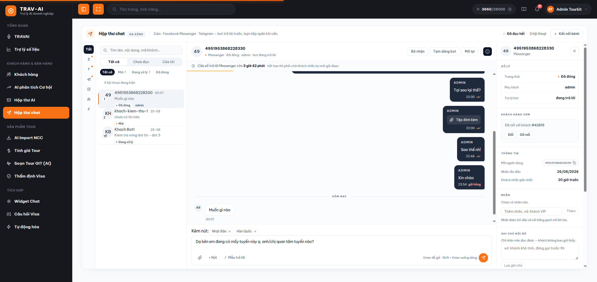

### Bước 11 — Xem hạn trả lời và gửi tin mẫu khi hết hạn

Ngay dưới tên khách có một **thanh thời hạn** cho biết bạn còn bao lâu để trả lời tự do, ví dụ *"Cửa sổ trả lời Zalo còn 41 giờ 18 phút"*. Nó **luôn hiện**, không đợi sắp hết mới báo — thấy sớm mới kịp làm gì đó.

Khi hết hạn, **ô soạn khoá lại** kèm câu giải thích rõ lý do, và có nút **"Gửi tin mẫu"**. Bấm vào đó:

1. Chọn một **mẫu đã được nền tảng duyệt** trong danh sách.
2. Điền các ô còn trống. Ô nào nền tảng có ví dụ sẵn thì hệ thống **điền trước giúp bạn**, chỉ việc sửa lại.
3. Bấm **"Gửi cho khách"**.

Mẫu đang **chờ duyệt** vẫn hiện trong danh sách nhưng mờ đi và chưa bấm được — để bạn biết là mình đã đăng ký rồi, khỏi đăng ký trùng.

> ⚠️ **Tin mẫu có thể tính phí và không thu hồi được.** Đọc kỹ trước khi bấm gửi.

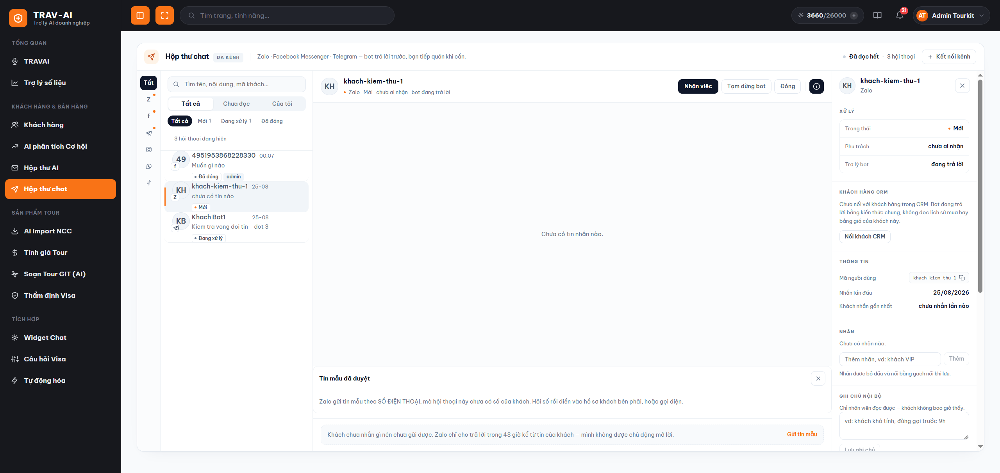

### Bước 12 — Nhận việc, đổi trạng thái, tạm dừng trợ lý

Trên đầu khung chat có bốn nút:

- **"Nhận việc"** — hội thoại này về tay bạn, tên bạn hiện trong danh sách để đồng nghiệp biết mà không nhảy vào. Bấm lại (**"Bỏ nhận"**) để nhả ra. Nếu người khác vừa nhận trước, hệ thống báo **tên người đang giữ** chứ không im lặng.
- **"Tạm dừng bot"** — bắt trợ lý im **30 phút** cho riêng hội thoại này. Bấm lại (**"Cho bot nói lại"**) để trả về bình thường.
- **"Đóng"** / **"Mở lại"** — chốt hội thoại đã xong hoặc mở lại khi khách quay lại.
- **Nút chữ i** — ẩn/hiện panel hồ sơ khách bên phải.

Ba trạng thái của một hội thoại là **Mới** · **Đang xử lý** · **Đã đóng**.

### Bước 13 — Gắn nhãn, ghi chú và nối khách với CRM

Mở panel **hồ sơ khách** bên phải (nút chữ **i**). Ở đó có:

- **Xử lý** — nhìn một cái là biết trạng thái, ai phụ trách, trợ lý đang trả lời hay đang tạm dừng.
- **Khách hàng CRM** — bấm **"Nối khách CRM"**, gõ tên, số điện thoại hoặc mã khách (từ 2 ký tự), chọn đúng người trong kết quả. Nối tay như vậy để không ghép nhầm hai khách trùng tên. Muốn đổi hoặc bỏ thì bấm **"Đổi"** / **"Gỡ nối"**.
- **Thông tin** — mã người dùng (bấm để chép), số điện thoại, email, lần nhắn đầu, lần nhắn gần nhất, và **"Đến từ"** (khách tới từ quảng cáo Facebook, liên kết, mã QR…) nếu kênh có báo.
- **Nhãn** — gõ nhãn rồi bấm **Thêm**, ví dụ "khách VIP". Nhãn được **bỏ dấu và nối bằng gạch nối** khi lưu, đó là bình thường chứ không phải lỗi gõ.
- **Ghi chú nội bộ** — **khách không bao giờ thấy**, ví dụ *"khách khó tính, đừng gọi trước 9h"*.
- **Nhật ký thao tác** — ai nhận việc, ai chuyển việc, ai đổi trạng thái, ai tạm dừng trợ lý, lúc nào.

> Nhãn và ghi chú gắn theo **khách**, không theo từng hội thoại — khách nhắn lại sau ba tháng thì nhãn cũ vẫn còn nguyên.

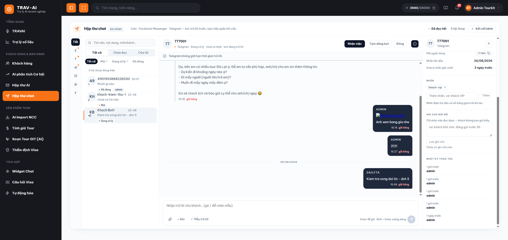

### Bước 14 — Lấy các đoạn chat cũ về (chỉ Facebook và Instagram)

Kênh mới nối chỉ nhận tin **từ lúc nối trở đi**. Muốn kéo các đoạn chat có từ trước:

1. Vào **Cài đặt hộp thư → Kênh**, chọn tab **Facebook** hoặc **Instagram**.
2. Bấm vào dòng tài khoản để mở phần cấu hình.
3. Bấm **"Lấy hội thoại cũ"**.
4. Chờ — việc này chạy ở phía sau và có thể **mất vài phút**. Nút hiện số hội thoại đã lấy được trong lúc chạy.
5. Xong, hệ thống báo đã lấy về bao nhiêu hội thoại. Nếu còn nữa, bấm lại lượt tiếp; tin đã có sẵn thì được bỏ qua, không bị trùng.

**Telegram, Zalo và TikTok không có nút này** — nền tảng của họ không cho đọc lại quá khứ. **WhatsApp** thì lấy được nhưng theo đường khác: chỉ khi công ty chuyển sang từ ứng dụng WhatsApp Business, và **chỉ trong 24 giờ đầu** kể từ lúc nối.

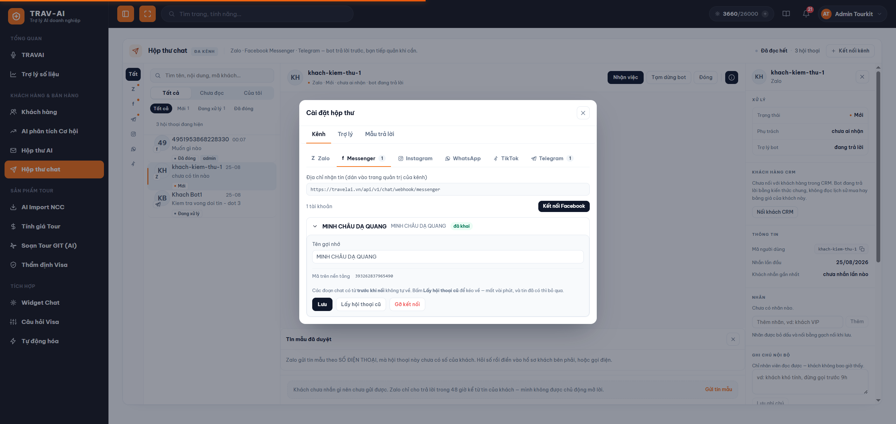

## 4. Lưu ý quan trọng / giới hạn

**Về quyền và điều kiện dùng**

- **Cần công ty được mở tính năng.** Không thấy mục "Hộp thư chat" trên menu nghĩa là công ty bạn chưa được bật — hỏi người quản trị hệ thống, không phải bạn làm sai.
- **Nối kênh, sửa cài đặt trợ lý và sửa mẫu trả lời đều cần quyền cấu hình hệ thống.** Nhân viên thường vẫn **xem** được các phần này và dùng hộp thư bình thường, chỉ là không lưu được thay đổi. Vào mục Kênh mà thấy dòng *"Chỉ tài khoản có quyền Cấu hình hệ thống mới khai được kết nối kênh"* thì nhờ người quản trị làm giúp.
- Nút **"Lấy hội thoại cũ"** chỉ hiện khi công ty được bật riêng phần này, vì nó tốn hạn mức gọi sang Facebook.

**Về hạn trả lời — chỗ hay thắc mắc nhất**

- **Zalo**: trả lời tự do trong **48 giờ** kể từ tin **của khách**.
- **Facebook Messenger và Instagram**: **24 giờ** cho trợ lý, nhưng **nhân viên vẫn nhắn tay được tới 7 ngày** kể từ tin của khách. Quá 24 giờ, thanh thời hạn sẽ ghi rõ *"giờ chỉ bạn trả lời được, trợ lý thì không"*.
- **WhatsApp**: **24 giờ**, không có phần nới thêm cho người thật — ngoài hạn phải dùng mẫu đã duyệt.
- **Telegram và TikTok**: **không giới hạn thời gian**.
- **Khách chưa nhắn gì thì chưa gửi được.** Các nền tảng không cho công ty chủ động mở lời trước. Đây là luật của họ, không phải hệ thống làm khó.
- Hết hạn thì ô soạn khoá lại kèm lý do, và đường duy nhất còn lại là **tin mẫu đã duyệt**.

**Về tin mẫu đã duyệt**

- Mẫu phải do công ty **tự đăng ký bên nền tảng** (Zalo ZNS, Meta Business) và **được họ duyệt**. Duyệt xong là mẫu tự hiện ở đây, bạn không phải khai lại.
- **Tin mẫu có thể tính phí và không thu hồi được.**
- **Zalo gửi tin mẫu theo SỐ ĐIỆN THOẠI**, không theo tài khoản Zalo. Hội thoại chưa có số của khách thì chưa gửi mẫu được, dù bạn vẫn biết khách là ai trên OA.
- **Instagram, Telegram và TikTok không có tin mẫu** — Telegram/TikTok thì không cần (không giới hạn thời gian), còn Instagram thì nền tảng không cấp mẫu nào.

**Về trợ lý tự trả lời**

- **Trợ lý không bao giờ tự báo giá, lịch khởi hành hay số chỗ còn.** Nó chưa đọc dữ liệu thật của công ty; gặp câu hỏi cần số liệu, nó hẹn kiểm tra rồi báo lại. Phần bạn tự viết trong cài đặt **không gỡ được** luật này.
- **Bạn gõ một câu là trợ lý im 30 phút** (chỉnh được từ 0 đến 24 giờ) — để hai bên không nói đè lên nhau.
- Trợ lý **không trả lời hội thoại đã đóng**, và **vẫn trả lời hội thoại đã có người nhận** cho tới khi người đó thật sự gõ một câu — vì "đã nhận việc" không có nghĩa người đó đang ngồi trước màn hình.
- Khách hay gõ liền mấy dòng ngắn ("cho hỏi tour Đà Nẵng" / "đi 4 ngày" / "2 người lớn"). Trợ lý **chờ khách gõ xong** rồi mới trả lời một lần cho cả cụm, nên có độ trễ vài giây — đó là cố ý.
- **Câu chào khách nhắn lần đầu hiện CHƯA CHẠY.** Bạn khai và lưu được, nhưng khách chưa nhận được câu chào đó. Đừng dựa vào nó cho tới khi có thông báo mới.

**Về từng kênh**

- **WhatsApp** cần tài khoản doanh nghiệp **đã xác minh** và một **số điện thoại riêng** — số đang dùng cho ứng dụng WhatsApp thường thì không nối được.
- **TikTok** cần ứng dụng TikTok for Business **đã được duyệt quyền nhắn tin**, và chỉ gửi được **chữ và ảnh**; tệp, âm thanh, video thì gửi đường dẫn bằng tin chữ.
- **Instagram** cần tài khoản Professional, đã liên kết Trang Facebook, đã bật "Cho phép truy cập tin nhắn". Kênh này **không có dấu "đã tới máy khách"** — tin nhảy thẳng từ *đã gửi* sang *khách đã xem*, và đó là đúng.
- **Telegram không bao giờ báo lại** việc khách đã nhận hay đã xem — dấu tích dừng ở *đã gửi* vĩnh viễn. Đừng kết luận "khách Telegram không đọc tin".
- **Zalo** cấp **hai khoá bí mật khác nhau** nếu công ty tự khai tay (một để gửi, một để nhận) — thiếu khoá nhận thì tin khách không vào hộp thư. Bình thường bấm một nút là xong, không phải đụng tới.
- **Bốn kênh WhatsApp, TikTok, Instagram và Telegram chưa được chạy thử đầy đủ với tài khoản thật.** Hãy **thử một cuộc trò chuyện** trước khi giao cho cả đội dùng.

**Khác**

- **Gỡ kết nối một tài khoản không xóa lịch sử chat** — chỉ ngừng nhận và gửi qua tài khoản đó. Hệ thống có hỏi xác nhận trước.
- **Tệp gửi tối đa 15MB.**
- Có đính kèm mà hiện *"chưa tải được"* nghĩa là kênh chưa khai đủ khoá hoặc tệp đã quá hạn bên nền tảng — hỏi lại khách gửi lần nữa.
- **Ghi chú nội bộ khách không bao giờ thấy**; ngược lại, mọi thứ bạn gõ trong **ô soạn** là gửi thẳng cho khách.
- Mở nhiều tab TourKit cùng lúc có thể làm hộp thư chậm — nên dùng **một tab** cho trang này.

## 5. Câu hỏi thường gặp (FAQ)

**Q: Tôi vừa nối kênh xong mà hộp thư vẫn trống, có phải hỏng không?**
A: Không. Kênh mới nối chỉ nhận tin **từ lúc nối trở đi** — hãy nhờ ai đó nhắn thử một câu vào Trang/OA/bot để kiểm tra. Riêng Facebook và Instagram thì có nút **"Lấy hội thoại cũ"** để kéo các đoạn chat cũ về (xem Bước 14); Telegram, Zalo và TikTok thì nền tảng không cho đọc lại quá khứ.

**Q: Vì sao ô soạn của tôi bị khoá, không gõ được?**
A: Vì đã hết hạn trả lời tự do của kênh đó (Zalo 48 giờ, Facebook/Instagram/WhatsApp 24 giờ kể từ tin của khách), hoặc khách **chưa nhắn gì lần nào**. Ngay trên ô soạn có ghi rõ lý do. Muốn liên hệ tiếp thì bấm **"Gửi tin mẫu"**, hoặc gọi điện cho khách.

**Q: Đã quá 24 giờ mà tôi vẫn gõ được cho khách Facebook, sao vậy?**
A: Đúng rồi. Facebook và Instagram cho **người thật** nhắn tiếp tới **7 ngày** kể từ tin của khách, chỉ trợ lý là không được. Thanh thời hạn sẽ ghi *"Quá 24 giờ — giờ chỉ bạn trả lời được, trợ lý thì không"*. Nên tranh thủ xử lý dứt điểm trong khoảng đó.

**Q: Tôi nối Instagram ở đâu? Tab Instagram không có nút kết nối.**
A: Instagram không nối riêng — nó **đi theo Trang Facebook**. Bạn nối Trang Facebook, hệ thống tự tìm tài khoản Instagram liên kết vào Trang đó. Nếu vẫn không thấy, kiểm tra ba điều: tài khoản phải là **Instagram Professional**, đã **liên kết đúng Trang**, và đã bật **"Cho phép truy cập tin nhắn"** trong cài đặt Instagram.

**Q: Trợ lý trả lời khách bằng thông tin sai / không đúng giọng công ty tôi, sửa ở đâu?**
A: Vào **Cài đặt hộp thư → Trợ lý**, viết vào ô **"Trợ lý cần biết gì về công ty bạn"**: chuyên tuyến nào, xưng hô ra sao, không nhận đoàn dưới bao nhiêu khách… Lưu là áp dụng ngay. Nhưng nhớ: dù bạn viết gì, trợ lý **vẫn không tự báo giá hay số chỗ còn**.

**Q: Trợ lý trả lời chen ngang lúc tôi đang nói chuyện với khách thì sao?**
A: Bình thường thì không xảy ra: bạn vừa gõ một câu là trợ lý tự im **30 phút**. Muốn chắc chắn hơn cho một hội thoại cụ thể, bấm **"Tạm dừng bot"** trên đầu khung chat. Muốn tắt hẳn cho cả công ty thì gạt công tắc trong Cài đặt hộp thư → Trợ lý.

**Q: Tôi bấm "Nhận việc" nhưng báo người khác đã nhận trước?**
A: Đúng như vậy — hệ thống cho biết **tên người đang giữ** hội thoại để hai người không cùng trả lời một khách. Trao đổi với đồng nghiệp đó, hoặc để họ bấm **"Bỏ nhận"** rồi bạn nhận lại.

**Q: Tôi trả lời khách từ điện thoại (app Zalo OA / Trang Facebook / WhatsApp), tin đó có vào hộp thư không?**
A: Có. Tin bạn gửi từ chính ứng dụng của kênh vẫn hiện trong hộp thư, nên cả đội đọc được đủ mạch hội thoại.

**Q: Tôi soạn 5 nút mà khách chỉ thấy 3, vì sao?**
A: Mỗi kênh nhận số nút khác nhau (Facebook/Instagram 13, còn 3 nếu có nút mở trang · Telegram 8 · Zalo 5 · WhatsApp 3 và không nhận nút mở trang · TikTok không có nút). Soạn dư thì hệ thống bỏ bớt để nền tảng khỏi từ chối **cả tin**, và có báo lại cho bạn biết đã bỏ mấy nút.

**Q: Nút bấm dưới tin khác gì nút mở đường dẫn?**
A: **Bỏ trống ô đường dẫn** = nút trả lời nhanh: khách bấm là coi như họ nhắn đúng câu ghi trên nút, trợ lý xử lý tiếp. **Điền đường dẫn** = khách bấm là mở trang đó. Trong lịch sử chat, nút trả lời nhanh chỉ hiện lại để bạn biết khách đã thấy gì (không bấm được), còn nút mở trang thì bạn bấm thử được.

**Q: Nhãn tôi gõ "Khách VIP" mà lưu thành "khach-vip", có phải lỗi không?**
A: Không. Nhãn được **bỏ dấu và nối bằng gạch nối** khi lưu, để nhân viên gõ nhanh không dấu vẫn tìm ra đúng nhãn đó. Hiển thị hơi khác lúc gõ, nhưng lọc và tìm kiếm thì luôn đúng.

**Q: Khách có đọc được ghi chú nội bộ của tôi không?**
A: Không bao giờ. Ghi chú nội bộ chỉ nhân viên trong hệ thống đọc được. Cứ ghi thật, ví dụ *"khách khó tính, đừng gọi trước 9h"*.

**Q: Nối hội thoại với khách hàng trong CRM để làm gì?**
A: Để mọi người biết người đang nhắn là ai trong hệ thống của công ty, tra ngược ra lịch sử mua và hồ sơ khách. Hệ thống **không tự đoán** mà để bạn chọn tay, vì khách du lịch trùng tên rất nhiều và các kênh chat thường không cho biết số điện thoại.

**Q: Gỡ kết nối một Trang/OA thì lịch sử chat có mất không?**
A: Không. Gỡ kết nối chỉ ngừng nhận và gửi qua tài khoản đó, **toàn bộ lịch sử chat với khách vẫn giữ nguyên**. Hệ thống có hỏi xác nhận trước khi gỡ.

**Q: Vì sao tin của tôi ở Telegram mãi không thấy "đã xem"?**
A: Vì Telegram **không báo lại** việc khách đã nhận hay đã xem — dấu tích của kênh này dừng ở *đã gửi* vĩnh viễn. Đây là giới hạn của Telegram, không phải khách chưa đọc.
