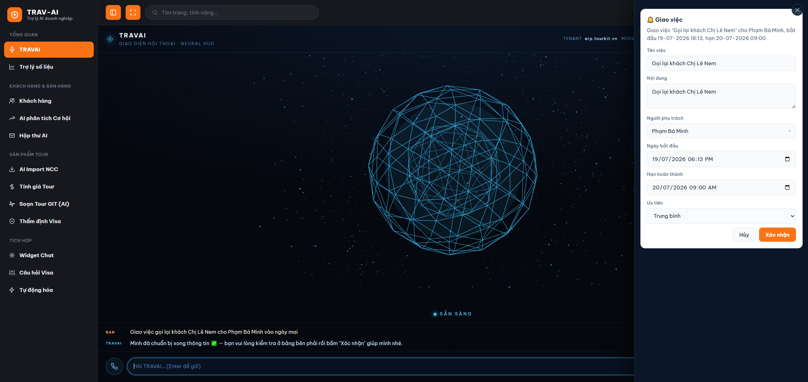

# Hướng dẫn sử dụng TRAVAI — trợ lý giọng nói

## 1. TRAVAI là gì

> **Tên đọc là "Trà vải"** (Tra-vai). Khi trò chuyện, trợ lý sẽ tự giới thiệu và đọc tên mình là "Trà vải".

TRAVAI là một trợ lý ảo bạn có thể **nói chuyện bằng giọng nói** hoặc gõ chữ để hỏi về số liệu công việc — doanh thu, khách hàng, tour sắp khởi hành, cơ hội bán hàng đang chờ... TRAVAI sẽ tìm số liệu thật trong hệ thống, trả lời bạn bằng chữ **và đọc to câu trả lời** để bạn không cần nhìn màn hình liên tục.

Không chỉ hỏi đáp, TRAVAI còn **làm được một số việc ngay bằng giọng nói**: chấm hạng khách hàng, chấm điểm cơ hội bán hàng (deal), kiểm tra hộp thư, trả lời/soạn email, giao việc cho nhân viên, tạo lịch hẹn chăm sóc khách. Các việc hướng ra ngoài (gửi email, giao việc, tạo lịch hẹn) luôn cần bạn bấm "Xác nhận" trước khi thực hiện — xem [Bước 3B](#bước-3b--nhờ-travai-làm-việc-không-chỉ-hỏi-số-liệu).

Bạn có thể tưởng tượng TRAVAI giống hệt "trợ lý số liệu" đang có (trang Trợ lý số liệu), chỉ khác là giao diện đẹp mắt hơn (có quả cầu ánh sáng phản ứng theo trạng thái) và trả lời có kèm giọng đọc, giúp bạn vừa nghe vừa làm việc khác — rảnh tay hơn, hỏi nhanh hơn khi cần con số gấp.

## 2. Ai nên dùng

- Nhân viên sale, chăm sóc khách hàng cần tra cứu nhanh số liệu (doanh thu, top khách hàng, tour sắp khởi hành...) mà không muốn gõ nhiều hoặc đang bận tay.
- Người thích **nghe** câu trả lời hơn là đọc chữ trên màn hình.
- Quản lý/điều hành muốn hỏi nhanh một câu trong lúc đang làm việc khác, không cần mở bảng số liệu.

## 3. Hướng dẫn sử dụng từng bước

### Bước 1 — Mở trang TRAVAI

Ở menu bên trái, mở nhóm **"Tổng quan"** rồi bấm mục **"TRAVAI (giọng nói)"** (có biểu tượng micro). Trang TRAVAI sẽ mở ra ngay.

Nếu thích, bạn cũng có thể vào nhanh bằng cách thêm `/travai` vào cuối địa chỉ trang chủ đang dùng. (Đường link cũ `/jarvis` vẫn vào được như trước — nhưng khuyến nghị dùng `/travai` cho đúng tên mới.)

Bạn cần **đã đăng nhập** vào hệ thống trước đó (đăng nhập TourKit như bình thường) thì mới vào được trang này.

> 📸 Cần chụp: menu bên trái mở nhóm "Tổng quan" với mục "TRAVAI (giọng nói)" được khoanh vùng; hoặc màn hình ngay sau khi trang TRAVAI load xong.

### Bước 2 — Làm quen với giao diện

Khi vào trang, bạn sẽ thấy:
- Một **quả cầu ánh sáng** ở giữa màn hình — đổi màu và chuyển động theo trạng thái của TRAVAI (đang chờ, đang nghe, đang suy nghĩ, đang trả lời).
- Dòng chữ trạng thái ngay dưới quả cầu: SẴN SÀNG / ĐANG NGHE / ĐANG SUY NGHĨ / ĐANG TRẢ LỜI.
- Thanh điều khiển phía trên cùng: nút bật/tắt "Luôn nghe", nút bật/tắt loa, nút chọn giọng đọc, nút "Nghe thử", nút "Mới" (xóa hội thoại đang có).
- Ô nhập câu hỏi và nút micro ở phía dưới cùng.

TRAVAI sẽ tự cất tiếng **chào bạn** ngay khi trang vừa mở xong (nếu loa đang bật).

> 📸 Cần chụp: toàn màn hình trang TRAVAI gồm quả cầu, thanh trạng thái, thanh điều khiển trên cùng, ô nhập câu hỏi.

### Bước 3 — Đặt câu hỏi

Bạn có 2 cách hỏi:
- **Gõ chữ**: nhập câu hỏi vào ô nhập ở dưới cùng rồi nhấn Enter (hoặc bấm nút mũi tên gửi).
- **Nói bằng giọng**: bấm nút micro cạnh ô nhập rồi nói rõ câu hỏi. Cách nói khác nhau một chút giữa máy tính và điện thoại:
  - **Trên máy tính (Chrome/Edge)**: bấm micro → nói → TRAVAI tự nhận diện và gửi câu hỏi **ngay khi bạn nói xong** — không cần bấm gửi.
  - **Trên điện thoại**: bấm micro để **bắt đầu thu âm** (nút chuyển sang trạng thái đang ghi) → nói xong **bấm micro lần nữa để dừng** → máy gửi bản ghi lên hệ thống nhận diện (hiện "Đang nhận diện…") rồi tự gửi câu hỏi cho bạn.

Nếu chưa biết hỏi gì, bạn có thể bấm vào các gợi ý có sẵn hiện ra khi mới vào trang, ví dụ "Doanh thu tháng này", "Top khách hàng", "Tour sắp khởi hành", "Cơ hội bán hàng đang chờ".

> 📸 Cần chụp: ô nhập câu hỏi có sẵn văn bản + nút micro đang sáng (trạng thái đang nghe), kèm vài gợi ý câu hỏi bên dưới khung chat.

### Bước 3B — Nhờ TRAVAI làm việc, không chỉ hỏi số liệu

Ngoài tra cứu số liệu, bạn có thể **ra lệnh cho TRAVAI thực hiện một số việc** ngay bằng giọng nói (hoặc gõ chữ). Cụ thể:

- **Chấm hạng khách hàng** — ví dụ nói *"Chấm hạng khách Nguyễn Văn A"*. TRAVAI sẽ đánh giá và đọc/hiện kết quả hạng (A–D) kèm gợi ý hành động.
- **Chấm điểm cơ hội bán hàng (deal)** — ví dụ *"Chấm điểm cơ hội của khách B"* để TRAVAI phân tích khả năng chốt và gợi ý bước tiếp theo.
- **Kiểm tra hộp thư** — ví dụ *"Có email nào mới không?"* để nghe nhanh các email cần xử lý.
- **Trả lời / soạn email** — ví dụ *"Trả lời email của khách C"* hoặc *"Soạn email báo giá gửi khách D"*. TRAVAI soạn sẵn nội dung để bạn duyệt.
- **Giao việc cho nhân viên** — ví dụ *"Giao việc gọi lại khách E cho bạn Lan"*.
- **Tạo lịch hẹn chăm sóc khách** — ví dụ *"Đặt lịch hẹn tư vấn khách F chiều mai"*.

Có hai kiểu hành động, khác nhau ở chỗ có phải xác nhận hay không:

- **Chạy ngay** (chỉ xem/không thay đổi ra ngoài): chấm hạng khách hàng, chấm điểm deal, kiểm tra hộp thư — TRAVAI làm luôn và trả kết quả.
- **Phải bấm "Xác nhận" trước** (việc hướng ra ngoài, khó thu hồi): gửi/soạn email, giao việc, tạo lịch hẹn. TRAVAI luôn **hiện một thẻ xác nhận** với đầy đủ thông tin (bạn có thể sửa lại nội dung/người nhận) — chỉ khi bạn chạm "Xác nhận" việc mới thực sự được gửi đi. Nếu TRAVAI chưa rõ bạn muốn chấm/giao cho ai (trùng tên, thiếu thông tin), nó sẽ **hỏi lại** chứ không tự đoán.

> **Lưu ý về quyền:** giao việc và tạo lịch hẹn cần tài khoản của bạn có **quyền tạo công việc / tạo nhắc hẹn** tương ứng (xem mục Lưu ý bên dưới). Các việc chấm điểm và xem mail thì mọi người dùng đều thực hiện được.

> 📸 Cần chụp: thẻ xác nhận hành động (ví dụ "Giao việc cho…" hoặc "Gửi email cho…") với các ô thông tin sửa được + nút "Xác nhận".

### Bước 4 — Nghe TRAVAI trả lời

Khi bạn gửi câu hỏi, quả cầu chuyển sang trạng thái "ĐANG SUY NGHĨ" (có thể phát vài câu nói ngắn kiểu "đang xử lý..." trong lúc chờ), sau đó TRAVAI trả lời bằng chữ hiện dần trên màn hình **và đọc to câu trả lời** (nếu loa đang bật). Bạn có thể hỏi tiếp câu khác ngay cả khi TRAVAI đang đọc — TRAVAI sẽ tự ngắt câu đang đọc để trả lời câu mới.

### Bước 5 — Chọn giọng đọc bạn thích

Ở thanh điều khiển trên cùng, nếu máy bạn có giọng đọc tiếng Việt, sẽ hiện thêm một ô chọn giọng và nút "Thử". Bạn có thể chọn giọng nam/nữ mình thích, rồi bấm "Thử" để nghe thử ngay mà không cần hỏi câu nào.

> 📸 Cần chụp: thanh điều khiển trên cùng có ô chọn giọng đọc đang mở danh sách + nút "Thử" được khoanh vùng.

### Bước 6 — Bật/tắt loa đọc

Nếu không muốn nghe đọc (ví dụ đang ở nơi cần yên tĩnh), bấm nút **LOA** trên thanh điều khiển để tắt — TRAVAI vẫn trả lời bằng chữ như bình thường, chỉ là không đọc to nữa. Bấm lại để bật lại bất cứ lúc nào. Trạng thái này được nhớ lại cho lần sau vào trang.

### Bước 7 — Bật chế độ "Luôn nghe" (rảnh tay hoàn toàn — chỉ trên máy tính)

Nếu muốn hỏi liên tục mà không cần bấm nút mỗi lần, bấm nút **"LUÔN NGHE: TẮT"** trên thanh điều khiển để bật lên "LUÔN NGHE: BẬT". Trình duyệt sẽ xin quyền dùng micro (chỉ hỏi lần đầu) — bạn cần bấm "Cho phép". Từ đó, cứ nói là TRAVAI tự nghe và trả lời, không cần bấm micro mỗi câu. TRAVAI sẽ tự tạm ngưng nghe trong lúc đang đọc trả lời (để không tự nghe nhầm giọng đọc của chính mình), rồi tự nghe lại khi đọc xong.

Lưu ý: chế độ "Luôn nghe" chỉ dùng được trên **máy tính** (Chrome/Edge). Trên **điện thoại**, nút này sẽ bị mờ và không bấm được — trên điện thoại bạn dùng cách bấm-để-nói ở Bước 3.

> 📸 Cần chụp: thanh điều khiển với nút "LUÔN NGHE: BẬT" đang sáng + thanh sóng âm hiển thị "Mời nói…" phía trên ô nhập.

### Bước 8 — Bắt đầu hội thoại mới

Muốn xóa hết câu hỏi/trả lời cũ để hỏi chủ đề khác, bấm nút **"MỚI"** ở thanh điều khiển trên cùng.

## 4. Lưu ý quan trọng / giới hạn

- **Cần đăng nhập trước.** TRAVAI dùng chung tài khoản đăng nhập với toàn bộ hệ thống — nếu phiên đăng nhập hết hạn, bạn sẽ được yêu cầu đăng nhập lại.
- **Nói để hỏi trên máy tính chỉ mượt nhất với Chrome hoặc Microsoft Edge.** Đây là các trình duyệt hỗ trợ nhận diện giọng nói tức thời (nói tới đâu nhận tới đó). Nếu máy tính dùng trình duyệt khác không hỗ trợ, bạn vẫn gõ chữ để hỏi được bình thường.
- **Trên điện thoại dùng cách bấm-để-nói (thu âm gửi máy chủ).** Trình duyệt điện thoại — nhất là iPhone — không hỗ trợ nhận diện giọng nói tức thời, nên TRAVAI chuyển sang cách thu âm rồi gửi lên hệ thống nhận diện cho ổn định: bấm micro để bắt đầu thu, bấm lần nữa để dừng và gửi. Vì vậy trên điện thoại **không có chế độ "Luôn nghe"** (nút bị mờ).
- **Cần cho phép quyền micro.** Lần đầu bấm micro hoặc bật "Luôn nghe", trình duyệt sẽ hỏi xin quyền dùng micro — bạn cần bấm "Cho phép" (Allow) thì mới nói được. Nếu lỡ chọn "Chặn" (Block), bạn cần vào phần cài đặt trang web của trình duyệt để bật lại quyền micro.
- **Giọng đọc tốt nhất khi dùng Microsoft Edge.** Edge có sẵn giọng đọc tiếng Việt tự nhiên (nghe gần giống người thật). Trình duyệt khác có thể không có giọng tiếng Việt cài sẵn trên máy — khi đó hệ thống sẽ tự chuyển sang đọc bằng dịch vụ đọc thành tiếng dự phòng ở máy chủ; nếu tất cả dịch vụ dự phòng đều chưa sẵn sàng, TRAVAI sẽ vẫn trả lời bằng chữ nhưng không đọc to được, và có thông báo nhắc bạn nên mở bằng Edge.
- **Cần bật loa/tai nghe** để nghe được câu trả lời.
- **Lần đầu vào trang có thể không tự đọc lời chào ngay.** Một số trình duyệt chặn tự phát âm thanh khi trang vừa mở — bạn chỉ cần bấm hoặc gõ bất kỳ đâu trên trang một lần, câu chào (và các câu trả lời sau đó) sẽ đọc bình thường.
- **Câu trả lời quá dài sẽ chỉ đọc một phần.** Nếu câu trả lời rất dài (khoảng hơn 2000 ký tự — tương đương vài đoạn văn dài), phần đọc to có thể bị cắt bớt ở cuối; tuy nhiên chữ hiển thị trên màn hình vẫn hiện đầy đủ, không bị mất nội dung.
- **Hỏi câu mới sẽ ngắt câu đang đọc/đang trả lời trước đó** — đây là chủ ý để bạn không phải chờ, không phải lỗi.
- **Các thao tác giao việc / tạo lịch hẹn cần quyền tương ứng.** Khi bạn nhờ TRAVAI giao việc cho nhân viên hoặc đặt lịch hẹn chăm sóc khách hàng, hệ thống luôn hiện thẻ xác nhận để bạn duyệt trước; và các thao tác này chỉ chạy được nếu tài khoản của bạn có **quyền tạo công việc / tạo nhắc hẹn**. Thiếu quyền thì khi xác nhận sẽ báo không đủ quyền — hãy liên hệ người quản trị để được cấp. Các việc chỉ xem (hỏi số liệu, xem mail, chấm điểm) thì không cần quyền này.

## 5. Câu hỏi thường gặp (FAQ)

**Q: Tên "TRAVAI" đọc như thế nào?**
A: Đọc là "Trà vải" (giống tên quả trà vải). Khi trả lời bằng giọng nói, trợ lý cũng tự đọc tên mình là "Trà vải".

**Q: Micro không nhận giọng nói của tôi thì sao?**
A: Nếu dùng máy tính, hãy kiểm tra bạn đang dùng Chrome hoặc Microsoft Edge. Sau đó kiểm tra trình duyệt đã được cấp quyền micro chưa — nếu trước đó bạn chọn "Chặn", cần vào cài đặt trang web để bật lại quyền micro rồi tải lại trang. Trên điện thoại, nhớ bấm micro lần nữa để dừng thu âm thì máy mới gửi bản ghi đi nhận diện.

**Q: TRAVAI có làm được việc gì ngoài trả lời số liệu không?**
A: Có. Bạn có thể nhờ TRAVAI **chấm hạng khách hàng**, **chấm điểm cơ hội bán hàng (deal)**, **kiểm tra hộp thư**, **trả lời/soạn email**, **giao việc cho nhân viên** và **tạo lịch hẹn chăm sóc khách** — ngay bằng giọng nói. Việc chấm điểm và xem mail chạy luôn; còn gửi email, giao việc, tạo lịch hẹn thì TRAVAI hiện thẻ xác nhận để bạn duyệt (và sửa lại nếu cần) trước khi thực hiện. Xem chi tiết ở Bước 3B.

**Q: Nhờ TRAVAI giao việc / tạo lịch hẹn nhưng nó báo không đủ quyền?**
A: Hai thao tác này cần tài khoản của bạn có **quyền tạo công việc / tạo nhắc hẹn** trong hệ thống. Nếu chưa có, hãy liên hệ người quản trị của công ty để được cấp. Các việc chấm điểm khách/deal và xem mail thì không cần quyền này.

**Q: Trên điện thoại nói mãi mà không thấy gửi câu hỏi?**
A: Trên điện thoại, TRAVAI thu âm cho tới khi bạn **bấm micro lần thứ hai để dừng**. Sau khi dừng, máy sẽ hiện "Đang nhận diện…" một chút rồi tự gửi câu hỏi. Nếu bạn chỉ bấm một lần rồi để đó, máy sẽ vẫn đang thu âm chứ chưa gửi.

**Q: Đổi giọng đọc ở đâu?**
A: Trên thanh điều khiển phía trên cùng, có một ô chọn giọng (chỉ hiện khi máy bạn có giọng tiếng Việt). Chọn giọng bạn thích, bấm nút "Thử" để nghe thử ngay.

**Q: Vì sao vừa vào trang mà không nghe TRAVAI chào?**
A: Trình duyệt thường chặn phát âm thanh tự động khi trang mới mở. Bạn chỉ cần bấm/gõ vào bất kỳ chỗ nào trên trang, tiếng chào (và các câu trả lời sau) sẽ phát bình thường từ đó.

**Q: Dùng TRAVAI có tốn phí gì không?**
A: Về phía bạn thì không — giọng đọc chính đang dùng là miễn phí (chạy ngay trên trình duyệt Edge, hoặc dịch vụ đọc thành tiếng miễn phí phía máy chủ). Bạn không cần quan tâm chi phí khi sử dụng bình thường.

**Q: TRAVAI trả lời sai hoặc không đúng số liệu tôi cần thì sao?**
A: Hãy hỏi càng cụ thể càng tốt (tên khách hàng, khoảng thời gian, loại số liệu...) để TRAVAI chọn đúng nguồn dữ liệu. Nếu vẫn thấy số liệu không khớp thực tế, hãy phản hồi lại cho bộ phận quản trị/IT để kiểm tra.

**Q: Tôi mở link cũ `/jarvis` thì có sao không?**
A: Không sao — link cũ `/jarvis` vẫn vào được trang này bình thường (được giữ lại làm đường tắt). Nhưng bạn nên dùng mục "TRAVAI (giọng nói)" trong menu, hoặc địa chỉ `/travai` cho đúng tên mới.

**Q: Chế độ "Luôn nghe" khác gì so với bấm micro từng câu?**
A: Bấm micro cạnh ô nhập là hỏi từng câu một — bấm, nói, TRAVAI gửi. "Luôn nghe" là chế độ rảnh tay hoàn toàn: bật lên một lần, sau đó cứ nói là TRAVAI tự nghe và trả lời liên tục, không cần bấm nút mỗi lần hỏi. Chế độ này chỉ có trên máy tính (Chrome/Edge); trên điện thoại nút bị mờ nên bạn dùng cách bấm-để-nói.

**Q: Tôi muốn tắt tiếng đọc nhưng vẫn xem được câu trả lời bằng chữ, có được không?**
A: Được. Bấm nút "LOA" trên thanh điều khiển để tắt — TRAVAI vẫn trả lời đầy đủ bằng chữ, chỉ ngừng đọc to.

**Q: Làm sao xóa hội thoại cũ để hỏi chủ đề khác cho gọn?**
A: Bấm nút "MỚI" ở thanh điều khiển trên cùng để xóa toàn bộ hội thoại đang hiển thị và bắt đầu lại từ đầu.
