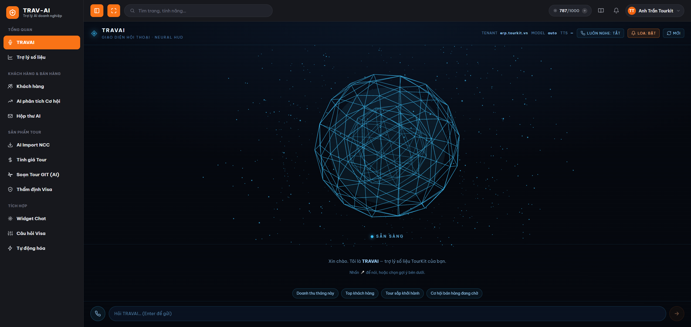
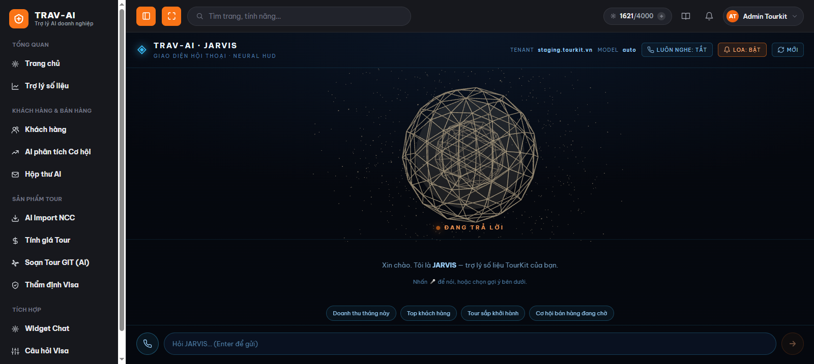
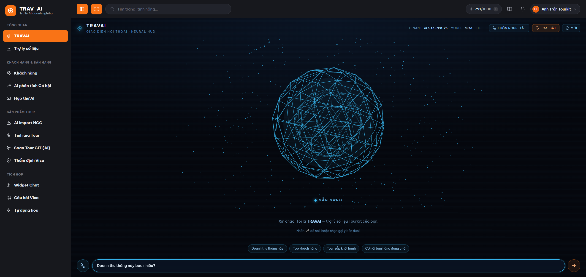

# Hướng dẫn sử dụng JARVIS — trợ lý giọng nói

## 1. JARVIS là gì

JARVIS là một trợ lý ảo bạn có thể **nói chuyện bằng giọng nói** hoặc gõ chữ để hỏi về số liệu công việc — doanh thu, khách hàng, tour sắp khởi hành, cơ hội bán hàng đang chờ... JARVIS sẽ tìm số liệu thật trong hệ thống, trả lời bạn bằng chữ **và đọc to câu trả lời** để bạn không cần nhìn màn hình liên tục.

Bạn có thể tưởng tượng JARVIS giống hệt "trợ lý số liệu" đang có (trang Trợ lý số liệu), chỉ khác là giao diện đẹp mắt hơn (có quả cầu ánh sáng phản ứng theo trạng thái) và trả lời có kèm giọng đọc, giúp bạn vừa nghe vừa làm việc khác — rảnh tay hơn, hỏi nhanh hơn khi cần con số gấp.

## 2. Ai nên dùng

- Nhân viên sale, chăm sóc khách hàng cần tra cứu nhanh số liệu (doanh thu, top khách hàng, tour sắp khởi hành...) mà không muốn gõ nhiều hoặc đang bận tay.
- Người thích **nghe** câu trả lời hơn là đọc chữ trên màn hình.
- Quản lý/điều hành muốn hỏi nhanh một câu trong lúc đang làm việc khác, không cần mở bảng số liệu.

> Lưu ý: JARVIS hiện là tính năng đang thử nghiệm, **chưa có trong menu điều hướng** của ứng dụng — bạn cần được cung cấp đường link trực tiếp để vào (xem Bước 1 bên dưới).

## 3. Hướng dẫn sử dụng từng bước

### Bước 1 — Mở trang JARVIS

Vì JARVIS chưa nằm trong menu bên trái, bạn hãy vào bằng đường link `/jarvis` (thêm `/jarvis` vào cuối địa chỉ trang chủ đang dùng), hoặc dùng link được quản trị viên/IT gửi cho bạn. Bạn cần **đã đăng nhập** vào hệ thống trước đó (đăng nhập TourKit như bình thường) thì mới vào được trang này.

> 📸 Cần chụp: màn hình gõ địa chỉ .../jarvis trên thanh địa chỉ trình duyệt, hoặc màn hình ngay sau khi trang JARVIS load xong.

### Bước 2 — Làm quen với giao diện

Khi vào trang, bạn sẽ thấy:
- Một **quả cầu ánh sáng** ở giữa màn hình — đổi màu và chuyển động theo trạng thái của JARVIS (đang chờ, đang nghe, đang suy nghĩ, đang trả lời).
- Dòng chữ trạng thái ngay dưới quả cầu: SẴN SÀNG / ĐANG NGHE / ĐANG SUY NGHĨ / ĐANG TRẢ LỜI.
- Thanh điều khiển phía trên cùng: nút bật/tắt "Luôn nghe", nút bật/tắt loa, nút chọn giọng đọc, nút "Nghe thử", nút "Mới" (xóa hội thoại đang có).
- Ô nhập câu hỏi và nút micro ở phía dưới cùng.

JARVIS sẽ tự cất tiếng **chào bạn** ngay khi trang vừa mở xong (nếu loa đang bật).

> 📸 Cần chụp: toàn màn hình trang JARVIS gồm quả cầu, thanh trạng thái, thanh điều khiển trên cùng, ô nhập câu hỏi.

### Bước 3 — Đặt câu hỏi

Bạn có 2 cách hỏi:
- **Gõ chữ**: nhập câu hỏi vào ô nhập ở dưới cùng rồi nhấn Enter (hoặc bấm nút mũi tên gửi).
- **Nói bằng giọng**: bấm nút micro (hình điện thoại) ở góc trái ô nhập, nói rõ câu hỏi, JARVIS sẽ tự nhận diện và gửi câu hỏi ngay khi bạn nói xong — không cần bấm gửi.

Nếu chưa biết hỏi gì, bạn có thể bấm vào các gợi ý có sẵn hiện ra khi mới vào trang, ví dụ "Doanh thu tháng này", "Top khách hàng", "Tour sắp khởi hành", "Cơ hội bán hàng đang chờ".

> 📸 Cần chụp: ô nhập câu hỏi có sẵn văn bản + nút micro đang sáng (trạng thái đang nghe), kèm vài gợi ý câu hỏi bên dưới khung chat.

### Bước 4 — Nghe JARVIS trả lời

Khi bạn gửi câu hỏi, quả cầu chuyển sang trạng thái "ĐANG SUY NGHĨ" (có thể phát vài câu nói ngắn kiểu "đang xử lý..." trong lúc chờ), sau đó JARVIS trả lời bằng chữ hiện dần trên màn hình **và đọc to câu trả lời** (nếu loa đang bật). Bạn có thể hỏi tiếp câu khác ngay cả khi JARVIS đang đọc — JARVIS sẽ tự ngắt câu đang đọc để trả lời câu mới.

### Bước 5 — Chọn giọng đọc bạn thích

Ở thanh điều khiển trên cùng, nếu máy bạn có giọng đọc tiếng Việt, sẽ hiện thêm một ô chọn giọng và nút "Thử". Bạn có thể chọn giọng nam/nữ mình thích, rồi bấm "Thử" để nghe thử ngay mà không cần hỏi câu nào.

> 📸 Cần chụp: thanh điều khiển trên cùng có ô chọn giọng đọc đang mở danh sách + nút "Thử" được khoanh vùng.

### Bước 6 — Bật/tắt loa đọc

Nếu không muốn nghe đọc (ví dụ đang ở nơi cần yên tĩnh), bấm nút **LOA** trên thanh điều khiển để tắt — JARVIS vẫn trả lời bằng chữ như bình thường, chỉ là không đọc to nữa. Bấm lại để bật lại bất cứ lúc nào. Trạng thái này được nhớ lại cho lần sau vào trang.

### Bước 7 — Bật chế độ "Luôn nghe" (rảnh tay hoàn toàn)

Nếu muốn hỏi liên tục mà không cần bấm nút mỗi lần, bấm nút **"LUÔN NGHE: TẮT"** trên thanh điều khiển để bật lên "LUÔN NGHE: BẬT". Trình duyệt sẽ xin quyền dùng micro (chỉ hỏi lần đầu) — bạn cần bấm "Cho phép". Từ đó, cứ nói là JARVIS tự nghe và trả lời, không cần bấm micro mỗi câu. JARVIS sẽ tự tạm ngưng nghe trong lúc đang đọc trả lời (để không tự nghe nhầm giọng đọc của chính mình), rồi tự nghe lại khi đọc xong.

> 📸 Cần chụp: thanh điều khiển với nút "LUÔN NGHE: BẬT" đang sáng + thanh sóng âm hiển thị "Mời nói…" phía trên ô nhập.

### Bước 8 — Bắt đầu hội thoại mới

Muốn xóa hết câu hỏi/trả lời cũ để hỏi chủ đề khác, bấm nút **"MỚI"** ở thanh điều khiển trên cùng.

## 4. Lưu ý quan trọng / giới hạn

- **Cần đăng nhập trước.** JARVIS dùng chung tài khoản đăng nhập với toàn bộ hệ thống — nếu phiên đăng nhập hết hạn, bạn sẽ được yêu cầu đăng nhập lại.
- **Chưa có trong menu.** Hiện tại JARVIS chỉ vào được bằng đường link trực tiếp, chưa xuất hiện ở thanh menu bên trái.
- **Nói để hỏi (micro) chỉ dùng được trên trình duyệt Chrome hoặc Microsoft Edge.** Các trình duyệt khác (Firefox, Safari...) sẽ báo lỗi không hỗ trợ khi bấm micro hoặc bật "Luôn nghe" — trong trường hợp này bạn vẫn gõ chữ để hỏi được bình thường.
- **Cần cho phép quyền micro.** Lần đầu bấm micro hoặc bật "Luôn nghe", trình duyệt sẽ hỏi xin quyền dùng micro — bạn cần bấm "Cho phép" (Allow) thì mới nói được. Nếu lỡ chọn "Chặn" (Block), bạn cần vào phần cài đặt trang web của trình duyệt để bật lại quyền micro.
- **Giọng đọc tốt nhất khi dùng Microsoft Edge.** Edge có sẵn giọng đọc tiếng Việt tự nhiên (nghe gần giống người thật). Trình duyệt khác có thể không có giọng tiếng Việt cài sẵn trên máy — khi đó hệ thống sẽ tự chuyển sang đọc bằng dịch vụ đọc thành tiếng dự phòng ở máy chủ; nếu tất cả dịch vụ dự phòng đều chưa sẵn sàng, JARVIS sẽ vẫn trả lời bằng chữ nhưng không đọc to được, và có thông báo nhắc bạn nên mở bằng Edge.
- **Cần bật loa/tai nghe** để nghe được câu trả lời.
- **Lần đầu vào trang có thể không tự đọc lời chào ngay.** Một số trình duyệt chặn tự phát âm thanh khi trang vừa mở — bạn chỉ cần bấm hoặc gõ bất kỳ đâu trên trang một lần, câu chào (và các câu trả lời sau đó) sẽ đọc bình thường.
- **Câu trả lời quá dài sẽ chỉ đọc một phần.** Nếu câu trả lời rất dài (khoảng hơn 2000 ký tự — tương đương vài đoạn văn dài), phần đọc to có thể bị cắt bớt ở cuối; tuy nhiên chữ hiển thị trên màn hình vẫn hiện đầy đủ, không bị mất nội dung.
- **Hỏi câu mới sẽ ngắt câu đang đọc/đang trả lời trước đó** — đây là chủ ý để bạn không phải chờ, không phải lỗi.

## 5. Câu hỏi thường gặp (FAQ)

**Q: Micro không nhận giọng nói của tôi thì sao?**
A: Kiểm tra bạn đang dùng Chrome hoặc Microsoft Edge (trình duyệt khác không hỗ trợ nghe giọng nói). Sau đó kiểm tra trình duyệt đã được cấp quyền micro chưa — nếu trước đó bạn chọn "Chặn", cần vào cài đặt trang web để bật lại quyền micro rồi tải lại trang.

**Q: Đổi giọng đọc ở đâu?**
A: Trên thanh điều khiển phía trên cùng, có một ô chọn giọng (chỉ hiện khi máy bạn có giọng tiếng Việt). Chọn giọng bạn thích, bấm nút "Thử" để nghe thử ngay.

**Q: Vì sao vừa vào trang mà không nghe JARVIS chào?**
A: Trình duyệt thường chặn phát âm thanh tự động khi trang mới mở. Bạn chỉ cần bấm/gõ vào bất kỳ chỗ nào trên trang, tiếng chào (và các câu trả lời sau) sẽ phát bình thường từ đó.

**Q: Dùng JARVIS có tốn phí gì không?**
A: Về phía bạn thì không — giọng đọc chính đang dùng là miễn phí (chạy ngay trên trình duyệt Edge, hoặc dịch vụ đọc thành tiếng miễn phí phía máy chủ). Bạn không cần quan tâm chi phí khi sử dụng bình thường.

**Q: JARVIS trả lời sai hoặc không đúng số liệu tôi cần thì sao?**
A: Hãy hỏi càng cụ thể càng tốt (tên khách hàng, khoảng thời gian, loại số liệu...) để JARVIS chọn đúng nguồn dữ liệu. Nếu vẫn thấy số liệu không khớp thực tế, hãy phản hồi lại cho bộ phận quản trị/IT để kiểm tra.

**Q: Tôi không thấy JARVIS trong menu bên trái, có phải tôi bị thiếu quyền không?**
A: Không phải do quyền — JARVIS hiện đang trong giai đoạn thử nghiệm nên chưa gắn vào menu chính. Bạn cần vào bằng đường link trực tiếp (`/jarvis`).

**Q: Chế độ "Luôn nghe" khác gì so với bấm micro từng câu?**
A: Bấm micro (nút hình điện thoại cạnh ô nhập) là hỏi từng câu một — bấm, nói, JARVIS tự gửi. "Luôn nghe" là chế độ rảnh tay hoàn toàn: bật lên một lần, sau đó cứ nói là JARVIS tự nghe và trả lời liên tục, không cần bấm nút mỗi lần hỏi.

**Q: Tôi muốn tắt tiếng đọc nhưng vẫn xem được câu trả lời bằng chữ, có được không?**
A: Được. Bấm nút "LOA" trên thanh điều khiển để tắt — JARVIS vẫn trả lời đầy đủ bằng chữ, chỉ ngừng đọc to.

**Q: Làm sao xóa hội thoại cũ để hỏi chủ đề khác cho gọn?**
A: Bấm nút "MỚI" ở thanh điều khiển trên cùng để xóa toàn bộ hội thoại đang hiển thị và bắt đầu lại từ đầu.
