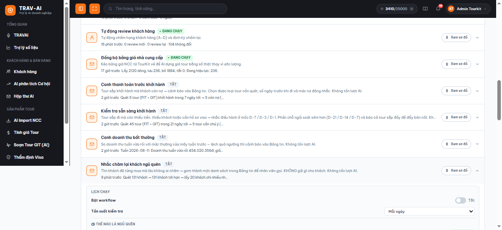
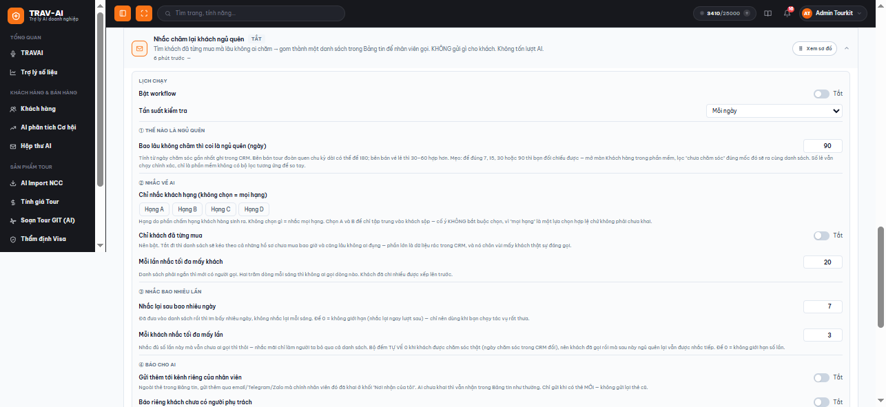
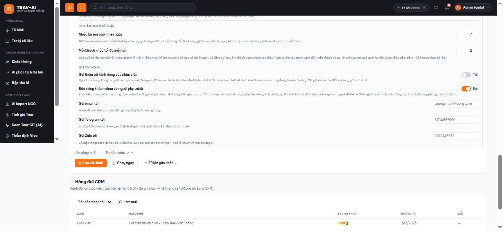
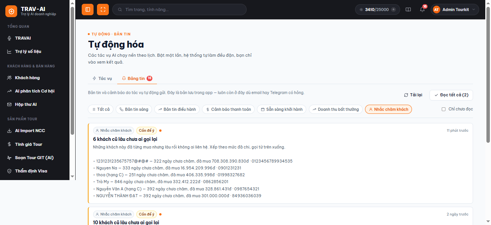

# Hướng dẫn sử dụng Nhắc chăm lại khách ngủ quên

## 1. Tính năng này làm gì

**Nhắc chăm lại khách ngủ quên** là một tác vụ tự động trong trang **Tự động hóa**. Nó đi tìm những khách **đã từng mua tour** của công ty nhưng **lâu rồi không ai liên hệ**, rồi gom lại thành **một danh sách gọn để nhân viên gọi điện lại** — mỗi nhân viên một danh sách riêng, chỉ gồm khách của chính mình.

Ba điều nên nhớ ngay từ đầu:

- **Nó KHÔNG gửi bất cứ thứ gì cho khách hàng.** Nó chỉ nhắc *bạn* gọi. Việc nói chuyện với khách vẫn hoàn toàn do con người làm.
- **Nó không tốn lượt AI.** Đây là tác vụ chạy theo quy tắc bạn khai (bao nhiêu ngày, hạng nào…), không nhờ AI viết gì cả.
- **Kết quả nằm ở tab "Bảng tin"** của chính trang Tự động hóa — mở ra là thấy danh sách khách kèm số ngày chưa chăm và số tiền họ đã mua, xếp khách chi nhiều lên trước.

## 2. Ai nên dùng

- **Nhân viên kinh doanh / chăm sóc khách hàng** — muốn mỗi sáng có sẵn một danh sách ngắn "hôm nay nên gọi lại ai", thay vì tự lục sổ khách cũ.
- **Trưởng nhóm / quản lý kinh doanh** — muốn biết tệp khách cũ có đang bị bỏ quên không, và muốn đo xem nhắc rồi thì thật sự có ai nhấc máy gọi hay không.
- **Người quản trị hệ thống của công ty** — người bật tác vụ và khai các ngưỡng chung (bao lâu thì coi là ngủ quên, chỉ nhắc hạng nào…), vì đây là tác vụ chạy chung cho cả công ty.

## 3. Hướng dẫn sử dụng từng bước

### Bước 1 — Mở trang "Tự động hóa" và tìm thẻ tác vụ

Vào menu bên trái, nhóm **"Tích hợp"**, chọn **"Tự động hóa"**. Ở tab **"Tác vụ"**, kéo xuống mục **"Theo tổ chức (cả công ty)"** — thẻ **"Nhắc chăm lại khách ngủ quên"** nằm ở cuối danh sách.

Ngay trên thẻ bạn đọc được 2 dòng: dòng mô tả tác vụ làm gì, và dòng **tóm tắt lần chạy gần nhất** (ví dụ: *"9 phút trước · Quét 131 khách → 131 khách tới hạn → lấy 20 khách chi nhiều nh…"*). Bấm vào thẻ để mở phần cấu hình.

> 💡 Tác vụ này chạy chung cho cả công ty nên **cần khai "Tài khoản tự động"** ở đầu mục "Theo tổ chức" trước (xem [Hướng dẫn Tự động hóa](tu-dong-hoa.md)). Chưa khai thì các nút Bật/Lưu/Chạy ngay đều bị khóa.

### Bước 2 — Bật tác vụ và chọn tần suất chạy

Trong mục **"Lịch chạy"** ở đầu thẻ:

1. Gạt công tắc **"Bật tác vụ"** sang **Bật**.
2. Chọn **"Tần suất kiểm tra"**. Với tác vụ này, **"Mỗi ngày"** là hợp lý nhất — danh sách khách cũ không thay đổi theo giờ, và mỗi lượt chạy chỉ tạo tối đa một thẻ nhắc cho mỗi nhân viên trong ngày.
3. Bấm **"Lưu cấu hình"** ở cuối thẻ.

### Bước 3 — Khai ① Thế nào là ngủ quên

Ô **"Bao lâu không chăm thì coi là ngủ quên (ngày)"** (mặc định **90**) là ngưỡng quan trọng nhất. Hệ thống tính từ **ngày chăm sóc gần nhất đã ghi trong phần mềm** của từng khách.

- Bên **bán tour đoàn**, chu kỳ mua dài — để **180** cũng hợp lý.
- Bên **bán vé lẻ / tour ngắn**, để **30–60** sẽ sát thực tế hơn.

> 💡 **Mẹo đối chiếu:** để đúng **7, 15, 30 hoặc 90** thì bạn kiểm tra lại được bằng tay — mở màn **Khách hàng** trong phần mềm, lọc "chưa chăm sóc" đúng mốc đó sẽ ra cùng một danh sách. Số lẻ (ví dụ 45) vẫn chạy chính xác, chỉ là phần mềm không có bộ lọc tương ứng để bạn so tay.

### Bước 4 — Khai ② Nhắc về ai

Ba ô quyết định *danh sách gồm những ai*:

1. **"Chỉ nhắc khách hạng"** — chọn Hạng A / B / C / D. **Không chọn gì = nhắc mọi hạng** (đây là lựa chọn hợp lệ, không phải "chưa khai"). Chọn A và B nếu bạn chỉ muốn tập trung vào khách sộp. Hạng ở đây do phần chấm hạng khách hàng sinh ra.
2. **"Chỉ khách đã từng mua"** — **nên bật**. Tắt đi thì danh sách sẽ kéo theo cả những hồ sơ chưa mua bao giờ mà cũng lâu không ai đụng — phần lớn là dữ liệu rác, và nó chôn vùi mấy khách thật sự đáng gọi.
3. **"Mỗi lần nhắc tối đa mấy khách"** (mặc định **20**) — danh sách phải ngắn thì mới có người gọi. Hai trăm dòng mỗi sáng thì không ai gọi dòng nào. Khách **đã chi nhiều được xếp lên trước**, nên phần bị cắt luôn là phần ít quan trọng hơn, và sẽ được đưa vào lượt sau.

### Bước 5 — Khai ③ Nhắc bao nhiêu lần

Đây là phần **chống làm phiền** — không có nó thì cùng một khách sẽ nằm lại danh sách **mỗi sáng** cho tới khi có người gọi, và chỉ vài tuần là không ai buồn mở danh sách nữa.

- **"Nhắc lại sau bao nhiêu ngày"** (mặc định **7**) — đã đưa một khách vào danh sách rồi thì im bấy nhiêu ngày mới nhắc lại. Để **0** = không giới hạn (nhắc lại ngay lượt sau), chỉ nên dùng khi bạn cho tác vụ chạy rất thưa.
- **"Mỗi khách nhắc tối đa mấy lần"** (mặc định **3**) — nhắc đủ số lần này mà vẫn chưa ai gọi thì thôi. Để **0** = không giới hạn số lần.

> ✅ **Bộ đếm tự về 0 khi khách được chăm sóc thật.** Ngay khi có người ghi nhận chăm sóc khách đó trong phần mềm, hệ thống coi như khách bắt đầu một vòng đời mới: quên hết những lần nhắc cũ. Nghĩa là khách **đã gọi rồi mà sau này lại ngủ quên vẫn được nhắc tiếp** — "đã nhắc đủ 3 lần" không phải án chung thân.

### Bước 6 — Khai ④ Báo cho ai

Mặc định, danh sách chỉ nằm trong **Bảng tin** (kênh trong app, luôn bật). Hai công tắc ở nhóm ④ cho bạn đưa nó tới gần người cần hơn:

1. **"Gửi thêm tới kênh riêng của nhân viên"** — ngoài thẻ trong Bảng tin, gửi thêm qua **email / Telegram / Zalo** mà **chính nhân viên đó** đã khai ở khối **"Nơi nhận của tôi"** (mục "Theo người dùng" ở đầu trang). Ai chưa khai thì vẫn nhận trong Bảng tin như thường. Chỉ gửi khi có **thẻ mới** — thẻ cũ không bị gửi lại.
2. **"Báo riêng khách chưa có người phụ trách"** — dành cho những khách lâu chưa chăm mà **trong phần mềm chưa gán ai phụ trách**, nên không biết giao cho ai gọi.
   - **Tắt (mặc định) = bỏ qua họ**, chỉ đếm lại trong tóm tắt lần chạy.
   - **Bật** thì hiện thêm 3 ô: **"Gửi email tới"** (nhiều địa chỉ cách nhau bằng dấu phẩy hoặc xuống dòng), **"Gửi Telegram tới"** (là dãy **số** chat id, không phải @tên; người nhận phải bấm "Bắt đầu" với bot trước), **"Gửi Zalo tới"** (số điện thoại đang dùng Zalo; cần khai OA Zalo của công ty ở mục "Theo tổ chức" thì mới gửi được).
   - Tin gửi tới đó nói thẳng vấn đề gốc: **việc cần làm là GÁN người phụ trách** cho những khách này, chứ không phải gọi hộ một lần rồi đâu lại vào đấy.

Khai xong nhớ bấm **"Lưu cấu hình"**.

### Bước 7 — Chạy thử ngay và đọc tóm tắt

Bấm **"Chạy ngay"** để không phải chờ tới lịch. Tác vụ chạy ở phía sau — bạn rời trang cũng được. Xong thì mở **"20 lần gần nhất"** để đọc tóm tắt, ví dụ:

> *Quét 131 khách → 51 khách tới hạn (bỏ 31 đã nhắc rồi: 28 vừa nhắc 2 ngày trước · 3 đã nhắc đủ 3 lần) → lấy 20 khách chi nhiều nhất (còn 0 để lượt sau) → 4 thẻ cho 4 nhân viên, BỎ QUA 6 khách chưa gán người phụ trách. **Trong 25 khách đã nhắc 30 ngày qua, 9 người đã được liên hệ sau đó (36%)**.*

Câu in đậm ở cuối là **con số đo hiệu quả** — tác vụ này chỉ *nhắc*, giá trị của nó bằng 0 nếu không ai nhấc máy. Đây chính là con số cho bạn biết có nên tiếp tục bật tính năng hay không: tỉ lệ cao nghĩa là danh sách đang được dùng thật; tỉ lệ gần 0 kéo dài nghĩa là nên xem lại ngưỡng, hoặc nhắc lại đội ngũ.

### Bước 8 — Xem danh sách khách cần gọi trong Bảng tin

Chuyển sang tab **"Bảng tin"** ngay trên trang, bấm bộ lọc **"Nhắc chăm khách"**. Mỗi thẻ là danh sách của **một nhân viên**, tiêu đề dạng *"6 khách cũ lâu chưa ai gọi lại"*, bên trong mỗi dòng ghi rõ: **tên khách — hạng — bao nhiêu ngày chưa chăm — đã mua bao nhiêu tiền — số điện thoại**. Cứ gọi từ trên xuống, vì khách chi nhiều đã được xếp trước.

## 4. Lưu ý quan trọng / giới hạn

- **Tính năng chỉ đọc được khách CÓ ghi nhận chăm sóc trong phần mềm.** Nếu công ty bạn không có thói quen ghi nhật ký CSKH, danh sách sẽ **rỗng** và tóm tắt sẽ ghi rõ *"không khách nào có ngày chăm sóc gần nhất… nên chưa chấm được"*. **Đó không phải lỗi** — hệ thống không có căn cứ nào để biết ai đang bị bỏ quên. Muốn dùng tính năng này thì phải ghi CSKH trước.
- **Khách chưa từng được chăm lần nào sẽ bị bỏ qua** (có đếm trong tóm tắt). Nếu coi "chưa có ngày chăm" là "đã im lâu" thì danh sách sẽ phình ra gần như toàn bộ tệp khách — không ai đọc nổi và cũng không nói lên điều gì.
- **Khách chưa gán người phụ trách bị bỏ qua** theo mặc định. Vì mỗi thẻ là danh sách gọi của **một người cụ thể**, khách chưa có ai nhận thì không biết đưa vào thẻ của ai. Muốn xử lý nhóm này thì bật công tắc ở nhóm ④ (Bước 6).
- **Chạy lại trong cùng một ngày sẽ báo "đã nhắc hôm nay"** và **không tạo thẻ mới** — đây là cơ chế chống trùng, **không phải lỗi**. Muốn thấy danh sách mới thì chờ sang ngày hôm sau.
- **Tính năng KHÔNG gửi gì cho khách hàng** — không email, không tin nhắn. Mọi thứ nó gửi đều đi tới **người trong công ty**.
- **Không tốn lượt AI** — chạy dày hay thưa cũng không ảnh hưởng số lượt AI còn lại của công ty.
- **Mỗi lượt quét có giới hạn khối lượng.** Nếu tệp khách quá lớn và chạm trần, tóm tắt sẽ **nói thẳng** (*"CHẠM TRẦN … còn khách chưa quét tới"*) và gợi ý hạ ngưỡng "bao lâu không chăm" xuống, chứ không im lặng cắt bớt.
- **Cần bật "Tài khoản tự động"** ở mục "Theo tổ chức" — tác vụ chạy ở phía sau, không có ai đăng nhập sẵn nên phải mượn tài khoản này để đọc danh sách khách. Sai mật khẩu tài khoản đó thì tác vụ báo lỗi ngay ở lịch sử chạy.
- **Nếu bạn không thấy thẻ tác vụ này**, có thể tính năng chưa được mở cho công ty bạn (nó đi kèm cụm **Bảng tin**) — hãy liên hệ người quản trị hệ thống.
- Nếu tác vụ **chạy lỗi 5 lần liên tiếp**, hệ thống tự tạm dừng và hiện dải cảnh báo vàng trên thẻ; khắc phục xong bấm **"Bật lại"**.

## 5. Câu hỏi thường gặp (FAQ)

**Q: Tác vụ này có tự nhắn tin / gửi email cho khách hàng không?**
A: **Không, tuyệt đối không.** Nó chỉ lập danh sách cho nhân viên gọi. Lý do rất thực tế: đo trên dữ liệu thật thì **100/100 khách có số điện thoại, nhưng chỉ 14/100 có email** — gửi thư tự động chỉ với tới được một phần nhỏ tệp khách, mà lại là việc rủi ro nhất vì nó đi ra ngoài công ty. Gọi điện vẫn là cách đúng, và gọi thì phải người gọi.

**Q: Chạy xong mà tóm tắt ghi "không ai tới hạn chăm lại", trong khi tôi biết có khách cũ lâu rồi không ai gọi?**
A: Gần như chắc chắn là do **những khách đó chưa có ghi nhận chăm sóc nào trong phần mềm**. Hệ thống tính "bao lâu không chăm" từ ngày chăm sóc gần nhất; khách chưa từng được ghi nhận thì không có mốc để tính nên bị bỏ qua. Tóm tắt sẽ ghi rõ điều này. Cách xử lý: yêu cầu đội ngũ ghi nhật ký CSKH khi liên hệ khách.

**Q: Tôi bấm "Chạy ngay" lần thứ hai trong ngày nhưng không thấy thẻ mới?**
A: Đúng như thiết kế. Mỗi nhân viên chỉ có **một thẻ nhắc mỗi ngày** — chạy lại sẽ báo *"đã nhắc hôm nay"* trong tóm tắt. Nếu vẫn tạo thêm thì Bảng tin sẽ đầy thẻ trùng nội dung.

**Q: Một khách cứ nằm mãi trong danh sách mỗi ngày, làm sao cho hết?**
A: Đặt ô **"Nhắc lại sau bao nhiêu ngày"** (nhóm ③) khác 0 — ví dụ 7 — thì sau khi đã đưa vào danh sách, khách đó sẽ im 7 ngày. Và đặt **"Mỗi khách nhắc tối đa mấy lần"** (ví dụ 3) để sau 3 lần mà vẫn chưa ai gọi thì thôi hẳn.

**Q: Vậy khách đã bị "nhắc đủ 3 lần" thì mất luôn khỏi hệ thống à?**
A: Không. **Bộ đếm tự về 0 ngay khi khách được chăm sóc thật** (có người ghi nhận chăm sóc trong phần mềm). Sau đó nếu khách lại ngủ quên thêm một thời gian nữa, họ sẽ quay lại danh sách bình thường như lần đầu.

**Q: Tôi là nhân viên, tại sao trong Bảng tin tôi chỉ thấy vài khách chứ không thấy toàn bộ danh sách công ty?**
A: Vì mỗi nhân viên có **thẻ riêng, chỉ chứa khách của mình** (dựa theo nhân viên phụ trách khai trong phần mềm). Trước đây gom hết vào một thẻ chung thì không ai thấy đó là việc của mình — mà đây là danh sách để *gọi điện*, không ai gọi thì tính năng vô nghĩa.

**Q: Tóm tắt ghi "BỎ QUA 6 khách chưa gán người phụ trách" — tôi phải làm gì?**
A: Việc đúng là vào phần mềm **gán nhân viên phụ trách** cho những khách đó; từ lượt sau họ sẽ tự vào thẻ của người phụ trách. Nếu muốn được báo về nhóm này trong lúc chờ, bật công tắc **"Báo riêng khách chưa có người phụ trách"** ở nhóm ④ và điền nơi nhận (thường là email trưởng nhóm).

**Q: Danh sách quá dài / quá ngắn, chỉnh ở đâu?**
A: Ba ô ảnh hưởng trực tiếp: **"Bao lâu không chăm thì coi là ngủ quên"** (nhóm ①, hạ xuống → nhiều khách hơn), **"Chỉ nhắc khách hạng"** (nhóm ②, chọn A–B → gọn lại), và **"Mỗi lần nhắc tối đa mấy khách"** (nhóm ②, mặc định 20). Phần bị cắt không mất — khách chi nhiều được xếp trước, phần còn lại vào lượt sau.

**Q: Con số "Trong N khách đã nhắc 30 ngày qua, M người đã được liên hệ sau đó (X%)" nghĩa là gì?**
A: Nó so ngày chăm sóc **lúc nhắc** với ngày chăm sóc **hiện tại** của đúng những khách đã được nhắc trong 30 ngày gần đây. X% cao = lời nhắc đang được đội ngũ dùng thật. X% gần 0 kéo dài = có nhắc nhưng không ai gọi, lúc đó nên xem lại ngưỡng hoặc trao đổi với đội ngũ, chứ đừng chỉ tăng tần suất nhắc.

**Q: Tác vụ này có tốn lượt AI của công ty không?**
A: Không. Nó chạy hoàn toàn bằng quy tắc bạn khai, không gọi AI lần nào — bạn có thể bật thoải mái mà không lo hết lượt.

**Q: Nhân viên không mở Bảng tin thì sao?**
A: Bật công tắc **"Gửi thêm tới kênh riêng của nhân viên"** ở nhóm ④ — danh sách sẽ được gửi tới email/Telegram/Zalo mà chính họ đã khai ở khối **"Nơi nhận của tôi"**. Yên tâm là không bị spam: phần chống nhắc lặp ở nhóm ③ chạy trước, và chỉ **thẻ mới** mới được gửi đi.

---

## 📸 Ảnh nên bổ sung thêm

Ngoài 4 ảnh đã có ở trên, các ảnh sau sẽ giúp trang này dễ theo hơn:

1. **Mục "Lịch chạy"** của thẻ — công tắc "Bật tác vụ" đang **Bật** và ô "Tần suất kiểm tra" chọn **"Mỗi ngày"** (minh hoạ Bước 2; ảnh hiện có đang ở trạng thái Tắt).
2. **Bảng "20 lần gần nhất"** đang mở, có một dòng tóm tắt đầy đủ **kèm câu đo hiệu quả** *"Trong N khách đã nhắc 30 ngày qua, M người đã được liên hệ sau đó (X%)"* (minh hoạ Bước 7 — đây là điểm bán hàng chính của tính năng).
3. **Khối "Nơi nhận của tôi"** ở mục "Theo người dùng" — để người đọc biết công tắc "Gửi thêm tới kênh riêng của nhân viên" lấy email/Telegram/Zalo từ đâu.
4. **Khối "Tài khoản tự động"** ở đầu mục "Theo tổ chức", ở trạng thái đã cấu hình — điều kiện bắt buộc trước khi bật tác vụ.
5. **Thẻ tác vụ ở trạng thái tạm dừng** (dải cảnh báo vàng + nút "Bật lại") — minh hoạ mục Lưu ý.
6. **Màn Khách hàng trong phần mềm với bộ lọc "chưa chăm sóc" 90 ngày** — minh hoạ mẹo đối chiếu ở Bước 3.
