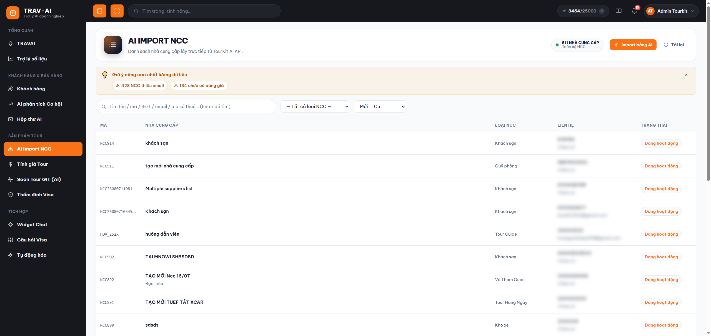
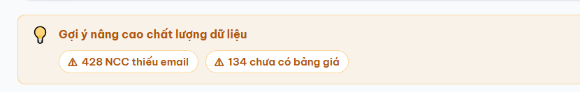
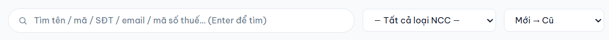
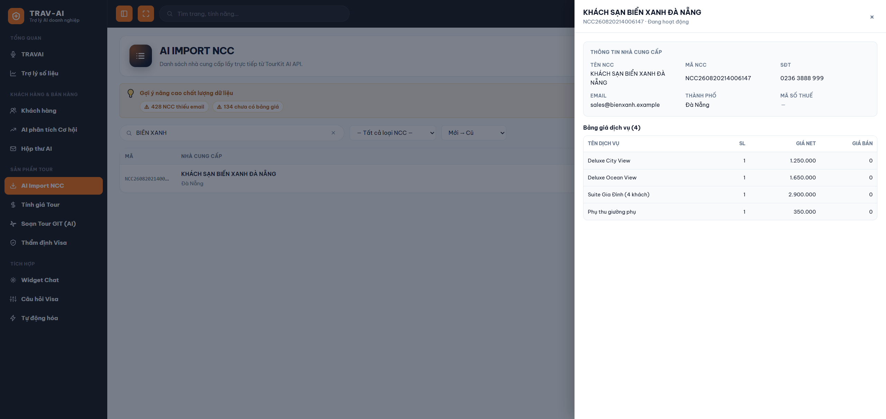
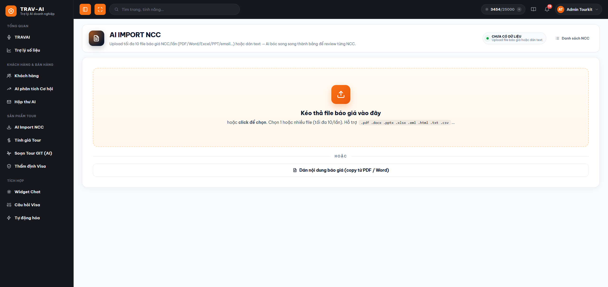
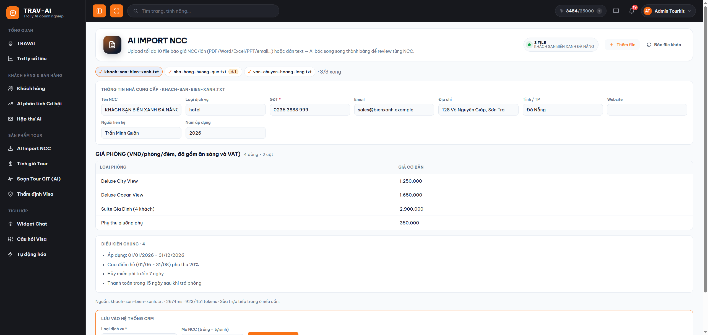
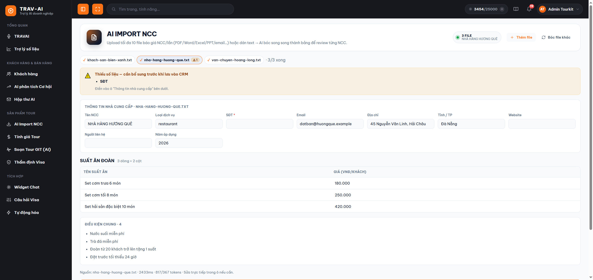
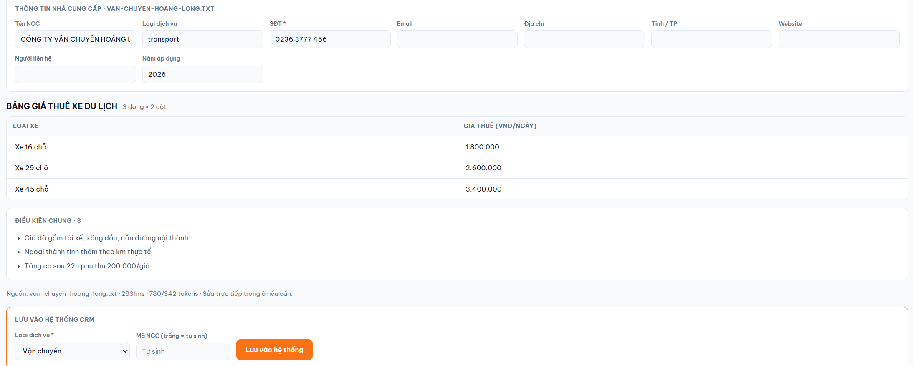
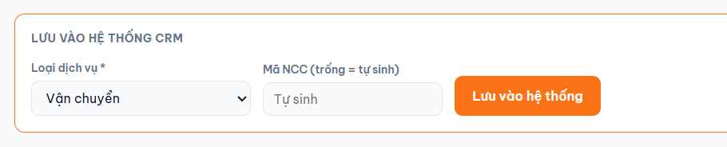
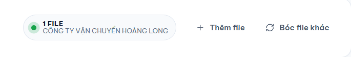

# Hướng dẫn sử dụng — Nhà cung cấp & Nhập bảng giá bằng AI (AI Import NCC)

## 1. Tính năng này làm gì

Đây là nơi bạn **quản lý danh sách nhà cung cấp (NCC)** của công ty — khách sạn, nhà hàng, xe, vé máy bay, hướng dẫn viên… — và **nhập bảng giá của họ vào hệ thống mà không phải gõ tay**.

Thay vì ngồi chép từng dòng giá từ file báo giá NCC gửi qua email, bạn chỉ cần **tải file lên (hoặc dán nội dung)**, AI sẽ tự đọc và bóc thành bảng giá gọn gàng. Bạn xem lại, sửa chỗ nào chưa đúng, rồi bấm lưu — nhà cung cấp cùng toàn bộ bảng giá vào thẳng hệ thống.

Có bảng giá NCC trong hệ thống thì khi dựng báo giá tour, bạn (và cả AI) mới có **giá thật của công ty** để tính, thay vì ước chừng.

## 2. Ai nên dùng

- **Điều hành tour / phụ trách sản phẩm** — người nhận báo giá từ khách sạn, nhà xe, hãng bay hằng năm và phải cập nhật vào hệ thống.
- **Nhân viên sale** cần tra nhanh: nhà cung cấp này liên hệ ai, số nào, giá phòng/xe/vé hiện đang là bao nhiêu.
- **Người phụ trách dữ liệu công ty** muốn biết còn bao nhiêu nhà cung cấp thiếu email, thiếu số điện thoại hoặc chưa có bảng giá để đi bổ sung.

## 3. Hướng dẫn sử dụng từng bước

Tính năng gồm **hai màn hình**: màn **danh sách nhà cung cấp** (nơi bạn tra cứu) và màn **nhập bằng AI** (nơi bạn tải file lên). Vào menu là ra màn danh sách trước.

---

### Phần A — Màn hình danh sách nhà cung cấp

#### Bước 1 — Mở trang "AI Import NCC"

Ở menu bên trái, nhóm **"Sản phẩm Tour"**, bấm mục **"AI Import NCC"**. Trang mở ra là **danh sách toàn bộ nhà cung cấp** của công ty bạn.

Góc trên bên phải có hai nút:
- **"Import bằng AI"** — sang màn nhập bảng giá bằng AI (Phần B bên dưới).
- **"Tải lại"** — nạp lại danh sách từ hệ thống. Dùng khi bạn hoặc đồng nghiệp vừa thêm nhà cung cấp mới mà danh sách chưa thấy hiện ra. Nút này mờ đi trong lúc đang tải.

> 📸 Cần chụp: toàn màn hình trang "AI Import NCC" ở chế độ danh sách — tiêu đề trang, ô đếm tổng bên phải tiêu đề, hai nút "Import bằng AI" + "Tải lại", thanh tìm kiếm và bảng danh sách bên dưới.

#### Bước 2 — Đọc ô đếm tổng và khối gợi ý chất lượng dữ liệu

**Ô đếm tổng** nằm cạnh tiêu đề trang, ví dụ **"511 NHÀ CUNG CẤP · Toàn bộ NCC"**. Đây là **tổng số nhà cung cấp công ty đang có**, không phải số dòng đang hiện trên màn hình. Khi bạn gõ từ khoá tìm kiếm, dòng chữ nhỏ bên dưới đổi thành *Đang lọc: "…"* để bạn biết mình đang xem kết quả lọc chứ không phải toàn bộ. Nếu công ty chưa có nhà cung cấp nào, ô này ghi **"CHƯA CÓ DỮ LIỆU"**.

Ngay dưới đó có thể xuất hiện khối vàng **"💡 Gợi ý nâng cao chất lượng dữ liệu"** với vài thẻ cảnh báo, ví dụ:

- **⚠ 428 NCC thiếu email**
- **⚠ 134 thiếu SĐT**
- **⚠ 134 chưa có bảng giá**

Đây là **bảng nhắc việc**: hệ thống đếm trên **toàn bộ** nhà cung cấp (không phải chỉ trang bạn đang xem) xem còn bao nhiêu hồ sơ bị trống thông tin. Thiếu email/số điện thoại thì lúc cần liên hệ gấp bạn không có chỗ gọi; **chưa có bảng giá** thì nhà cung cấp đó gần như vô dụng khi dựng báo giá tour, vì không có số nào để tính.

> ⚠️ **Các thẻ này chỉ để xem, bấm vào KHÔNG lọc danh sách.** Muốn tìm hồ sơ trống, bạn nhìn cột **"Liên hệ"** trong bảng — chỗ nào thiếu sẽ ghi chữ nghiêng **"Chưa có"** thay vì để trống, nên rất dễ nhận ra khi lướt.

Bấm dấu **×** góc phải để ẩn khối gợi ý cho gọn màn hình; lần sau mở lại trang nó sẽ hiện lại. Nếu cả ba chỉ số đều bằng 0 (dữ liệu đã đầy đủ) thì khối này không hiện.

> 📸 Cần chụp: cận cảnh khối vàng "💡 Gợi ý nâng cao chất lượng dữ liệu" với đủ 3 thẻ cảnh báo (thiếu email / thiếu SĐT / chưa có bảng giá) và dấu × ở góc phải.

#### Bước 3 — Tìm kiếm, lọc theo loại, sắp xếp

Ngay dưới là ba công cụ nằm cạnh nhau:

1. **Ô tìm kiếm** — gõ tên, mã NCC, số điện thoại, email hoặc mã số thuế rồi **bấm Enter**. Lưu ý: phải bấm Enter mới tìm, gõ không thôi thì danh sách chưa đổi.
2. **Ô lọc "— Tất cả loại NCC —"** — chọn một loại dịch vụ (khách sạn, vận chuyển, nhà hàng…) để chỉ xem đúng nhóm đó. Đây chính là danh mục loại dịch vụ của công ty bạn trong hệ thống.
3. **Ô sắp xếp** — mặc định là **"Mới → Cũ"**, tức nhà cung cấp vừa thêm gần đây nhất nằm trên cùng (rất tiện ngay sau khi bạn vừa nhập một loạt bảng giá). Hai lựa chọn còn lại: **"Tên A → Z"** để tra theo tên, và **"Cũ → Mới"** để xem lại những hồ sơ lâu đời.

Danh sách hiển thị 5 cột: **Mã · Nhà cung cấp** (kèm tỉnh/thành ở dòng dưới) **· Loại NCC · Liên hệ** (số điện thoại + email) **· Trạng thái**. Nếu có nhiều nhà cung cấp, phần phân trang ở cuối trang cho bạn chuyển trang và đổi số dòng hiển thị mỗi trang.

Trên điện thoại, danh sách tự chuyển sang dạng **thẻ xếp dọc** cho dễ đọc, không phải kéo ngang bảng.

> 📸 Cần chụp: cận cảnh hàng công cụ — ô tìm kiếm, ô "— Tất cả loại NCC —", và ô sắp xếp đang mở xổ xuống cho thấy đủ 3 lựa chọn "Mới → Cũ / Tên A → Z / Cũ → Mới".

#### Bước 4 — Xem nhanh một nhà cung cấp

**Bấm vào một dòng** bất kỳ, một cửa sổ xem nhanh trượt ra từ bên phải, gồm:

- **Thông tin nhà cung cấp**: tên, mã, số điện thoại, email, thành phố, mã số thuế.
- **Bảng giá dịch vụ** đã lưu: từng dòng gồm *Tên dịch vụ · SL · Giá NET · Giá bán*.

Nếu nhà cung cấp chưa từng được nhập bảng giá, phần này ghi *"NCC này chưa có bảng giá dịch vụ nào."* — đó chính là những hồ sơ được đếm trong thẻ **"chưa có bảng giá"** ở Bước 2.

> Cửa sổ này **chỉ để xem, không sửa được**. Muốn sửa thông tin hay giá của nhà cung cấp, bạn vào phần quản lý nhà cung cấp trong hệ thống CRM chính.

Bấm **×** hoặc bấm ra vùng tối bên ngoài để đóng.

> 📸 Cần chụp: cửa sổ xem nhanh mở bên phải — khối "Thông tin nhà cung cấp" phía trên và bảng giá dịch vụ có vài dòng phía dưới.

---

### Phần B — Nhập bảng giá nhà cung cấp bằng AI

#### Bước 5 — Mở màn hình nhập bằng AI

Từ trang danh sách, bấm nút **"Import bằng AI"** ở góc trên bên phải. Màn hình mở ra có **một ô lớn để kéo thả file** ở giữa, bên dưới là nút **"Dán nội dung báo giá (copy từ PDF / Word)"**.

Muốn quay lại danh sách, bấm nút **"Danh sách NCC"** ở góc trên bên phải.

> 📸 Cần chụp: màn hình nhập NCC khi chưa có file nào — ô kéo thả lớn ở giữa, dòng "HOẶC", nút "Dán nội dung báo giá" bên dưới.

#### Bước 6 — Đưa bảng giá vào: chọn file hoặc dán nội dung

**Cách 1 — Tải file lên.** Kéo thả file vào ô lớn, hoặc bấm vào ô để chọn từ máy. Bạn có thể **chọn cùng lúc tối đa 10 file**; hệ thống bóc **3 file một lúc** cho nhanh mà không quá tải, các file còn lại xếp hàng chờ tới lượt.

Các định dạng nhận được: **PDF, Word (.docx), Excel (.xlsx), PowerPoint (.pptx), email đã lưu (.eml), trang web lưu về (.html), và các file chữ (.txt, .csv, .tsv, .md, .json, .xml)**.

**Cách 2 — Dán chữ trực tiếp.** Nếu bạn chỉ có nội dung bảng giá dạng chữ (bôi đen rồi copy từ PDF, Word hay email), bấm **"Dán nội dung báo giá"**, dán vào ô văn bản rồi bấm **"AI bóc tách"** — không cần tạo file. Đây cũng là **cách chữa cháy tốt nhất** khi AI đọc file gốc bị lệch.

> Chọn quá 10 file thì hệ thống chỉ nhận 10 file đầu và báo cho bạn biết đã bỏ bao nhiêu file cuối.

#### Bước 7 — Theo dõi các tab file và bổ sung chỗ AI bóc thiếu

Mỗi file trở thành **một tab nhỏ hình viên thuốc** trên một hàng ngang. Bấm vào tab để xem kết quả của file đó. Ký hiệu đầu tab cho biết trạng thái:

| Ký hiệu | Nghĩa |
|---|---|
| **…** | đang xếp hàng chờ tới lượt |
| **⏳** | AI đang đọc file này |
| **✓** | đã bóc xong, mời bạn xem lại |
| **✗** | file lỗi — di chuột lên tab để xem lý do |
| **ĐÃ LƯU** | đã lưu vào hệ thống thành công |

Cuối hàng tab có bộ đếm kiểu **"3/5 xong"** để bạn biết còn bao nhiêu file đang chạy.

> 📸 Cần chụp: hàng tab nhiều file — có tab đang bóc (⏳), tab đã xong (✓), tab gắn badge cam "⚠ 2", và bộ đếm "3/3 xong" ở cuối hàng.

**Nếu AI bóc thiếu thông tin bắt buộc**, ngay sau khi file bóc xong sẽ hiện **khung cảnh báo màu cam**: *"Thiếu số liệu — cần bổ sung trước khi lưu"*, liệt kê rõ đang thiếu mục nào trong bốn mục:

- **Tên NCC**
- **SĐT** (bắt buộc, hệ thống quản lý nhà cung cấp không nhận hồ sơ trống số điện thoại)
- **Bảng giá dịch vụ** (nghĩa là AI không đọc được dòng giá nào)
- **Loại dịch vụ** (hệ thống chưa tự đoán được nhà cung cấp này thuộc nhóm nào)

Trên tab của những file còn thiếu cũng có thêm **badge cam ⚠ kèm con số** — con số là số mục còn thiếu. Nhờ vậy bạn liếc một cái là biết file nào cần đụng tới, khỏi mở từng tab kiểm tra.

> 📸 Cần chụp: khung cam "Thiếu số liệu — cần bổ sung trước khi lưu vào CRM" với danh sách mục thiếu (ví dụ SĐT + Loại dịch vụ), chụp kèm hàng tab bên trên để thấy badge "⚠ 2".

#### Bước 8 — Kiểm tra lại thông tin và bảng giá

Bên dưới cảnh báo là hai phần bạn có thể sửa trực tiếp:

**Khối "Thông tin nhà cung cấp"** — các ô: Tên NCC, Loại dịch vụ, **SĐT (có dấu \* đỏ vì bắt buộc)**, Email, Địa chỉ, Tỉnh/TP, Website, Người liên hệ, Năm áp dụng. Ô nào AI bóc thiếu hoặc sai, bạn gõ đè lên là được.

**Các bảng giá** — AI giữ nguyên cách trình bày của bảng gốc, mỗi bảng trong file thành một bảng riêng kèm tiêu đề và dòng ghi rõ *"N dòng × M cột"*. **Mọi ô trong bảng đều sửa được**: bấm vào ô, ô sẽ viền xanh lên cho bạn gõ lại. Hãy rà nhanh các con số quan trọng — AI đọc từ file nên vẫn có thể nhầm, nhất là khi bảng gốc trình bày rối.

Nếu file gốc có ghi **điều kiện chung** (chính sách huỷ, phụ thu, thời hạn áp dụng…), chúng nằm ở khối **"Điều kiện chung"** phía dưới bảng giá.

> 📸 Cần chụp: một file đã bóc xong — khối "Thông tin nhà cung cấp" đã điền phía trên, các bảng giá bên dưới (lý tưởng là đang bấm vào một ô để thấy viền sáng lên, chứng tỏ sửa trực tiếp được) và khối "Điều kiện chung".

#### Bước 9 — Chọn loại dịch vụ và lưu vào hệ thống

Cuối trang là khung viền xanh **"Lưu vào hệ thống CRM"**:

1. **Chọn "Loại dịch vụ" (bắt buộc)** — khách sạn, nhà hàng, vận chuyển, vé… Hệ thống thường đoán sẵn giúp bạn dựa trên nội dung báo giá, bạn chỉ cần kiểm tra lại cho đúng. Chưa chọn thì nút lưu còn mờ.
2. **Nhập "Mã NCC" (không bắt buộc)** — để trống thì hệ thống tự sinh mã không trùng. Chỉ nhập tay khi công ty bạn có quy ước mã riêng.
3. Bấm **"Lưu vào hệ thống"**.

Lưu xong, khung đổi thành dòng xác nhận kiểu *"✓ Đã lưu NCC-00123 · 42 dòng giá"*, tab tương ứng gắn nhãn **ĐÃ LƯU**, và có sẵn link **"Xem danh sách NCC"** để nhảy qua kiểm tra ngay.

> 💰 **Giá được lưu vào cột "Giá NET"** của nhà cung cấp — tức mức giá nhà cung cấp báo cho công ty bạn, không phải giá bán ra cho khách. Khi mở cửa sổ xem nhanh ở Bước 4, bạn sẽ thấy con số này nằm ở cột **Giá NET**; cột **Giá bán** để trống vì báo giá NCC không nói về giá bán cho khách.

> 📸 Cần chụp: cận cảnh khung "LƯU VÀO HỆ THỐNG CRM" — ô "Loại dịch vụ *" đang xổ danh sách, ô "Mã NCC (trống = tự sinh)", nút "Lưu vào hệ thống"; nếu chụp được thêm trạng thái sau khi lưu ("✓ Đã lưu … · N dòng giá") thì càng tốt.

#### Bước 10 — Thêm file khác hoặc bắt đầu lại

Sau khi đã có file trên màn hình, góc trên bên phải xuất hiện hai nút:

- **"Thêm file"** — chọn thêm file **nối vào danh sách đang có**, các tab cũ và những gì bạn đã sửa vẫn nguyên. Nút mờ đi khi đang có file chạy dở hoặc khi đã đủ 10 file.
- **"Bóc file khác"** — **xoá sạch toàn bộ tab** và quay về màn hình kéo thả trống để làm mẻ mới.

> ⚠️ **"Bóc file khác" không hỏi lại và không hoàn tác được.** Mọi file đang mở, kể cả những sửa đổi bạn vừa gõ mà **chưa bấm lưu**, sẽ mất hết. Muốn thêm file mà vẫn giữ việc đang làm dở thì dùng **"Thêm file"**.

> 📸 Cần chụp: cận cảnh góc trên bên phải màn hình nhập khi đã có vài file — thấy rõ ô đếm "3 FILE" kèm tên NCC, nút "Thêm file" và nút "Bóc file khác".

## 4. Lưu ý quan trọng / giới hạn

- **Cần đăng nhập vào hệ thống** như mọi tính năng khác. Nếu đang làm mà hệ thống bật màn đăng nhập, phiên của bạn đã hết hạn — đăng nhập lại rồi làm tiếp. Riêng phần lưu vào hệ thống, nếu khung lưu hiện lời nhắc đăng nhập thì hãy đăng nhập lại trước khi bấm lưu, kẻo mất công sửa.
- **Tối đa 10 file mỗi lần.** Chọn quá thì hệ thống chỉ nhận 10 file đầu và báo cho bạn biết.
- **Không nhận file Word/Excel đời cũ (.doc, .xls).** Hãy mở ra rồi lưu lại thành **.docx / .xlsx**, hoặc dùng cách dán chữ trực tiếp.
- **Ảnh chụp và file scan thì AI không đọc được.** Nhiều báo giá là ảnh chụp màn hình hoặc bản scan — nhìn thì thấy chữ nhưng máy không có chữ nào để đọc, kết quả sẽ ra bảng giá trống. Khi đó hãy xin file gốc, hoặc gõ/dán nội dung chữ vào ô "Dán nội dung báo giá".
- **Bắt buộc phải có Tên NCC và Số điện thoại** thì mới lưu được. Nếu báo giá gốc không ghi số điện thoại, bạn tự điền vào ô "SĐT" — không có cách nào bỏ qua.
- **Phải chọn Loại dịch vụ trước khi lưu.** Hệ thống đoán giúp nhưng không phải lúc nào cũng đoán được.
- **Kết quả AI bóc luôn cần bạn rà lại.** Đặc biệt các con số: bảng trình bày càng phức tạp (ô gộp, nhiều mức giá theo mùa, ghi chú xen giữa) thì AI càng dễ đọc lệch.
- **Mỗi lần bấm "Lưu vào hệ thống" là tạo MỘT nhà cung cấp mới.** Sau khi đã lưu, nút **"Lưu lại / sửa"** chỉ nên dùng khi bạn thực sự muốn tạo lại — bấm lưu lần nữa sẽ có **hai nhà cung cấp trùng tên** trong danh sách. Nếu bạn tự nhập Mã NCC đã tồn tại, hệ thống sẽ báo lỗi trùng mã và không lưu.
- **Sửa hồ sơ nhà cung cấp đã lưu phải vào hệ thống CRM chính.** Ở đây bạn chỉ xem được (cửa sổ xem nhanh) và tạo mới (màn nhập bằng AI).
- **Con số ở khối "Gợi ý nâng cao chất lượng dữ liệu" được tính sẵn định kỳ**, nên sau khi bạn vừa bổ sung email hay bảng giá, số này có thể **chưa đổi ngay trong khoảng mươi phút** — không phải bạn làm hụt.
- **Đóng tab trình duyệt giữa chừng là mất kết quả đang bóc.** Kết quả AI bóc chỉ nằm trên màn hình cho tới khi bạn bấm lưu; hãy lưu từng nhà cung cấp xong xuôi rồi mới rời trang.

## 5. Câu hỏi thường gặp (FAQ)

**Q: Tôi vào menu "AI Import NCC" nhưng lại thấy danh sách, chỗ tải file đâu?**
A: Đúng rồi — menu mở ra danh sách nhà cung cấp trước. Bấm nút **"Import bằng AI"** ở góc trên bên phải để sang chỗ tải file lên.

**Q: Bấm vào thẻ "428 NCC thiếu email" có lọc ra đúng 428 nhà cung cấp đó không?**
A: Chưa. Các thẻ đó hiện chỉ là **con số nhắc việc**, bấm vào không lọc gì cả. Cách nhận biết trong danh sách: cột "Liên hệ" của hồ sơ thiếu sẽ ghi chữ nghiêng **"Chưa có"**.

**Q: Con số "511 NHÀ CUNG CẤP" là tổng hay là số dòng đang xem?**
A: Là **tổng toàn bộ** nhà cung cấp của công ty. Khi bạn đang tìm kiếm, dòng nhỏ bên dưới sẽ ghi *Đang lọc: "…"* để nhắc rằng bảng bên dưới chỉ là kết quả lọc.

**Q: Tôi vừa lưu một nhà cung cấp mới mà danh sách không thấy đâu?**
A: Bấm nút **"Tải lại"** ở góc trên bên phải để nạp lại danh sách. Nếu vẫn không thấy, kiểm tra xem bạn có đang bật ô lọc theo loại NCC hoặc đang tìm kiếm bằng một từ khoá cũ không.

**Q: Nhập cùng lúc nhiều bảng giá được không?**
A: Được, tối đa **10 file một lần**. Hệ thống bóc 3 file cùng lúc, số còn lại xếp hàng. Mỗi file là một tab riêng, bạn xem/sửa/lưu từng nhà cung cấp độc lập.

**Q: Làm sao biết file nào còn thiếu thông tin mà không phải mở từng tab?**
A: Nhìn **badge cam ⚠ kèm số** trên tab — con số là số mục còn thiếu của file đó. Mở tab lên sẽ thấy khung cam liệt kê chi tiết.

**Q: AI bóc ra bảng giá trống trơn thì sao?**
A: Gần như chắc chắn file là **ảnh chụp hoặc bản scan** — máy không "nhìn" được chữ trong ảnh. Xin lại file gốc (PDF/Word/Excel), hoặc copy phần bảng giá dạng chữ rồi dùng **"Dán nội dung báo giá"**.

**Q: Giá tôi vừa nhập được lưu vào cột nào?**
A: Vào cột **Giá NET** — mức nhà cung cấp báo cho công ty bạn. Cột **Giá bán** để trống, vì báo giá của nhà cung cấp không nói gì về giá bạn bán ra cho khách.

**Q: Vì sao lưu báo lỗi thiếu số điện thoại dù báo giá không hề ghi số nào?**
A: Hệ thống quản lý nhà cung cấp bắt buộc phải có số điện thoại, không có ngoại lệ. Bạn tự điền vào ô **"SĐT"** trong khối "Thông tin nhà cung cấp" (ô có dấu \* đỏ) rồi lưu lại.

**Q: Tôi lỡ bấm "Bóc file khác", lấy lại được không?**
A: Không. Nút đó xoá sạch mọi tab đang mở và không hoàn tác được. Lần sau, muốn thêm file mà giữ nguyên việc đang làm thì bấm **"Thêm file"**.

**Q: Nhập giá vào rồi thì báo giá tour tự dùng luôn chưa?**
A: Có — bảng giá bạn vừa nhập trở thành **giá thật của công ty** để dựng báo giá tour. Xem thêm [Hướng dẫn Báo giá tour](bao-gia-tour.md), phần chọn "Nguồn giá tham khảo cho AI".

**Q: Tôi muốn sửa lại thông tin/giá của một nhà cung cấp đã lưu?**
A: Ở đây cửa sổ xem nhanh **chỉ để xem**. Việc sửa làm trong phần quản lý nhà cung cấp của hệ thống CRM chính.
