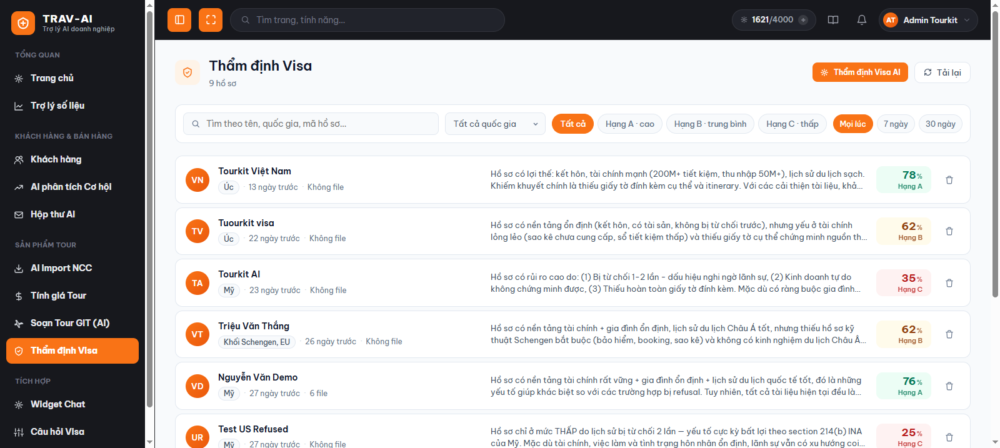
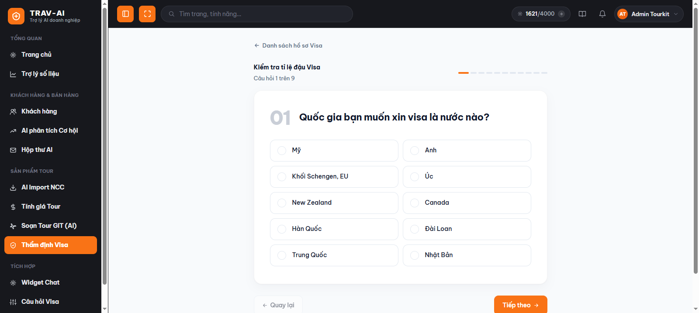
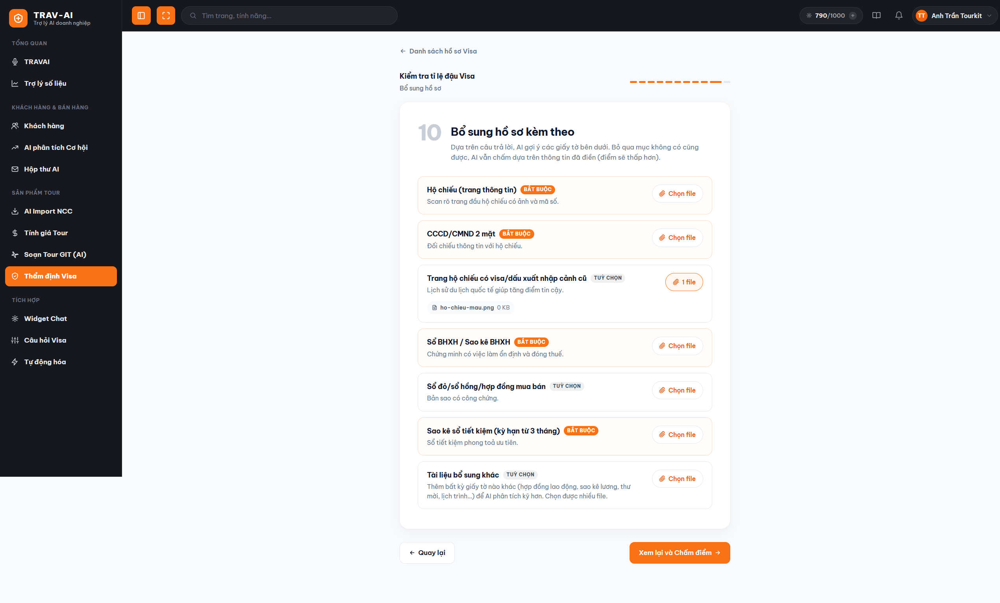
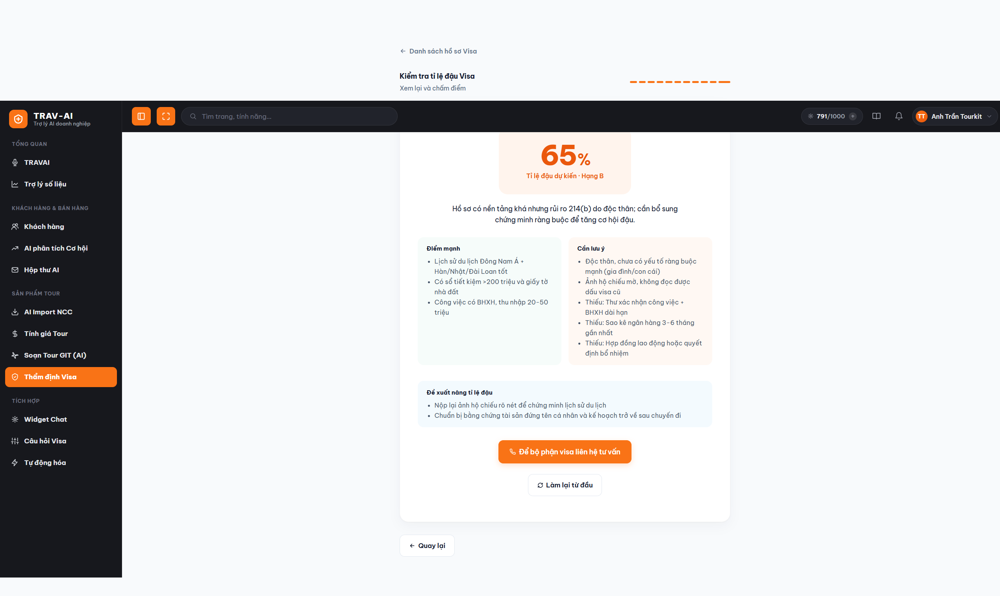
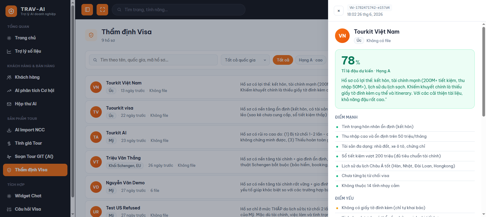
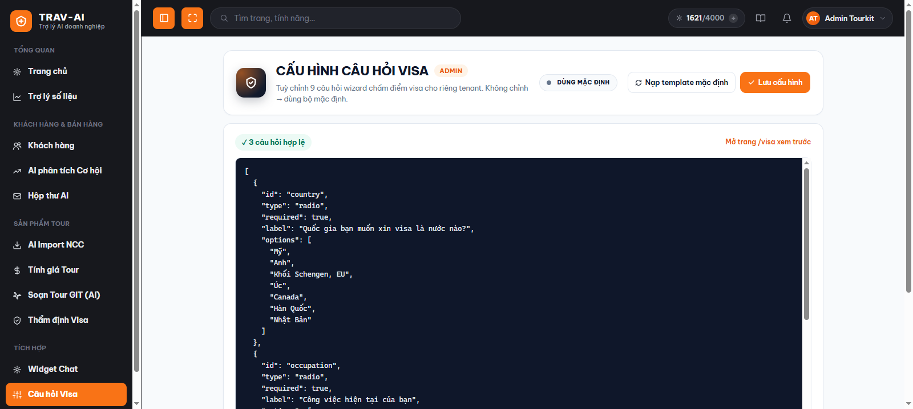

# Thẩm định hồ sơ Visa bằng AI

## 1. Tính năng này làm gì

Trước khi tư vấn khách làm hồ sơ xin visa, bạn có thể để AI "chấm điểm" nhanh khả năng đậu của khách chỉ trong vài phút. Bạn trả lời một bộ câu hỏi ngắn về khách (quốc gia muốn đi, công việc, thu nhập, lịch sử du lịch...) và đính kèm vài giấy tờ khách đang có, AI sẽ đọc, phân tích và đưa ra **tỉ lệ đậu dự kiến (%)**, **hạng đánh giá (A/B/C)**, điểm mạnh, điểm cần lưu ý, giấy tờ còn thiếu và gợi ý cách nâng tỉ lệ đậu. Mọi lượt thẩm định đều được lưu lại thành lịch sử để bạn xem lại hoặc so sánh sau này.

## 2. Ai nên dùng

- **Nhân viên tư vấn / sale visa**: dùng để chấm nhanh hồ sơ khách ngay trong buổi tư vấn đầu tiên, biết khách thuộc "hạng" nào để tư vấn đúng hướng, và biết cần xin thêm giấy tờ gì.
- **Người phụ trách/quản lý (admin công ty)**: dùng thêm trang cấu hình để tùy chỉnh lại bộ câu hỏi wizard cho phù hợp với đặc thù công ty mình (ví dụ đổi câu hỏi, thêm/bớt lựa chọn).

## 3. Hướng dẫn sử dụng từng bước

### Chấm điểm hồ sơ mới

1. Vào menu bên trái, nhóm **"Sản phẩm Tour"** → bấm **"Thẩm định Visa"**. Bạn sẽ thấy trang danh sách các hồ sơ đã chấm trước đó.

   
   > 📸 Cần chụp: trang `/visa/history` với vài hồ sơ mẫu trong danh sách.

2. Bấm nút **"Thẩm định Visa AI"** ở góc trên để mở form câu hỏi.

3. Trả lời lần lượt từng câu hỏi (quốc gia muốn xin visa, tình trạng hôn nhân, nơi sinh, lịch sử du lịch, từng bị từ chối visa chưa, công việc, thu nhập, tài sản...). Với câu hỏi 1 lựa chọn, bấm chọn 1 ô; với câu hỏi nhiều lựa chọn, có thể chọn nhiều ô. Bấm **"Tiếp theo"** để qua câu kế tiếp, hoặc **"Quay lại"** nếu muốn sửa câu trước.

   
   > 📸 Cần chụp: 1 màn hình câu hỏi dạng chọn nhiều lựa chọn (ví dụ "Lịch sử du lịch quốc tế").

   > Mẹo: hệ thống tự lưu tạm câu trả lời của bạn. Nếu lỡ đóng tab hoặc mất mạng giữa chừng, mở lại trang trong vòng 7 ngày sẽ có thông báo "Đã khôi phục bài làm dở" để tiếp tục đúng chỗ đang làm dở, không cần làm lại từ đầu.

4. Ở bước **"Bổ sung hồ sơ"**, hệ thống tự gợi ý danh sách giấy tờ cần có dựa trên các câu bạn vừa trả lời (ví dụ: hộ chiếu, CCCD, sổ BHXH, sao kê ngân hàng...). Với mỗi loại giấy tờ, bấm **"Chọn file"** để tải ảnh chụp hoặc file PDF lên. Giấy tờ có nhãn **BẮT BUỘC** nên được đính kèm để AI chấm chính xác hơn; giấy tờ **TUỲ CHỌN** có thể bỏ qua. Bạn cũng có thể đính kèm thêm các giấy tờ khác ở ô "Tài liệu bổ sung khác".

   
   > 📸 Cần chụp: bước upload với vài dòng giấy tờ gợi ý, có 1-2 dòng đã chọn file.

5. Ở bước **"Xem lại"**, kiểm tra nhanh lại toàn bộ câu trả lời và số file đã đính kèm. Nếu cần sửa, bấm **"Quay lại sửa câu trả lời"**. Khi đã ổn, bấm **"Chấm điểm bằng AI"** và chờ vài chục giây để AI đọc hồ sơ và phân tích.

6. Xem **kết quả**: tỉ lệ đậu dự kiến (%), hạng đánh giá (A = tỉ lệ cao, B = trung bình, C = thấp), phần tóm tắt, danh sách điểm mạnh, những điều cần lưu ý (bao gồm cả giấy tờ còn thiếu), và các đề xuất để nâng tỉ lệ đậu.

   
   > 📸 Cần chụp: màn hình kết quả đầy đủ (tỉ lệ %, hạng, điểm mạnh, cần lưu ý, đề xuất).

7. Nếu muốn có bộ phận chuyên visa liên hệ tư vấn thêm cho khách, bấm **"Để bộ phận visa liên hệ tư vấn"** — yêu cầu sẽ được ghi nhận để đội visa chủ động liên hệ khách trong 1-2 giờ làm việc.

8. Muốn làm hồ sơ mới cho khách khác, bấm **"Làm lại từ đầu"**.

### Xem lại lịch sử đã chấm

9. Ở trang **"Thẩm định Visa"** (danh sách), bạn có thể:
   - Tìm theo tên khách, quốc gia hoặc mã hồ sơ.
   - Lọc theo quốc gia, theo hạng (A/B/C), hoặc theo khoảng thời gian (7 ngày / 30 ngày / mọi lúc).
   - Bấm vào 1 dòng để xem chi tiết đầy đủ (tỉ lệ đậu, điểm mạnh/yếu, giấy tờ còn thiếu, đề xuất, danh sách file AI đã đọc).
   - Bấm biểu tượng thùng rác để xoá hồ sơ không cần lưu nữa (thao tác này không thể hoàn tác).

   
   > 📸 Cần chụp: bộ lọc (tìm kiếm, quốc gia, hạng, khoảng thời gian) và khung chi tiết mở bên phải.

### Tuỳ chỉnh bộ câu hỏi (dành cho người quản lý)

10. Vào menu nhóm **"Tích hợp"** → bấm **"Câu hỏi Visa"**. Tại đây bạn xem/sửa toàn bộ nội dung câu hỏi của wizard (dạng văn bản có cấu trúc). Sửa xong bấm **"Lưu cấu hình"** — thay đổi áp dụng ngay cho toàn bộ nhân viên công ty khi họ mở trang Thẩm định Visa lần tiếp theo. Muốn quay về bộ câu hỏi gốc của hệ thống, bấm **"Reset về mặc định"**.

    > **Lưu ý về quyền:** mục **"Câu hỏi Visa"** chỉ hiện trong menu với tài khoản có quyền **cấu hình hệ thống**. Nếu bạn không thấy mục này (hoặc mở trực tiếp thì gặp trang "Bạn không có quyền xem"), nghĩa là tài khoản của bạn chưa được cấp quyền đó — hãy nhờ người quản trị của công ty chỉnh giúp, hoặc xin cấp quyền.

    
    > 📸 Cần chụp: trang `/visa-config` với nội dung câu hỏi và nút Lưu/Reset.

## 4. Lưu ý quan trọng / giới hạn

- **Bảo mật dữ liệu**: hồ sơ của mỗi công ty (bao gồm câu trả lời và lịch sử thẩm định) chỉ công ty đó xem được, các công ty khác dùng chung hệ thống không thể truy cập vào dữ liệu của bạn.
- **Giấy tờ tải lên không được lưu trữ lâu dài**: ảnh/PDF bạn đính kèm chỉ được dùng tạm thời để AI đọc trong lúc chấm điểm, sau đó không được giữ lại. Trong lịch sử chỉ còn lại tên loại giấy tờ và số lượng file, không còn nội dung file gốc.
- Ở bước "Bổ sung hồ sơ", hệ thống chỉ nhận **ảnh (JPG/PNG/WEBP/GIF)** và **file PDF**, dung lượng mỗi file không quá 25MB. Không hỗ trợ file Word (.docx) trong bước này.
- Nếu AI đọc giấy tờ bị lỗi (ảnh mờ, không rõ chữ...), hệ thống vẫn tiếp tục chấm điểm dựa trên các câu trả lời đã điền, nhưng kết quả có thể kém chính xác hơn — nên cố gắng đính kèm ảnh/PDF rõ nét.
- Câu trả lời đang làm dở được tự động lưu tạm trên máy bạn trong tối đa 7 ngày để tránh mất dữ liệu khi đóng tab; sau 7 ngày bản nháp sẽ tự bị xoá. Bản nháp KHÔNG lưu lại file đính kèm, chỉ lưu câu trả lời.
- Kết quả AI đưa ra chỉ mang tính **tham khảo, hỗ trợ tư vấn** — không phải là cam kết đậu/rớt visa. Quyết định cuối cùng luôn thuộc về lãnh sự quán/cơ quan cấp visa.
- Cần đăng nhập với phiên làm việc hợp lệ mới dùng được tính năng này; nếu phiên hết hạn, hệ thống sẽ yêu cầu đăng nhập lại.
- Việc chỉnh sửa bộ câu hỏi ở trang "Câu hỏi Visa" ảnh hưởng đến **tất cả nhân viên trong công ty** ngay khi lưu — nên cân nhắc kỹ trước khi thay đổi.
- **Trang "Câu hỏi Visa" cần quyền "cấu hình hệ thống".** Tài khoản không có quyền này sẽ không thấy mục "Câu hỏi Visa" trong menu nhóm "Tích hợp"; nếu mở thẳng địa chỉ trang thì gặp thông báo "Bạn không có quyền xem". Quyền được đọc lúc đăng nhập — vừa được cấp quyền thì đăng xuất/đăng nhập lại (hoặc tải lại trang) để cập nhật. Riêng phần **chấm điểm hồ sơ Visa** (dùng hằng ngày) thì không cần quyền này, mọi nhân viên tư vấn đều dùng được.

## 5. Câu hỏi thường gặp (FAQ)

**Hỏi: Tôi có bắt buộc phải tải hồ sơ giấy tờ lên mới chấm điểm được không?**
Không bắt buộc. Nếu bỏ qua bước tải giấy tờ, AI vẫn chấm điểm dựa trên các câu trả lời đã điền, nhưng tỉ lệ đậu và độ chính xác thường sẽ thấp hơn so với khi có đủ giấy tờ.

**Hỏi: Tôi đang làm dở form thì bị mất mạng / lỡ đóng tab, có mất hết dữ liệu không?**
Không. Mở lại trang Thẩm định Visa trong vòng 7 ngày, hệ thống sẽ tự khôi phục đúng câu trả lời và đúng bước bạn đang làm dở (trừ file đã chọn, cần chọn lại).

**Hỏi: Kết quả chấm điểm có chính xác 100% không?**
Không. Đây là công cụ hỗ trợ tư vấn dựa trên kinh nghiệm thẩm định chung, không thay thế quyết định của lãnh sự quán. Nên dùng kết quả để định hướng tư vấn khách chuẩn bị hồ sơ tốt hơn, không dùng để cam kết chắc chắn với khách.

**Hỏi: Tôi có thể xem lại hồ sơ đã chấm cách đây vài tuần không?**
Có. Vào trang "Thẩm định Visa" (danh sách), dùng ô tìm kiếm hoặc bộ lọc theo thời gian/quốc gia/hạng để tìm lại nhanh.

**Hỏi: Xoá nhầm 1 hồ sơ trong lịch sử thì có khôi phục lại được không?**
Không. Thao tác xoá không thể hoàn tác, nên cân nhắc kỹ trước khi bấm xoá.

**Hỏi: Ai được phép sửa bộ câu hỏi trong wizard?**
Chỉ tài khoản có quyền **cấu hình hệ thống** mới thấy và mở được trang "Câu hỏi Visa" (nhóm Tích hợp). Trang này tùy chỉnh bộ câu hỏi cho cả công ty nên thường chỉ dành cho người quản lý/phụ trách nghiệp vụ visa — thay đổi ở đây ảnh hưởng tới tất cả nhân viên. Nếu không thấy mục này trong menu, tài khoản của bạn chưa được cấp quyền; hãy liên hệ người quản trị của công ty.

**Hỏi: Bấm "Để bộ phận visa liên hệ tư vấn" thì điều gì xảy ra?**
Thông tin khách và kết quả chấm điểm sẽ được gửi cho đội ngũ visa của công ty để họ chủ động liên hệ tư vấn thêm cho khách, thường trong vòng 1-2 giờ làm việc.
