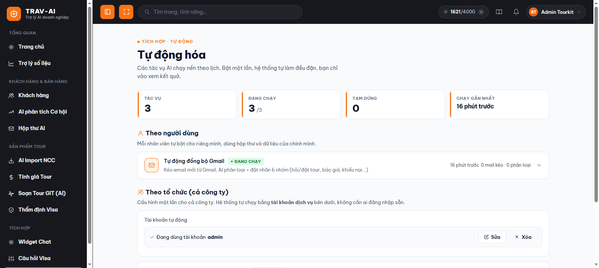
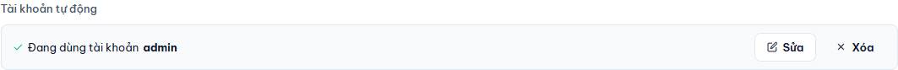
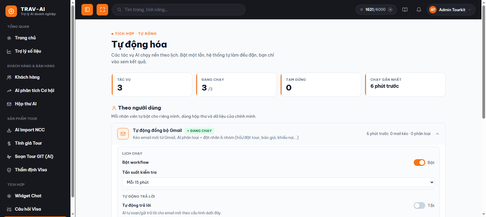
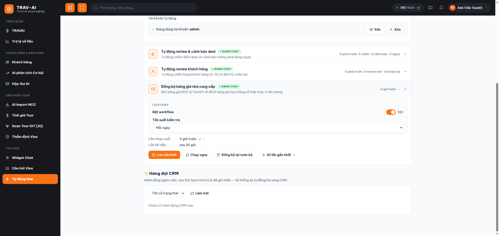
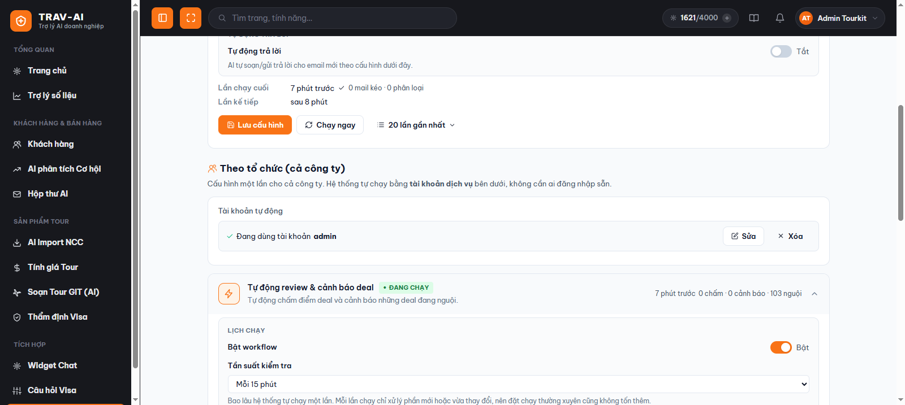
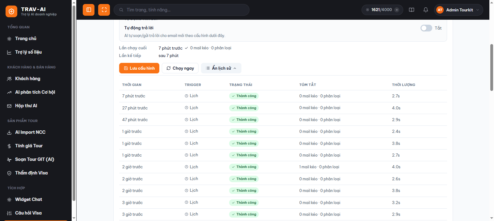

# Hướng dẫn sử dụng Tự động hóa

## 1. Tính năng này làm gì

**Tự động hóa** giúp AI tự làm một số việc lặp đi lặp lại **thay bạn, theo đúng lịch bạn chọn** — không cần ai ngồi bấm nút mỗi lần. Bạn chỉ cần bật công tắc một lần, chọn "bao lâu chạy một lần", rồi để hệ thống tự làm ở phía sau: tự đọc email mới và phân loại giúp bạn, tự chấm điểm cơ hội bán hàng (deal) và nhắc bạn khi có deal đang "nguội" lâu ngày không ai chăm sóc, tự chấm hạng cho khách hàng mới.

Bạn không cần túc trực để dùng — vào xem kết quả bất cứ lúc nào cũng được, hệ thống vẫn chạy đều ở phía sau.

## 2. Ai nên dùng

- **Nhân viên sale / chăm sóc khách hàng** muốn được nhắc tự động khi có deal lâu ngày chưa ai theo dõi, hoặc muốn hộp thư Gmail tự được đọc và phân loại sẵn mỗi khi có khách nhắn.
- **Quản lý/điều hành** muốn cả đội luôn có khách hàng được chấm hạng (A–D) đầy đủ, kịp thời mà không phải nhắc từng người review tay.
- **Người quản trị hệ thống của công ty** — người sẽ cấu hình phần chạy chung cho cả công ty (mục "Theo tổ chức" bên dưới), vì phần này cần khai báo một tài khoản dùng riêng cho việc tự động hóa.

## 3. Hướng dẫn sử dụng từng bước

### Bước 1 — Mở trang "Tự động hóa"

Vào menu bên trái, nhóm **"Tích hợp"**, chọn **"Tự động hóa"** (địa chỉ `/workflows`). Trang sẽ hiện một dải số liệu nhanh ở đầu trang (tổng số tác vụ, số đang chạy, số đang tạm dừng, lần chạy gần nhất), và bên dưới là danh sách các tác vụ được chia làm 2 nhóm:

- **Theo người dùng** — mỗi nhân viên tự bật riêng cho mình (hiện có: đồng bộ Gmail).
- **Theo tổ chức (cả công ty)** — cấu hình một lần, áp dụng chung cho cả công ty (hiện có: review deal + review khách hàng + đồng bộ bảng giá nhà cung cấp).

> 📸 Cần chụp: toàn trang `/workflows` gồm dải số liệu đầu trang + 2 nhóm "Theo người dùng" và "Theo tổ chức" với các thẻ tác vụ.

> **Bạn thấy nhóm nào là tuỳ theo quyền của tài khoản.** Trang "Tự động hóa" luôn mở được cho mọi người, nhưng:
> - Ai cũng thấy và tự bật được nhóm **"Theo người dùng"** (ví dụ đồng bộ Gmail cá nhân).
> - Nhóm **"Theo tổ chức (cả công ty)"** và khối **"Tài khoản tự động"** chỉ hiện với tài khoản có quyền **cấu hình hệ thống**. Nếu bạn không thấy các phần này, nghĩa là tài khoản của bạn chưa được cấp quyền đó — hãy nhờ người quản trị của công ty cấu hình, hoặc xin cấp quyền (xem mục Lưu ý và FAQ bên dưới).

### Bước 2 — Cấu hình "Tài khoản tự động" (chỉ cần làm 1 lần cho nhóm "Theo tổ chức")

Các tác vụ chạy chung cho cả công ty (review deal, review khách hàng) chạy ở phía sau, **không có ai đăng nhập sẵn**, nên cần một tài khoản để hệ thống tự đăng nhập thay bạn. Ngay phía trên nhóm "Theo tổ chức" có khối **"Tài khoản tự động"**:

1. Nhập **Tên đăng nhập** và **Mật khẩu** của một tài khoản TourKit (nên dùng tài khoản có quyền xem được **toàn bộ dữ liệu công ty**, không chỉ dữ liệu riêng của người đó — vì hệ thống chỉ tự động xử lý những gì tài khoản này nhìn thấy được).
2. Bấm **"Lưu & kiểm tra"**. Hệ thống sẽ thử đăng nhập và đếm số deal nhìn thấy được trước khi lưu:
   - Đăng nhập đúng → lưu lại (mật khẩu được mã hóa, không ai xem lại được).
   - Sai tên đăng nhập/mật khẩu → báo lỗi ngay, không lưu.
   - Đăng nhập được nhưng thấy 0 deal → vẫn lưu, kèm cảnh báo để bạn kiểm tra lại quyền của tài khoản.
3. Muốn đổi tài khoản → bấm **"Sửa"**. Muốn ngừng hẳn các tác vụ chung của công ty → bấm **"Xóa"** (các tác vụ này sẽ tự dừng vì không còn đăng nhập được).

Chưa cấu hình tài khoản này thì các thẻ trong nhóm "Theo tổ chức" sẽ hiện dòng nhắc và **chưa bật lên được**.

> 📸 Cần chụp: khối "Tài khoản tự động" ở trạng thái chưa cấu hình (form nhập tên đăng nhập/mật khẩu) và trạng thái đã cấu hình (dòng "Đang dùng tài khoản ... " + nút Sửa/Xóa).

### Bước 3 — Bật một tác vụ và chọn tần suất chạy

Bấm vào một thẻ tác vụ (ví dụ "Tự động đồng bộ Gmail") để mở rộng phần cấu hình. Trong mục **"Lịch chạy"**:

1. Gạt công tắc **"Bật workflow"** sang bật.
2. Chọn **"Tần suất kiểm tra"** — bao lâu hệ thống tự chạy lại một lần, từ mỗi 5 phút đến mỗi ngày. Với các tác vụ chấm điểm/review (deal, khách hàng), mỗi lần chạy chỉ xử lý phần mới hoặc vừa thay đổi, nên chọn chạy thường xuyên cũng không tốn thêm gì cả.
3. Bấm **"Lưu cấu hình"** ở cuối thẻ để áp dụng.

> 📸 Cần chụp: một thẻ tác vụ đang mở, thấy rõ công tắc "Bật workflow" và ô chọn "Tần suất kiểm tra" cùng nút "Lưu cấu hình".

### Bước 4 — Chỉnh các tùy chọn riêng của từng tác vụ

Mỗi tác vụ có thêm các tùy chọn riêng ngay bên dưới mục "Lịch chạy", có gợi ý (chữ nhỏ màu xám) giải thích từng ô ngay tại chỗ:

- **Tự động đồng bộ Gmail** (cần đã cấu hình hộp thư ở trang "Hộp thư AI" trước): bật/tắt **tự động trả lời** email mới, chọn **chế độ** (soạn sẵn để bạn duyệt rồi gửi, hoặc gửi thẳng luôn), chọn **nhóm email** nào được áp dụng tự động trả lời (nên bỏ nhóm "Khiếu nại" để người thật xử lý), và **giọng văn** trả lời.
- **Tự động review & cảnh báo deal**: chọn những **trạng thái deal** cần xử lý, chỉ xét deal **tạo trong bao nhiêu ngày** gần đây, bật/tắt **AI tự chấm điểm**, có **chấm lại khi deal có thay đổi** hay không, số deal tối đa chấm mỗi lượt, và phần **cảnh báo deal nguội**: sau bao nhiêu ngày không ai chăm sóc thì coi là "nguội", chỉ cảnh báo deal có khả năng chốt từ bao nhiêu %, và giới hạn số lần nhắc cho một deal để tránh làm phiền.
- **Tự động review khách hàng**: chỉ xét khách **tạo trong bao nhiêu ngày** gần đây, bật/tắt **review lại định kỳ**, và chu kỳ chấm lại (ví dụ 30 ngày = mỗi tháng chấm lại một lần).
- **Đồng bộ bảng giá nhà cung cấp**: kéo bảng giá nhà cung cấp (NCC) từ TourKit về hệ thống để **AI dựng giá tour bằng số thật thay vì ước lượng** (dùng ở trang **Tính giá Tour** — xem [Hướng dẫn Báo giá tour](bao-gia-tour.md)). Tác vụ này **mặc định chạy 1 lần/ngày** (khác các tác vụ khác thường mặc định 15 phút), bạn vẫn có thể đổi tần suất như bình thường. Riêng tác vụ này có thêm nút **"Đồng bộ lại toàn bộ"** — xem mục ngay bên dưới.

Sau khi chỉnh xong, nhớ bấm **"Lưu cấu hình"**.

#### Nút "Đồng bộ lại toàn bộ" (chỉ có ở tác vụ đồng bộ bảng giá)

Bình thường mỗi lần chạy, tác vụ chỉ cập nhật thêm/sửa phần bảng giá thay đổi. Nếu bạn **nghi ngờ bảng giá đã lưu bị lệch hoặc cũ**, bấm nút **"Đồng bộ lại toàn bộ"** trong thẻ tác vụ để làm sạch và kéo lại từ đầu:

1. Bấm **"Đồng bộ lại toàn bộ"**. Vì thao tác này sẽ **xóa sạch toàn bộ bảng giá NCC đã lưu của công ty** rồi mới kéo lại, hệ thống sẽ hỏi xác nhận trước — hãy đọc kỹ và cân nhắc.
2. Bấm xác nhận (**"Xóa & kéo lại"**). Hệ thống xóa dữ liệu cũ xong sẽ tự kéo lại toàn bộ ở phía sau, có thể mất vài phút.
3. Xem kết quả ở mục **"20 lần gần nhất"** khi chạy xong.

> ⚠️ Cân nhắc kỹ trước khi dùng: nút này **xóa dữ liệu bảng giá đã lưu trong hệ thống**. Tuy nhiên nó **không đụng tới dữ liệu gốc bên TourKit** — sau khi xóa, hệ thống kéo lại chính bảng giá đó từ TourKit, nên bạn không mất giá thật, chỉ là làm mới lại từ đầu.

> 📸 Cần chụp: thẻ "Đồng bộ bảng giá nhà cung cấp" đang mở, thấy nút "Đồng bộ lại toàn bộ" và ô chọn tần suất đang để mặc định "Hàng ngày".

> 📸 Cần chụp: thẻ "Tự động review & cảnh báo deal" đang mở, thấy các nhóm tùy chọn "Phạm vi xử lý", "Tự động chấm điểm", "Cảnh báo deal nguội".

### Bước 5 — Chạy thử ngay (không cần chờ tới lịch)

Muốn xem kết quả ngay mà không chờ tới chu kỳ, bấm nút **"Chạy ngay"** trong thẻ tác vụ. Tác vụ sẽ chạy ở phía sau — bạn có thể rời trang, kết quả sẽ tự hiện trong mục lịch sử khi xong (có tác vụ chấm điểm/review có thể mất vài phút vì phải xử lý nhiều deal/khách hàng).

### Bước 6 — Xem lịch sử chạy

Bấm nút **"20 lần gần nhất"** trong thẻ tác vụ để xem bảng lịch sử: thời gian chạy, chạy do lịch hay do bạn bấm tay, kết quả (Thành công/Lỗi), tóm tắt (ví dụ "5 chấm mới · 2 chấm lại · 1 cảnh báo") và thời gian chạy hết bao lâu. Nếu một lần chạy bị **Lỗi**, bấm vào dòng đó để xem chi tiết lỗi.

> 📸 Cần chụp: bảng "20 lần gần nhất" đang mở, có ít nhất 1 dòng "Thành công" và 1 dòng "Lỗi" (bấm vào dòng lỗi để lộ chi tiết).

### Bước 7 — Bật lại khi tác vụ bị tạm dừng

Nếu một tác vụ chạy lỗi liên tiếp nhiều lần, hệ thống sẽ **tự tạm dừng** tác vụ đó để tránh chạy hỏng mãi, và hiện một dải cảnh báo màu vàng ngay trên thẻ ghi rõ "Đã tạm dừng: ...". Sau khi kiểm tra và khắc phục nguyên nhân (ví dụ tài khoản tự động bị sai mật khẩu, hộp thư Gmail bị mất kết nối...), bấm nút **"Bật lại"** ngay trên dải cảnh báo đó để tác vụ tiếp tục chạy theo lịch.

> 📸 Cần chụp: một thẻ tác vụ có dải cảnh báo vàng "Đã tạm dừng: ..." kèm nút "Bật lại".

## 4. Lưu ý quan trọng / giới hạn

- **Cần quyền "cấu hình hệ thống" để thấy phần cấu hình chung của công ty.** Chỉ tài khoản có quyền này mới nhìn thấy nhóm **"Theo tổ chức (cả công ty)"** (tự chấm deal, tự chấm hạng khách hàng) và khối **"Tài khoản tự động"**. Tài khoản thường (không có quyền) vẫn vào được trang và tự bật các tác vụ **"Theo người dùng"** của riêng mình, nhưng sẽ không thấy phần cấu hình cấp công ty. Quyền được đọc một lần lúc đăng nhập — nếu vừa được cấp quyền mà chưa thấy thay đổi, hãy **đăng xuất rồi đăng nhập lại** (hoặc tải lại trang).
- **Tác vụ "Theo tổ chức" (review deal, review khách hàng) bắt buộc phải cấu hình Tài khoản tự động trước** — chưa cấu hình thì các nút Bật/Lưu/Chạy ngay đều bị khóa.
- **Tác vụ "Đồng bộ Gmail" cần đã cấu hình hộp thư ở trang "Hộp thư AI" trước** (địa chỉ Gmail + mật khẩu ứng dụng) — chưa cấu hình thì tác vụ này sẽ chạy lỗi.
- **Tài khoản tự động nên có quyền xem toàn bộ dữ liệu công ty.** Nếu tài khoản chỉ thấy dữ liệu của riêng nó, tác vụ tự động cũng chỉ xử lý được bấy nhiêu, bỏ sót phần còn lại. Ngoài ra, khi lưu Tài khoản tự động, nếu tài khoản đó thiếu quyền ghi dữ liệu vào CRM, hệ thống sẽ hiện một **cảnh báo** để bạn biết — kết quả tự động (ví dụ hạng khách hàng, điểm deal) có thể không đồng bộ ngược về CRM cho tới khi tài khoản được cấp đủ quyền.
- **Chạy lỗi 5 lần liên tiếp sẽ tự tạm dừng** để tránh lãng phí và chạy hỏng mãi — bạn cần chủ động bấm "Bật lại" sau khi khắc phục, hệ thống không tự bật lại.
- **Cảnh báo deal nguội tính theo từng deal, không theo người phụ trách** — khi đổi người phụ trách một deal, số lần đã nhắc vẫn được giữ nguyên (tránh bị nhắc lại từ đầu gây phiền). Deal chưa giao cho ai thì sẽ không được nhắc.
- **Deal đã chốt hoặc đã hủy** sẽ tự động được bỏ qua, không bị chấm lại hay nhắc nữa.
- **"Chấm lại khi có thay đổi" có giới hạn số lần** cho mỗi deal/khách hàng — tránh AI cứ chấm đi chấm lại mãi một hồ sơ không có gì mới.
- Với tác vụ chấm điểm/review, mỗi lượt chạy chỉ xử lý một số lượng giới hạn hồ sơ (để không chạy quá lâu) — nếu công ty có nhiều dữ liệu mới cùng lúc, phần còn lại sẽ được xử lý tiếp ở (các) lượt chạy sau, không bị bỏ sót.
- Bấm **"Chạy ngay"** không cần ngồi chờ trên trang — rời trang hay đóng tab không làm hủy lượt chạy đó, cứ quay lại xem mục lịch sử sau.
- **Tác vụ "Đồng bộ bảng giá nhà cung cấp" mặc định chạy 1 lần/ngày** (không phải 15 phút như một số tác vụ khác), và cũng thuộc nhóm "Theo tổ chức" nên cần cấu hình **Tài khoản tự động** trước. Nút **"Đồng bộ lại toàn bộ"** sẽ **xóa sạch bảng giá đã lưu rồi kéo lại từ đầu** — chỉ dùng khi nghi ngờ dữ liệu bị lệch, và luôn có bước hỏi xác nhận trước khi chạy.

## 5. Câu hỏi thường gặp (FAQ)

**Q: Tại sao tôi không thấy mục "Tài khoản tự động", cũng không thấy các tác vụ tự chấm deal / tự chấm hạng khách hàng?**
A: Vì tài khoản của bạn chưa có quyền **cấu hình hệ thống** — quyền này quyết định ai được cấu hình phần chạy chung cho cả công ty. Bạn vẫn dùng bình thường các tác vụ "Theo người dùng" (như đồng bộ Gmail cá nhân), nhưng phần cấu hình cấp công ty được ẩn đi để tránh nhầm lẫn. Hãy nhờ người quản trị của công ty (người có quyền này) cấu hình giúp, hoặc xin cấp quyền cho tài khoản của bạn.

**Q: Tôi vừa được cấp quyền cấu hình hệ thống nhưng vẫn chưa thấy mục "Theo tổ chức"?**
A: Quyền chỉ được đọc lại lúc đăng nhập. Bạn hãy **đăng xuất rồi đăng nhập lại** (hoặc tải lại trang) một lần để hệ thống cập nhật quyền mới, sau đó các phần cấu hình cấp công ty sẽ hiện ra.

**Q: Tôi bật một tác vụ "Theo tổ chức" nhưng không bấm được nút Lưu/Bật, vì sao?**
A: Kiểm tra khối "Tài khoản tự động" phía trên nhóm "Theo tổ chức" đã được cấu hình chưa. Các tác vụ chung của cả công ty cần tài khoản này để tự đăng nhập, chưa có thì mọi thao tác trong nhóm đó đều bị khóa.

**Q: "Tần suất kiểm tra" đặt càng dày (ví dụ mỗi 5 phút) có tốn thêm gì không?**
A: Không đáng kể. Các tác vụ review/chấm điểm chỉ xử lý phần dữ liệu mới hoặc vừa thay đổi ở mỗi lần chạy — hồ sơ chưa đổi gì sẽ tự bỏ qua, không chấm lại vô ích.

**Q: Deal của tôi bị "nguội" nhưng tôi không thấy email nhắc, vì sao?**
A: Kiểm tra vài khả năng: deal đó chưa được giao cho nhân viên phụ trách nào (hệ thống bỏ qua deal chưa giao người), hoặc mới được nhắc gần đây nên chưa đến lượt nhắc tiếp theo, hoặc khả năng chốt của deal đang thấp hơn ngưỡng cảnh báo đã cấu hình. Bạn có thể chỉnh lại các tùy chọn cảnh báo trong thẻ "Tự động review & cảnh báo deal".

**Q: Tại sao thẻ tác vụ của tôi hiện dòng cảnh báo màu vàng "Đã tạm dừng"?**
A: Tác vụ đó đã chạy lỗi 5 lần liên tiếp nên hệ thống tự dừng lại để tránh lãng phí. Xem mục "20 lần gần nhất" để biết lý do lỗi (ví dụ sai mật khẩu tài khoản tự động, mất kết nối hộp thư...), khắc phục xong rồi bấm nút "Bật lại" trên dải cảnh báo.

**Q: Tôi bấm "Chạy ngay" rồi rời trang, kết quả có bị mất không?**
A: Không. Việc chạy diễn ra ở phía sau, không phụ thuộc vào việc bạn có đang mở trang hay không. Quay lại trang bất cứ lúc nào, mở lại thẻ tác vụ và xem mục "20 lần gần nhất" để thấy kết quả.

**Q: Tác vụ "Đồng bộ Gmail" là bật riêng cho từng người hay bật một lần cho cả công ty?**
A: Bật riêng cho từng người — nằm trong nhóm "Theo người dùng". Mỗi nhân viên tự vào bật cho hộp thư của chính mình, không dùng chung cấu hình với người khác.

**Q: "Tự động trả lời" trong tác vụ đồng bộ Gmail có gửi thẳng cho khách không cần tôi duyệt không?**
A: Tùy bạn chọn ở "Chế độ": chọn **"Soạn sẵn"** thì AI chỉ soạn nháp, chờ bạn xem và bấm gửi; chọn **"Gửi thẳng tự động"** thì AI tự soạn và gửi luôn cho khách không cần duyệt. Nên cân nhắc kỹ trước khi bật "Gửi thẳng tự động", đặc biệt với các nhóm email nhạy cảm như khiếu nại.

**Q: Tác vụ "Đồng bộ bảng giá nhà cung cấp" dùng để làm gì?**
A: Nó tự kéo bảng giá nhà cung cấp (NCC) từ TourKit về hệ thống, để khi bạn tạo báo giá ở trang **Tính giá Tour**, AI dựng giá bằng **số thật của công ty thay vì ước lượng** (kể cả vé máy bay, vận chuyển, hướng dẫn viên). Xem thêm [Hướng dẫn Báo giá tour](bao-gia-tour.md).

**Q: Vì sao tác vụ đồng bộ bảng giá lại mặc định chạy 1 lần/ngày mà không phải mỗi 15 phút?**
A: Bảng giá nhà cung cấp không thay đổi liên tục, nên chạy mỗi ngày một lần là đủ để giữ số liệu tươi mới mà không tốn tài nguyên. Nếu công ty bạn cập nhật giá thường xuyên hơn, cứ đổi tần suất trong thẻ tác vụ như bình thường.

**Q: Bấm "Đồng bộ lại toàn bộ" có mất dữ liệu không?**
A: Nút này **xóa sạch bảng giá NCC đã lưu trong hệ thống rồi kéo lại mới hoàn toàn từ TourKit**. Nó **không ảnh hưởng dữ liệu gốc bên TourKit** — sau khi xóa, hệ thống lấy lại chính bảng giá đó từ TourKit, nên bạn không mất giá thật, chỉ là làm mới lại từ đầu. Chỉ nên dùng khi nghi ngờ dữ liệu đã lưu bị lệch hoặc cũ; thao tác luôn có bước hỏi xác nhận trước khi chạy.
