# Hướng dẫn sử dụng Tự động hóa

## 1. Tính năng này làm gì

**Tự động hóa** giúp AI tự làm một số việc lặp đi lặp lại **thay bạn, theo đúng lịch bạn chọn** — không cần ai ngồi bấm nút mỗi lần. Bạn chỉ cần bật công tắc một lần, chọn "bao lâu chạy một lần", rồi để hệ thống tự làm ở phía sau.

Trang này gom **10 tác vụ**, chia làm 3 kiểu việc:

- **Làm hộ bạn**: tự đọc email mới và phân loại, tự chấm điểm cơ hội bán hàng (deal), tự chấm hạng khách hàng, tự kéo bảng giá nhà cung cấp về.
- **Bản tin mỗi sáng**: gom việc cần làm trong ngày gửi tới từng nhân viên bán hàng, hoặc gửi số doanh thu – chi phí – lợi nhuận cho giám đốc.
- **Canh chừng giúp bạn**: tour sắp đi mà khách còn nợ tiền, tour thiếu khách/thiếu hồ sơ visa, doanh thu tuần lệch bất thường, khách cũ lâu không ai gọi lại.

Bạn không cần túc trực để dùng — vào xem kết quả bất cứ lúc nào cũng được, hệ thống vẫn chạy đều ở phía sau. Mọi bản tin và cảnh báo đều được lưu lại ở tab **"Bảng tin"** ngay trên trang này, nên kể cả email hay Telegram có hỏng thì bạn vẫn đọc lại được.

## 2. Ai nên dùng

- **Nhân viên sale / chăm sóc khách hàng** muốn mỗi sáng có sẵn danh sách việc cần làm, được nhắc khi có deal lâu ngày chưa ai theo dõi, hoặc muốn hộp thư Gmail tự được đọc và phân loại sẵn.
- **Điều hành tour** muốn được canh giúp những tour sắp khởi hành còn thiếu tiền, thiếu khách, hoặc cần rà lại hồ sơ visa.
- **Quản lý / giám đốc** muốn mỗi sáng nhận bản tin doanh thu – chi phí – lợi nhuận so cùng kỳ, và được báo khi doanh thu tuần lệch bất thường.
- **Người quản trị hệ thống của công ty** — người khai phần chạy chung cho cả công ty (mục "Theo tổ chức"), vì phần này cần một tài khoản dùng riêng cho việc tự động hóa.

## 3. Hướng dẫn sử dụng từng bước

### Bước 1 — Mở trang "Tự động hóa"

Vào menu bên trái, nhóm **"Tích hợp"**, chọn **"Tự động hóa"** (địa chỉ `/workflows`).

Đầu trang có 2 tab: **"Tác vụ"** (nơi cấu hình) và **"Bảng tin"** (nơi đọc kết quả — xem Bước 9). Ngay dưới là 4 ô thống kê nhanh: **Tác vụ**, **Đang chạy**, **Tạm dừng**, **Chạy gần nhất**.

Bên dưới là danh sách tác vụ, chia làm 2 nhóm:

- **Theo người dùng** — mỗi nhân viên tự khai riêng cho mình: khối **"Nơi nhận của tôi"**, tác vụ **"Tự động đồng bộ Gmail"**, và thẻ **đăng ký nhận bản tin** (có ô chọn "Loại bản tin").
- **Theo tổ chức (cả công ty)** — khai một lần, áp dụng chung: **Tài khoản tự động** + **Zalo OA của công ty**, khối **"Luật chung của bản tin"**, rồi các tác vụ chạy cho cả công ty.

Cuối trang còn một mục **"Hàng đợi CRM"** — xem Bước 11.

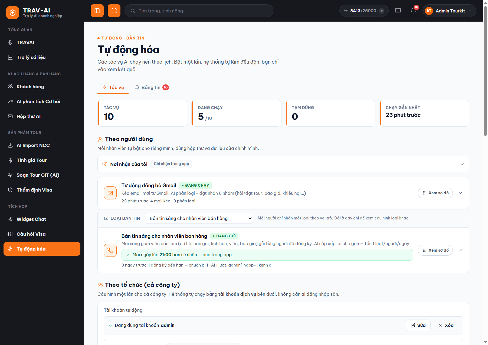

Mỗi thẻ tác vụ đều có nút **"Xem sơ đồ"** ở bên phải — bấm vào để xem sơ đồ hình vẽ giải thích tác vụ đó lấy dữ liệu ở đâu, quyết định thế nào và gửi đi đâu. Rất tiện khi bạn muốn hiểu tác vụ trước lúc bật.

> **Bạn thấy nhóm nào là tuỳ theo quyền của tài khoản.** Trang "Tự động hóa" luôn mở được cho mọi người, nhưng:
> - Ai cũng thấy và tự khai được nhóm **"Theo người dùng"** (nơi nhận, đồng bộ Gmail, đăng ký nhận bản tin).
> - Nhóm **"Theo tổ chức (cả công ty)"**, khối **"Tài khoản tự động"** và **"Zalo OA của công ty"** chỉ hiện với tài khoản có quyền **cấu hình hệ thống**. Không thấy các phần này nghĩa là tài khoản của bạn chưa được cấp quyền đó — hãy nhờ người quản trị của công ty (xem mục Lưu ý và FAQ bên dưới).

> **Không thấy đủ 10 tác vụ?** Bạn không làm sai gì cả. Nhóm bản tin và 4 tác vụ cảnh báo (bản tin sáng, bản tin điều hành, canh thanh toán, kiểm tra sẵn sàng khởi hành, canh doanh thu bất thường, nhắc chăm lại khách ngủ quên) là tính năng **được mở theo từng công ty**. Công ty bạn chưa được mở thì chúng — cùng với tab "Bảng tin" và khối "Nơi nhận của tôi" — sẽ **không hiện ra**. Muốn dùng thì hỏi người quản trị hệ thống để bật giúp.

### Bước 2 — Khai "Nơi nhận của tôi" (làm 1 lần, dùng cho mọi thông báo)

Khối **"Nơi nhận của tôi"** nằm ngay đầu mục "Theo người dùng". Đây là chỗ bạn nói cho hệ thống biết **muốn nhận thông báo ở đâu** — khai một lần, dùng chung cho **tất cả**: bản tin sáng, cảnh báo thanh toán, nhắc chăm khách…

1. Bấm vào dòng **"Nơi nhận của tôi"** để mở khối ra.
2. **Trong app** — luôn bật, không tắt được (ô này bị khoá cố ý). Mọi thông báo đều được lưu vào tab **Bảng tin** để bạn xem/nghe lại, kể cả khi các kênh khác hỏng.
3. **Email** — gạt công tắc rồi nhập địa chỉ email của bạn.
4. **Telegram** — gạt công tắc, rồi bấm **"Tự phát hiện"**: hệ thống đưa bạn một mã dạng `TK-xxxxxx`, bạn nhắn đúng dòng mã đó cho bot, quay lại bấm **"Tự phát hiện"** lần nữa là ô tự điền. Lưu ý: ô này cần **một dãy số** (không phải `@tên`, không phải số điện thoại), và bạn **phải bấm "Bắt đầu" với bot trước** — nếu không Telegram sẽ từ chối gửi mà không báo lỗi gì.
5. **Zalo** — gạt công tắc rồi nhập **số điện thoại đang dùng Zalo** của bạn.
6. Bấm **"Lưu nơi nhận"**.

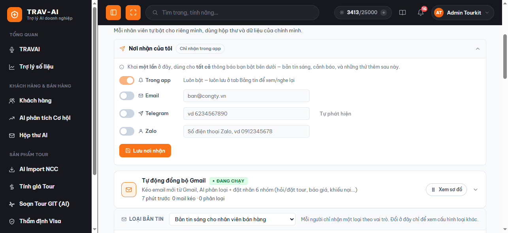

> Chưa khai gì thì dòng tiêu đề của khối sẽ ghi **"Chỉ nhận trong app"** — nghĩa là bạn vẫn nhận đủ mọi thông báo, chỉ là phải vào tab Bảng tin để đọc.

### Bước 3 — Cấu hình phần chung của cả công ty

Phần này chỉ dành cho người có quyền cấu hình hệ thống, và **chỉ cần làm một lần**.

#### 3.1 — Tài khoản tự động

Các tác vụ chạy chung cho cả công ty chạy ở phía sau, **không có ai đăng nhập sẵn**, nên cần một tài khoản để hệ thống tự đăng nhập thay bạn. Ngay đầu nhóm "Theo tổ chức" có khối **"Tài khoản tự động"**:

1. Nhập **Tên đăng nhập** và **Mật khẩu** của một tài khoản TourKit (nên dùng tài khoản xem được **toàn bộ dữ liệu công ty** — hệ thống chỉ tự động xử lý những gì tài khoản này nhìn thấy).
2. Bấm **"Lưu & kiểm tra"**. Hệ thống thử đăng nhập và đếm số deal nhìn thấy được trước khi lưu:
   - Đăng nhập đúng → lưu lại (mật khẩu được mã hóa, không ai xem lại được).
   - Sai tên đăng nhập/mật khẩu → báo lỗi ngay, không lưu.
   - Đăng nhập được nhưng thấy 0 deal → vẫn lưu, kèm cảnh báo để bạn kiểm tra lại quyền của tài khoản.
3. Muốn đổi tài khoản → bấm **"Sửa"**. Muốn ngừng hẳn các tác vụ chung → bấm **"Xóa"** (các tác vụ này sẽ tự dừng vì không còn đăng nhập được).

Chưa cấu hình tài khoản này thì các thẻ trong nhóm "Theo tổ chức" sẽ hiện dòng nhắc và **chưa bật lên được**.

#### 3.2 — Zalo OA của công ty (chỉ cần nếu muốn gửi qua Zalo)

Ngay dưới Tài khoản tự động là khối **"Zalo OA của công ty"**. Tin Zalo hiển thị **tên OA người gửi**, nên hệ thống bắt buộc dùng OA của chính công ty bạn — nó **không** tự gửi thay bằng OA của đơn vị khác.

Mở khối ra, có sẵn phần **"Lấy bốn thông tin này ở đâu?"** hướng dẫn từng bước. Bạn cần dán 4 giá trị: **OA ID**, **App ID**, **Secret Key**, **Refresh Token**. Bên dưới là ô nhập **mã mẫu ZNS theo từng chức năng** (Bản tin sáng / Bản tin điều hành / Nhắc thu tiền trước khởi hành) — Zalo duyệt mẫu theo nội dung nên mỗi chức năng cần một mẫu riêng; chức năng nào bỏ trống thì Zalo của chức năng đó không gửi được. Xong bấm **"Lưu cấu hình Zalo"**.

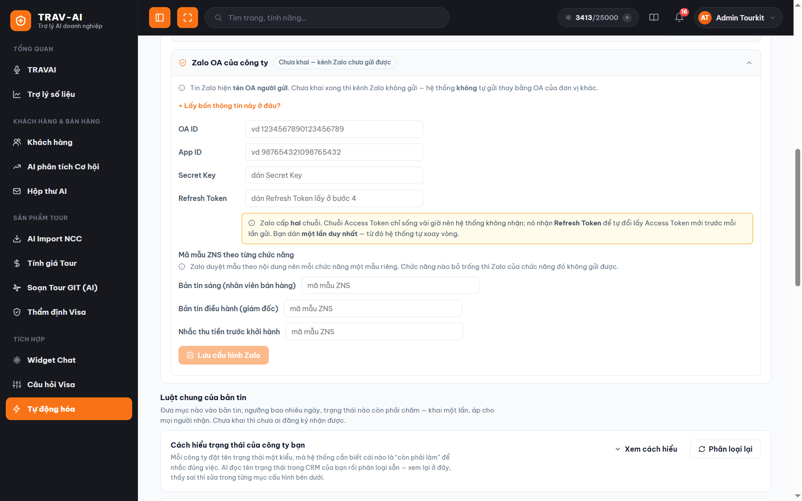

#### 3.3 — "Luật chung của bản tin" và "Cách hiểu trạng thái của công ty bạn"

Dưới thẻ tài khoản là mục **"Luật chung của bản tin"**: đưa mục nào vào bản tin, ngưỡng bao nhiêu ngày, trạng thái nào còn phải chăm — **khai một lần, áp cho mọi người nhận**. Chưa khai xong thì **chưa ai đăng ký nhận bản tin được** (thẻ bản tin sẽ ghi rõ "Công ty chưa cấu hình bản tin này").

Đầu mục có thẻ **"Cách hiểu trạng thái của công ty bạn"**. Mỗi công ty đặt tên trạng thái một kiểu (cơ hội bán hàng, công việc), mà hệ thống cần biết cái nào là **"còn phải làm"** để nhắc đúng việc. AI đọc tên trạng thái trong CRM của bạn rồi phân loại sẵn:

- Bấm **"Xem cách hiểu"** để mở bảng đối chiếu: từng trạng thái được đánh dấu là *còn phải làm* hay *đã xong*.
- Thấy sai → sửa lại bằng cách tick/bỏ tick trong ô cấu hình của từng tác vụ bên dưới, rồi bấm Lưu.
- Bấm **"Phân loại lại"** để nhờ AI đọc lại từ đầu.

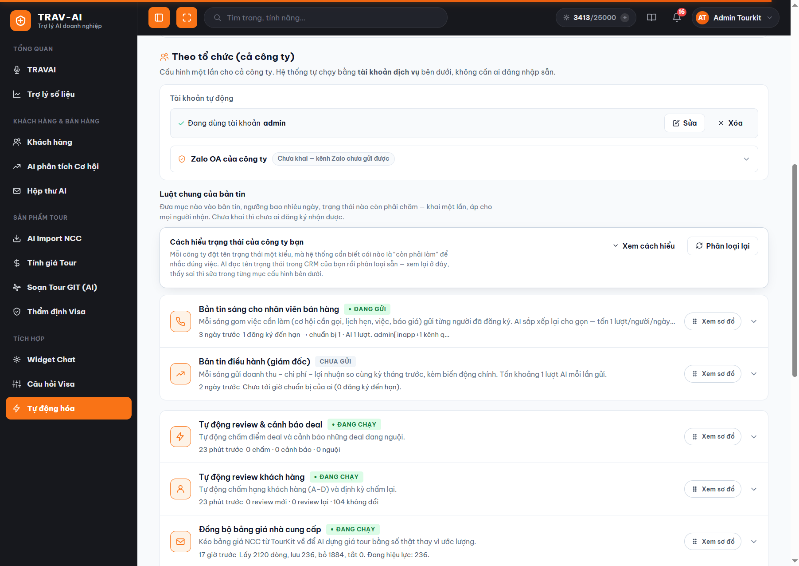

### Bước 4 — Bật một tác vụ và chọn tần suất chạy

Bấm vào một thẻ tác vụ để mở rộng phần cấu hình. Trong mục **"Lịch chạy"**:

1. Gạt công tắc **"Bật tác vụ"** sang bật.
2. Chọn **"Tần suất kiểm tra"** — bao lâu hệ thống tự chạy lại một lần, từ mỗi 5 phút đến mỗi ngày. Với các tác vụ chấm điểm/review, mỗi lần chạy chỉ xử lý phần mới hoặc vừa thay đổi, nên chọn chạy thường xuyên cũng không tốn thêm gì.
3. Bấm **"Lưu cấu hình"** ở cuối thẻ để áp dụng.

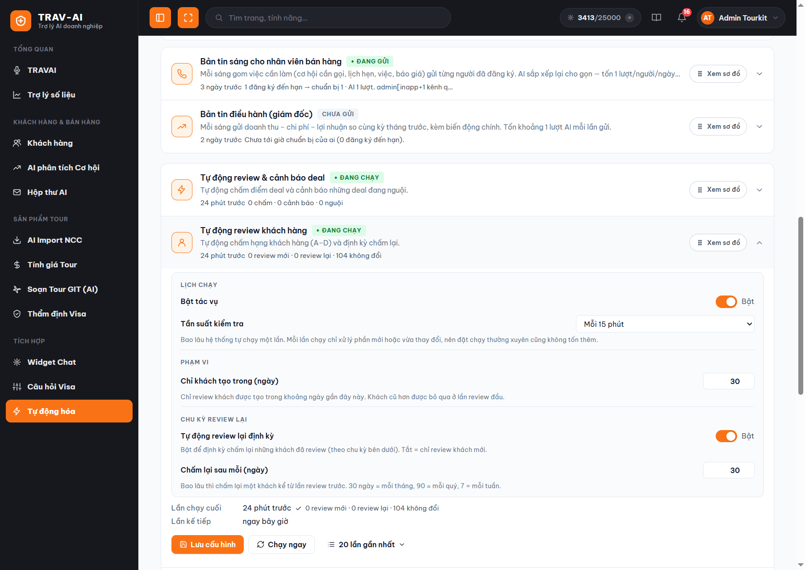

> **Riêng 2 thẻ bản tin**, ô này có tên khác: **"Kiểm tra ai đến giờ, mỗi"**. Đây **không phải** giờ gửi bản tin — giờ gửi do từng người tự chọn ở Bước 6. Nó là khoảng cách giữa 2 lần hệ thống ngó xem "ai sắp tới giờ". Đặt **10 phút trở xuống** thì bản tin luôn đến đúng giờ; đặt thưa hơn thì trễ nhiều nhất bằng phần dôi ra (ví dụ 15 phút → trễ tối đa 5 phút).

### Bước 5 — Chỉnh các tùy chọn riêng của từng tác vụ

Mỗi tác vụ có thêm tùy chọn riêng ngay dưới mục "Lịch chạy", chia thành các nhóm đánh số (①②③…), có gợi ý (chữ nhỏ màu xám) giải thích từng ô ngay tại chỗ. Chỉnh xong nhớ bấm **"Lưu cấu hình"**.

#### Nhóm "làm hộ bạn"

- **Tự động đồng bộ Gmail** *(Theo người dùng — cần đã cấu hình hộp thư ở trang "Hộp thư AI" trước)*: bật/tắt **tự động trả lời** email mới, chọn **chế độ** (soạn sẵn để bạn duyệt rồi gửi, hoặc gửi thẳng luôn), chọn **nhóm email** nào được áp dụng tự động trả lời (nên bỏ nhóm "Khiếu nại" để người thật xử lý), và **giọng văn** trả lời.
- **Tự động review & cảnh báo deal**: ① Phạm vi xử lý (trạng thái deal, chỉ deal tạo trong bao nhiêu ngày) · ② Chấm điểm cơ hội bằng AI (bật/tắt, có chấm lại khi deal thay đổi không, tối đa bao nhiêu deal mỗi lượt) · ③ Cảnh báo cơ hội nguội (sau bao nhiêu ngày không ai chăm thì coi là "nguội", chỉ cảnh báo deal có khả năng chốt từ bao nhiêu %, giới hạn số lần nhắc cho một deal).
- **Tự động review khách hàng**: chỉ xét khách **tạo trong bao nhiêu ngày** gần đây, bật/tắt **review lại định kỳ**, và chu kỳ chấm lại (30 ngày ≈ mỗi tháng).
- **Đồng bộ bảng giá nhà cung cấp**: kéo bảng giá nhà cung cấp (NCC) từ TourKit về để **AI dựng giá tour bằng số thật thay vì ước lượng** (dùng ở trang **Tính giá Tour** — xem [Hướng dẫn Báo giá tour](bao-gia-tour.md)). Tác vụ này **mặc định chạy 1 lần/ngày**, và có thêm nút **"Đồng bộ lại toàn bộ"** — xem mục ngay bên dưới.

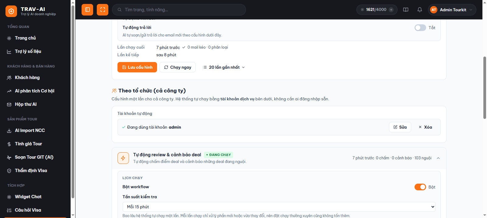

#### Nhóm bản tin sáng (khai luật chung cho cả công ty)

- **Bản tin sáng cho nhân viên bán hàng**: chọn mục nào được đưa vào bản tin — ① Cơ hội cần gọi lại (kèm ngưỡng "im lặng quá bao nhiêu ngày" và **trạng thái cơ hội nào mới nhắc**) · ② Cơ hội cần dọn hồ sơ · ③ Báo giá bỏ dở · ④ Việc cần làm (kèm **trạng thái nào coi là chưa xong**) · ⑤ Các mục chỉ bật/tắt (lịch hẹn hôm nay, tour sắp đi còn thiếu tiền, khách quen lâu không chăm, hộp thư công ty) · ⑥ Cách trình bày (**AI sắp xếp lại bản tin** — tốn 1 lượt AI mỗi người mỗi ngày, tắt được; và tối đa bao nhiêu việc trong một bản tin).
- **Bản tin điều hành (giám đốc)**: ① Kỳ so sánh (cùng kỳ tháng trước / cùng kỳ năm trước / không so sánh) · ② Đưa thêm vào bản tin (top nhân viên bán hàng, cơ hội mới hôm qua, lịch hẹn hôm nay, cảnh báo thanh toán đang mở, công việc chưa hoàn thành) · ③ Dự phóng cuối tháng (nhập **chỉ tiêu doanh thu tháng**, để 0 = không hiện phần này) và cách trình bày (**AI viết lời**, có đính bảng số dưới bài không).

> Với cả 2 loại bản tin: **số liệu luôn do máy chủ tính**, AI chỉ sắp xếp/viết lời. Bật hay tắt AI cũng không làm đổi con số. AI lỗi thì hệ thống tự in bảng số ra, không mất bản tin.

#### Nhóm canh chừng (4 tác vụ cảnh báo)

- **Canh thanh toán trước khởi hành**: ① Loại tour cần quét (mặc định FIT + GIT) · ② Khi nào thì nhắc (canh trong bao nhiêu ngày trước khi đi, nợ từ bao nhiêu đồng mới nhắc, lấy "còn nợ" theo bộ lọc phần mềm hay tự tính, mỗi tour nhắc tối đa mấy lần) · ③ Báo cho ai (bật thêm gửi email; có thể thêm địa chỉ ngoài như hộp thư kế toán).
- **Kiểm tra sẵn sàng khởi hành**: ① Loại tour cần quét · ② Nhắc ở các mốc ngày trước khi đi (mặc định 7, 3, 1) · ③ Kiểm những gì (tiền đã thu, số khách tối thiểu, nhắc hồ sơ visa) · ④ Canh chỗ ngồi (nhắc tour sắp đầy chỗ từ bao nhiêu %, mốc nhắc riêng — mặc định 21, 14, 7 ngày).
- **Canh doanh thu bất thường**: ① Lấy mấy tuần trước làm mức thường (mặc định 4) · ② Lệch từ bao nhiêu % thì báo (mặc định 30%), có báo cả khi tăng vọt không · và **nơi nhận khai tay** (email / Telegram / Zalo + mã mẫu ZNS riêng).
- **Nhắc chăm lại khách ngủ quên**: tìm khách đã từng mua mà lâu không ai chăm, gom thành một danh sách gọn để nhân viên gọi. Tác vụ này **không gửi gì cho khách**. Có bài hướng dẫn riêng đầy đủ: **[Nhắc chăm lại khách ngủ quên](nhac-cham-khach.md)**.

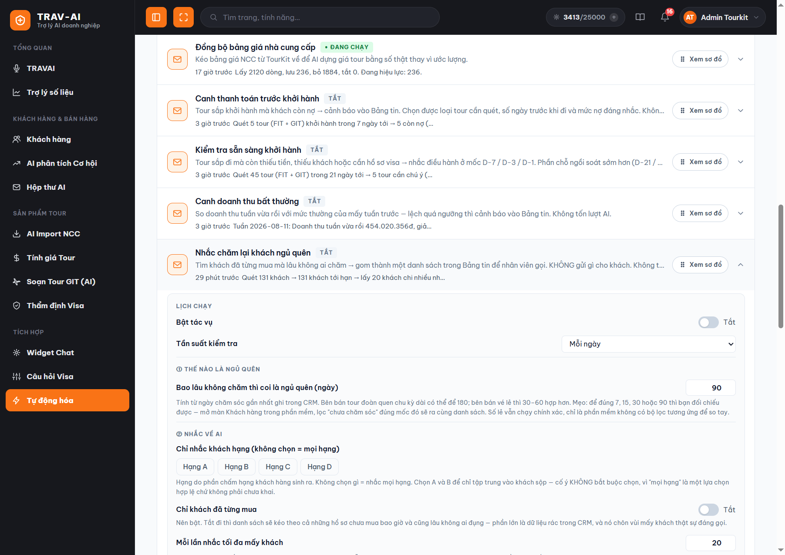

> ⚠️ **Cảnh báo được gửi cho ĐÚNG người phụ trách, không phải cho cả công ty.** Với *canh thanh toán*, *kiểm tra sẵn sàng khởi hành* và *nhắc chăm lại khách ngủ quên*, hệ thống nhìn xem tour/khách đó đang giao cho ai rồi gửi riêng cho người đó — mỗi người chỉ thấy phần việc của mình. Và nếu bản ghi **chưa gán ai phụ trách thì hệ thống BỎ QUA**, không đổ vào bảng tin chung (ai cũng thấy = không ai chịu trách nhiệm). Số bị bỏ qua vẫn được đếm và ghi rõ trong tóm tắt lần chạy, ví dụ *"BỎ QUA 4 tour chưa gán người phụ trách"* — thấy con số đó thì việc cần làm là vào CRM **gán người phụ trách**, không phải chỉnh tác vụ.
>
> Riêng **canh doanh thu bất thường** thì khác: doanh thu cả công ty không có "người phụ trách", nên thẻ này **cả công ty đều thấy** và muốn gửi thêm ra ngoài thì phải tự điền email/Telegram/Zalo vào ô nơi nhận của chính tác vụ đó. Để trống = chỉ vào Bảng tin, an toàn — vì đây là số liệu tài chính toàn công ty.

#### Nút "Đồng bộ lại toàn bộ" (chỉ có ở tác vụ đồng bộ bảng giá)

Bình thường mỗi lần chạy, tác vụ chỉ cập nhật thêm/sửa phần bảng giá thay đổi. Nếu bạn **nghi ngờ bảng giá đã lưu bị lệch hoặc cũ**, bấm nút **"Đồng bộ lại toàn bộ"** trong thẻ tác vụ để làm sạch và kéo lại từ đầu:

1. Bấm **"Đồng bộ lại toàn bộ"**. Vì thao tác này sẽ **xóa sạch toàn bộ bảng giá NCC đã lưu của công ty** rồi mới kéo lại, hệ thống sẽ hỏi xác nhận trước — hãy đọc kỹ và cân nhắc.
2. Bấm xác nhận (**"Xóa & kéo lại"**). Hệ thống xóa dữ liệu cũ xong sẽ tự kéo lại toàn bộ ở phía sau, có thể mất vài phút.
3. Xem kết quả ở mục **"20 lần gần nhất"** khi chạy xong.

> ⚠️ Cân nhắc kỹ trước khi dùng: nút này **xóa dữ liệu bảng giá đã lưu trong hệ thống**. Tuy nhiên nó **không đụng tới dữ liệu gốc bên TourKit** — sau khi xóa, hệ thống kéo lại chính bảng giá đó từ TourKit, nên bạn không mất giá thật, chỉ là làm mới lại từ đầu.

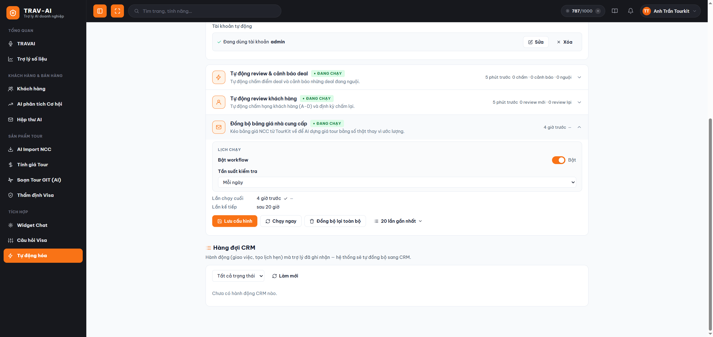

### Bước 6 — Đăng ký nhận bản tin sáng cho riêng bạn

Bản tin cần **đồng thời hai thứ**: công ty đã bật lịch gửi, VÀ bạn đã đăng ký nhận. Bước 4–5 lo phần công ty; bước này là phần của bạn — **không cần quyền gì**, ai cũng làm được.

1. Ở mục **"Theo người dùng"**, tìm thẻ bản tin (có ô chọn **"Loại bản tin"** ở phía trên).
2. Chọn loại bản tin phù hợp vai trò của bạn: *Bản tin sáng cho nhân viên bán hàng* hoặc *Bản tin điều hành (giám đốc)*.
3. Mở thẻ ra, tới khối **"Bản tin của tôi"**, gạt công tắc **"Nhận bản tin này"**.
4. Chọn **"Giờ nhận"** (theo giờ Việt Nam, chọn được cả 24 giờ trong ngày).
5. Bấm **"Lưu bản tin của tôi"**.
6. Muốn thử ngay thì bấm **"Gửi thử"** — hệ thống gửi qua đúng đường gửi thật, kết quả tới trong khoảng 1 phút.

Ngay trên đầu thẻ có một dòng nói thẳng kết quả, ví dụ *"Mỗi ngày lúc 21:00 bạn sẽ nhận — qua trong app, email"*. Nếu thiếu vế nào, dòng đó nói rõ thiếu gì và đặt sẵn nút sửa ngay cạnh.

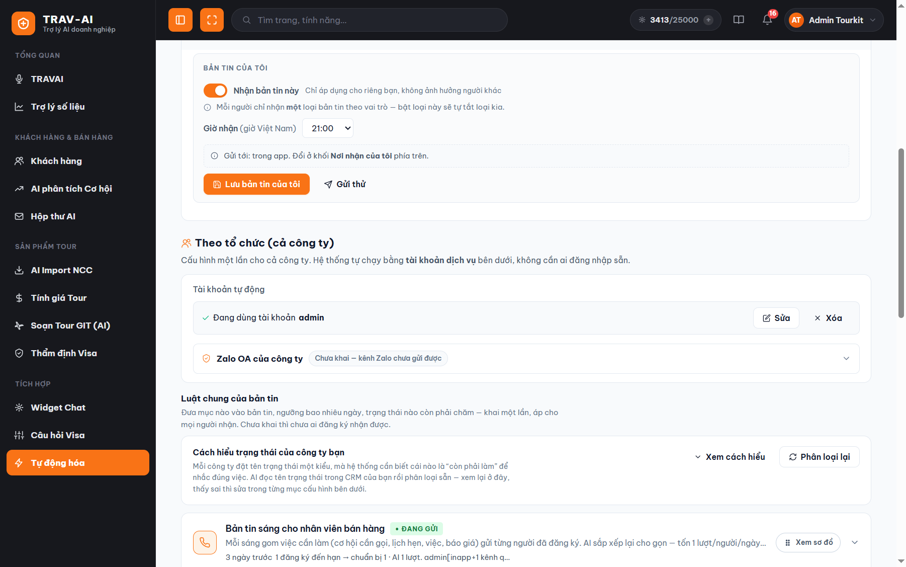

> **Mỗi người chỉ nhận MỘT loại bản tin theo vai trò** — bật loại này sẽ tự tắt loại kia. Đổi ô "Loại bản tin" chỉ để *xem* cấu hình loại khác, không làm đổi đăng ký của bạn.

### Bước 7 — Chạy thử ngay (không cần chờ tới lịch)

Muốn xem kết quả ngay mà không chờ tới chu kỳ, bấm nút **"Chạy ngay"** trong thẻ tác vụ. Tác vụ sẽ chạy ở phía sau — bạn có thể rời trang, kết quả sẽ tự hiện trong mục lịch sử khi xong (tác vụ chấm điểm/review có thể mất vài phút vì phải xử lý nhiều deal/khách hàng).

### Bước 8 — Xem lịch sử chạy

Bấm nút **"20 lần gần nhất"** trong thẻ tác vụ để mở bảng lịch sử: **Thời gian**, **Trigger** (chạy theo lịch hay do bạn bấm tay), **Trạng thái** (Thành công / Lỗi), **Tóm tắt** và **Thời lượng**. Bấm lại nút đó (nay ghi "Ẩn lịch sử") để đóng.

Cột **Tóm tắt** là chỗ đáng đọc nhất — nó kể lại nguyên văn lần chạy đó đã làm gì, ví dụ: *"Quét 131 khách → 131 khách tới hạn → lấy 20 khách chi nhiều nhất (còn 111 để lượt sau) → 7 thẻ cho 7 nhân viên"*. Nếu một lần chạy bị **Lỗi**, bấm vào dòng đó để xem chi tiết lỗi.

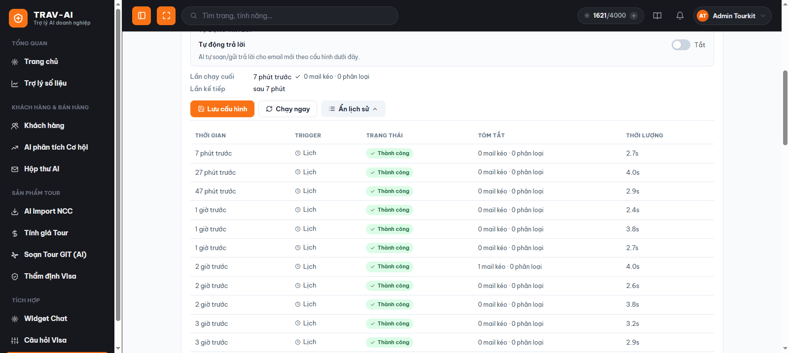

### Bước 9 — Đọc kết quả ở tab "Bảng tin"

Mọi bản tin và cảnh báo do các tác vụ sinh ra đều được lưu ở tab **"Bảng tin"** — đây là bản lưu trong app, **luôn còn ở đó dù email hay Telegram có hỏng**. Trên thanh tab có con số đỏ cho biết bạn còn bao nhiêu tin chưa đọc (chuông ở thanh trên cũng dẫn về đây).

Trong tab này bạn có thể:

- Lọc theo loại bằng dãy nút: **Tất cả** và 6 loại — *Bản tin sáng*, *Bản tin điều hành*, *Cảnh báo thanh toán*, *Sẵn sàng khởi hành*, *Doanh thu bất thường*, *Nhắc chăm khách*.
- Tick **"Chỉ chưa đọc"** để lọc ra những tin bạn chưa xem.
- Bấm **"Tải lại"** để lấy tin mới, hoặc **"Đọc tất cả"** để xoá hết dấu chưa đọc.
- Bấm vào một thẻ tin là nó tự được đánh dấu đã đọc.

Mỗi thẻ có nhãn loại, mức độ (**Gấp** đỏ / **Cần để ý** cam / thông tin) và thời điểm. Thẻ bản tin còn có nút **Nghe** để hệ thống đọc bản tin cho bạn. Thẻ nào là việc chung của cả công ty sẽ ghi rõ **"Cả công ty đều thấy tin này"** — để tránh cảnh 5 người cùng gọi một khách.

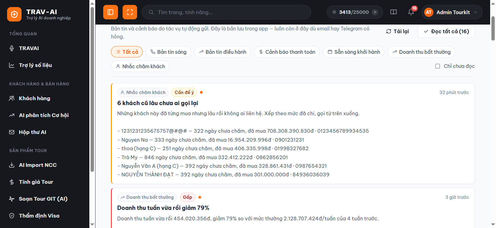

### Bước 10 — Bật lại khi tác vụ bị tạm dừng

Nếu một tác vụ chạy lỗi 5 lần liên tiếp, hệ thống sẽ **tự tạm dừng** tác vụ đó để tránh chạy hỏng mãi. Thẻ sẽ chuyển sang **viền đỏ**, gắn nhãn **"TẠM DỪNG"**, và hiện một dải cảnh báo đỏ ghi rõ lý do — ví dụ *"Đã tạm dừng: Lỗi 5 lần liên tiếp: không đăng nhập được bằng tài khoản tự động"*.

Sau khi kiểm tra và khắc phục nguyên nhân (tài khoản tự động bị sai/đổi mật khẩu, hộp thư Gmail mất kết nối…), bấm nút **"Bật lại"** ngay trên dải cảnh báo đó để tác vụ tiếp tục chạy theo lịch.

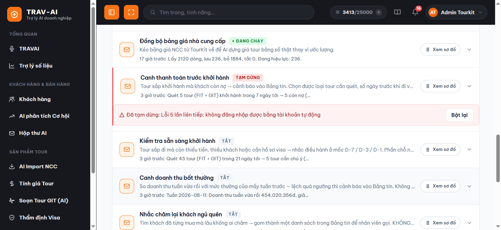

### Bước 11 — Theo dõi "Hàng đợi CRM"

Cuối trang có mục **"Hàng đợi CRM"**. Khi bạn nhờ trợ lý AI **giao việc** hoặc **tạo lịch hẹn**, hành động đó được ghi nhận vào đây trước, rồi hệ thống tự đồng bộ sang CRM.

Bảng gồm: **Loại** (Giao việc / Lịch hẹn), **Nội dung**, **Trạng thái** (Chờ ⏳ / Đang xử lý / Xong ✅ / Lỗi ❌), **Thời gian** và **Lỗi**. Có ô lọc theo trạng thái và nút **"Làm mới"**. Đây là mục **chỉ để xem** — bạn không thao tác gì ở đây; nếu một dòng báo Lỗi, hãy xem nội dung lỗi rồi tạo lại việc đó trong CRM.

## 4. Lưu ý quan trọng / giới hạn

- **Một số tác vụ chỉ hiện khi công ty bạn được mở tính năng.** Nhóm bản tin (bản tin sáng, bản tin điều hành), 3 tác vụ canh chừng (canh thanh toán, kiểm tra sẵn sàng khởi hành, canh doanh thu bất thường), tác vụ nhắc chăm khách, tab **Bảng tin**, khối **Nơi nhận của tôi** và khối **Zalo OA** đều nằm sau công tắc mở tính năng. Không thấy chúng thì hỏi người quản trị hệ thống — không phải bạn làm sai.
- **Cần quyền "cấu hình hệ thống" để thấy phần cấu hình chung của công ty.** Chỉ tài khoản có quyền này mới nhìn thấy nhóm **"Theo tổ chức (cả công ty)"**, khối **"Tài khoản tự động"** và **"Zalo OA của công ty"**. Tài khoản thường vẫn vào được trang, vẫn khai được **"Nơi nhận của tôi"**, vẫn tự bật đồng bộ Gmail và **vẫn đăng ký nhận bản tin** cho riêng mình. Quyền được đọc một lần lúc đăng nhập — nếu vừa được cấp quyền mà chưa thấy thay đổi, hãy **đăng xuất rồi đăng nhập lại**.
- **Tác vụ "Theo tổ chức" bắt buộc phải cấu hình Tài khoản tự động trước** — chưa cấu hình thì các nút Bật/Lưu/Chạy ngay đều bị khóa.
- **Bản tin cần đủ HAI vế mới tới được**: công ty đã bật lịch gửi (Bước 4) **và** bạn đã bật "Nhận bản tin này" (Bước 6). Thiếu một vế thì không có gì tới, và dòng phán quyết ở đầu thẻ sẽ nói rõ thiếu vế nào.
- **Chưa khai "Luật chung của bản tin" thì không ai đăng ký nhận được.** Thẻ bản tin sẽ ghi "Công ty chưa cấu hình bản tin này" và công tắc "Nhận bản tin này" bị khoá.
- **Cảnh báo đi theo người phụ trách, và bỏ qua bản ghi chưa gán ai.** Xem ô cảnh báo ở Bước 5. Số bị bỏ qua luôn được ghi trong tóm tắt lần chạy — hãy đọc dòng đó thay vì đoán.
- **Kênh "Trong app" luôn bật, không tắt được.** Đây là kho lưu để bạn xem/nghe lại, nên kể cả khi email/Telegram/Zalo hỏng hết thì thông báo vẫn còn ở tab Bảng tin.
- **Tin Zalo là lời nhắc ngắn, không phải bản tin đầy đủ.** Zalo chỉ cho gửi theo mẫu đã duyệt, nên nội dung đầy đủ luôn phải đọc ở tab Bảng tin.
- **Telegram: phải bấm "Bắt đầu" với bot trước.** Không làm bước này thì Telegram từ chối gửi và tin biến mất im lặng, không có lỗi nào hiện lên.
- **Tác vụ "Đồng bộ Gmail" cần đã cấu hình hộp thư ở trang "Hộp thư AI" trước** (địa chỉ Gmail + mật khẩu ứng dụng) — chưa cấu hình thì tác vụ này sẽ chạy lỗi.
- **Tài khoản tự động nên có quyền xem toàn bộ dữ liệu công ty.** Nếu tài khoản chỉ thấy dữ liệu của riêng nó, tác vụ tự động cũng chỉ xử lý được bấy nhiêu. Khi lưu, nếu tài khoản thiếu quyền ghi dữ liệu vào CRM, hệ thống sẽ hiện **cảnh báo** — kết quả tự động (hạng khách hàng, điểm deal) có thể không đồng bộ ngược về CRM cho tới khi tài khoản đủ quyền.
- **Bản tin sáng lấy dữ liệu bằng chính tài khoản của người nhận**, không dùng tài khoản tự động — nên bạn chỉ thấy phần việc mình có quyền xem, không bao giờ lộ dữ liệu của đồng nghiệp. Đổi lại, người **chưa từng đăng nhập** vào hệ thống sẽ không nhận được bản tin.
- **Chạy lỗi 5 lần liên tiếp sẽ tự tạm dừng** — bạn cần chủ động bấm "Bật lại" sau khi khắc phục, hệ thống không tự bật lại.
- **Cảnh báo deal nguội tính theo từng deal, không theo người phụ trách** — đổi người phụ trách thì số lần đã nhắc vẫn giữ nguyên (tránh nhắc lại từ đầu gây phiền). Deal chưa giao cho ai thì không được nhắc.
- **Deal đã chốt hoặc đã hủy** sẽ tự động được bỏ qua, không bị chấm lại hay nhắc nữa.
- **"Chấm lại khi có thay đổi" có giới hạn số lần** cho mỗi deal/khách hàng — tránh AI cứ chấm đi chấm lại mãi một hồ sơ không có gì mới.
- Với tác vụ chấm điểm/review, mỗi lượt chạy chỉ xử lý một số lượng giới hạn hồ sơ — phần còn lại được xử lý tiếp ở (các) lượt sau, không bị bỏ sót.
- **AI chỉ viết lời và sắp xếp, KHÔNG tự tính số.** Mọi con số trong bản tin đều do máy chủ tính từ dữ liệu CRM. Tắt AI đi thì bản tin dài hơn nhưng con số y hệt.
- **Bốn tác vụ canh chừng không tốn lượt AI nào** (canh thanh toán, kiểm tra sẵn sàng khởi hành, canh doanh thu bất thường, nhắc chăm lại khách) — chúng chạy bằng luật, không gọi AI.
- Bấm **"Chạy ngay"** không cần ngồi chờ trên trang — rời trang hay đóng tab không hủy lượt chạy đó.
- **Tác vụ "Đồng bộ bảng giá nhà cung cấp" mặc định chạy 1 lần/ngày** (không phải 15 phút như phần lớn tác vụ khác). Nút **"Đồng bộ lại toàn bộ"** sẽ **xóa sạch bảng giá đã lưu rồi kéo lại từ đầu** — chỉ dùng khi nghi ngờ dữ liệu bị lệch, và luôn có bước hỏi xác nhận.

## 5. Câu hỏi thường gặp (FAQ)

**Q: Tôi chỉ thấy 4 tác vụ, đồng nghiệp công ty khác thấy 10. Tôi làm sai gì à?**
A: Không. Nhóm bản tin và các tác vụ cảnh báo là tính năng được mở theo từng công ty. Công ty bạn chưa được mở thì chúng — cùng với tab "Bảng tin" và khối "Nơi nhận của tôi" — sẽ không hiện ra. Hãy nhờ người quản trị hệ thống bật giúp.

**Q: Tôi đã bật "Nhận bản tin này" và chọn giờ rồi, sáng ra vẫn không có gì?**
A: Xem dòng chữ ngay đầu thẻ bản tin — nó nói thẳng lý do. Thường gặp nhất: **công ty chưa bật lịch gửi** (dòng sẽ ghi "Bạn đã đăng ký, nhưng công ty chưa bật lịch gửi"), hoặc **công ty chưa khai Luật chung của bản tin**. Cả hai đều thuộc phần "Theo tổ chức" — nhờ người quản trị bật giúp. Nếu dòng đó đã báo xanh mà vẫn không thấy, kiểm tra tab **Bảng tin**: bản tin luôn được lưu ở đó kể cả khi email/Telegram hỏng.

**Q: Bấm "Gửi thử" mà báo "không có gì để thử" là sao?**
A: "Gửi thử" là để thử các **kênh ngoài** (email / Telegram / Zalo). Bạn chưa bật kênh ngoài nào ở khối "Nơi nhận của tôi" thì không có gì để gửi — kênh trong app luôn bật nên không cần thử. Hãy khai ít nhất một kênh ngoài rồi thử lại.

**Q: Bấm "Gửi thử" xong, sáng mai bản tin thật có bị mất không?**
A: Không. Bản gửi thử cố ý **không** được ghi vào Bảng tin, chính là để không làm hệ thống tưởng "hôm nay đã gửi rồi". Bản tin thật vẫn tới bình thường. Đổi lại, tin gửi thử tới hơi chậm (khoảng 1 phút) vì nó đi qua đúng đường gửi thật.

**Q: Cảnh báo "tour còn nợ tiền" gửi cho ai — cả công ty hay chỉ tôi?**
A: Chỉ cho **nhân viên phụ trách tour đó**. Mỗi người chỉ thấy phần việc của mình. Tour **chưa gán ai phụ trách thì bị bỏ qua hoàn toàn** — nó vẫn được đếm và ghi trong tóm tắt lần chạy dạng "BỎ QUA N tour chưa gán người phụ trách". Thấy con số đó thì việc cần làm là vào CRM gán người phụ trách cho những tour đó.

**Q: Vậy còn cảnh báo doanh thu bất thường?**
A: Cái này khác — doanh thu cả công ty không có "người phụ trách" nên thẻ cảnh báo hiện cho **cả công ty** ở tab Bảng tin. Muốn gửi thêm ra email/Telegram/Zalo thì phải tự điền nơi nhận vào ô của chính tác vụ đó (nó **không** dùng khối "Nơi nhận của tôi"). Để trống là an toàn — đây là số liệu tài chính toàn công ty, chỉ điền người thật sự cần xem.

**Q: Tôi phải khai email/Telegram/Zalo riêng cho từng loại thông báo à?**
A: Không. Khai **một lần** ở khối **"Nơi nhận của tôi"** đầu mục "Theo người dùng" là dùng chung cho tất cả: bản tin sáng, cảnh báo thanh toán, nhắc chăm khách và cả những thứ thêm sau này.

**Q: "Cách hiểu trạng thái của công ty bạn" là gì, tôi có phải làm gì không?**
A: Mỗi công ty đặt tên trạng thái một kiểu, mà hệ thống cần biết trạng thái nào là "còn phải làm" để nhắc đúng việc. AI đọc tên trạng thái trong CRM của bạn rồi phân loại sẵn. Bạn nên bấm **"Xem cách hiểu"** một lần để kiểm — thấy sai (ví dụ "Đang kiểm tra" ở công ty bạn nghĩa là đã xong) thì sửa lại trong ô cấu hình của tác vụ tương ứng rồi bấm Lưu. Nếu thẻ báo *"đoán theo từ khoá"* thay vì *"AI phân loại theo tên"*, hãy bấm **"Phân loại lại"**; nếu vẫn vậy và báo hết lượt AI thì cần nạp thêm lượt.

**Q: Tôi không thấy mục "Tài khoản tự động", cũng không thấy các tác vụ chạy cho cả công ty?**
A: Vì tài khoản của bạn chưa có quyền **cấu hình hệ thống**. Bạn vẫn dùng bình thường phần của riêng mình (nơi nhận, đồng bộ Gmail, đăng ký nhận bản tin), nhưng phần cấu hình cấp công ty được ẩn đi để tránh nhầm lẫn. Hãy nhờ người quản trị của công ty cấu hình giúp, hoặc xin cấp quyền.

**Q: Tôi vừa được cấp quyền cấu hình hệ thống nhưng vẫn chưa thấy mục "Theo tổ chức"?**
A: Quyền chỉ được đọc lại lúc đăng nhập. Hãy **đăng xuất rồi đăng nhập lại** (hoặc tải lại trang) một lần.

**Q: Tôi bật một tác vụ "Theo tổ chức" nhưng không bấm được nút Lưu/Bật, vì sao?**
A: Kiểm tra khối "Tài khoản tự động" phía trên đã được cấu hình chưa. Các tác vụ chung của cả công ty cần tài khoản này để tự đăng nhập, chưa có thì mọi thao tác trong nhóm đó đều bị khóa.

**Q: "Tần suất kiểm tra" đặt càng dày (ví dụ mỗi 5 phút) có tốn thêm gì không?**
A: Không đáng kể. Các tác vụ review/chấm điểm chỉ xử lý phần dữ liệu mới hoặc vừa thay đổi ở mỗi lần chạy. Riêng 2 thẻ bản tin, ô này tên là "Kiểm tra ai đến giờ, mỗi" và **không phải giờ gửi** — đặt 10 phút trở xuống thì bản tin luôn đến đúng giờ từng người đã chọn.

**Q: Bật "AI sắp xếp lại bản tin" / "AI viết lời" có tốn lượt AI không? Tắt đi thì mất gì?**
A: Có tốn — khoảng 1 lượt cho mỗi người mỗi ngày (bản tin sáng) hoặc mỗi lần gửi (bản tin điều hành). Tắt đi thì bản tin dài hơn, in đủ mọi mục thay vì được AI chọn lọc, nhưng **con số không đổi một chữ** vì số luôn do máy chủ tính. AI lỗi thì hệ thống tự rơi về bản đầy đủ, không bao giờ mất bản tin.

**Q: Deal của tôi bị "nguội" nhưng tôi không thấy email nhắc, vì sao?**
A: Vài khả năng: deal chưa được giao cho ai (hệ thống bỏ qua deal chưa giao người), hoặc mới được nhắc gần đây nên chưa tới lượt tiếp theo, hoặc khả năng chốt thấp hơn ngưỡng đã cấu hình. Bạn chỉnh lại các tùy chọn trong nhóm ③ của thẻ "Tự động review & cảnh báo deal".

**Q: Tại sao thẻ tác vụ của tôi viền đỏ và ghi "TẠM DỪNG"?**
A: Tác vụ đó đã chạy lỗi 5 lần liên tiếp nên hệ thống tự dừng lại. Dải cảnh báo đỏ ghi luôn lý do; xem thêm mục "20 lần gần nhất" để biết chi tiết. Khắc phục xong thì bấm **"Bật lại"** trên dải cảnh báo.

**Q: Tôi bấm "Chạy ngay" rồi rời trang, kết quả có bị mất không?**
A: Không. Việc chạy diễn ra ở phía sau. Quay lại bất cứ lúc nào, mở thẻ tác vụ và xem "20 lần gần nhất" để thấy kết quả.

**Q: Nút "Xem sơ đồ" trên mỗi thẻ dùng làm gì?**
A: Mở một sơ đồ hình vẽ giải thích tác vụ đó lấy dữ liệu ở đâu, quyết định thế nào và gửi kết quả đi đâu. Nên xem một lần trước khi bật một tác vụ bạn chưa quen.

**Q: Mục "Hàng đợi CRM" cuối trang để làm gì?**
A: Khi bạn nhờ trợ lý AI giao việc hoặc tạo lịch hẹn, hành động đó được ghi nhận vào hàng đợi này rồi hệ thống tự đồng bộ sang CRM. Đây là mục chỉ để theo dõi (Chờ / Đang xử lý / Xong / Lỗi) — bạn không thao tác gì ở đây.

**Q: Tác vụ "Đồng bộ Gmail" là bật riêng cho từng người hay cho cả công ty?**
A: Bật riêng cho từng người — nằm trong nhóm "Theo người dùng". Mỗi nhân viên tự bật cho hộp thư của chính mình.

**Q: "Tự động trả lời" trong tác vụ đồng bộ Gmail có gửi thẳng cho khách không cần tôi duyệt không?**
A: Tùy bạn chọn ở "Chế độ": **"Soạn sẵn"** thì AI chỉ soạn nháp, chờ bạn xem và bấm gửi; **"Gửi thẳng tự động"** thì AI tự soạn và gửi luôn. Nên cân nhắc kỹ trước khi bật "Gửi thẳng tự động", đặc biệt với nhóm email nhạy cảm như khiếu nại.

**Q: Tác vụ "Đồng bộ bảng giá nhà cung cấp" dùng để làm gì?**
A: Nó tự kéo bảng giá nhà cung cấp (NCC) từ TourKit về, để khi bạn tạo báo giá ở trang **Tính giá Tour**, AI dựng giá bằng **số thật của công ty thay vì ước lượng**. Xem thêm [Hướng dẫn Báo giá tour](bao-gia-tour.md).

**Q: Vì sao tác vụ đồng bộ bảng giá mặc định chạy 1 lần/ngày mà không phải mỗi 15 phút?**
A: Bảng giá nhà cung cấp không thay đổi liên tục, nên mỗi ngày một lần là đủ. Nếu công ty bạn cập nhật giá thường xuyên hơn, cứ đổi tần suất như bình thường.

**Q: Bấm "Đồng bộ lại toàn bộ" có mất dữ liệu không?**
A: Nút này **xóa sạch bảng giá NCC đã lưu trong hệ thống rồi kéo lại mới hoàn toàn từ TourKit**. Nó **không ảnh hưởng dữ liệu gốc bên TourKit**, nên bạn không mất giá thật, chỉ là làm mới lại từ đầu. Chỉ nên dùng khi nghi ngờ dữ liệu đã lưu bị lệch; thao tác luôn có bước hỏi xác nhận.
