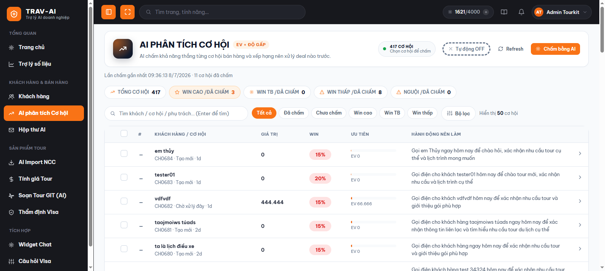
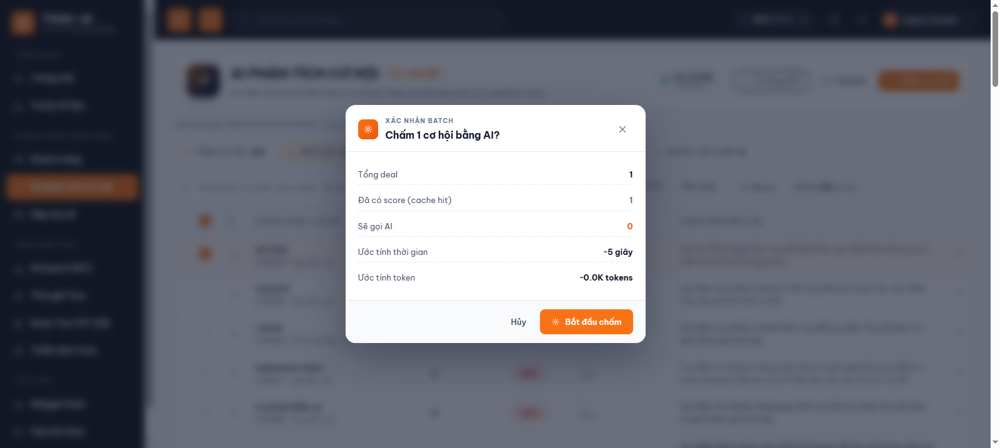
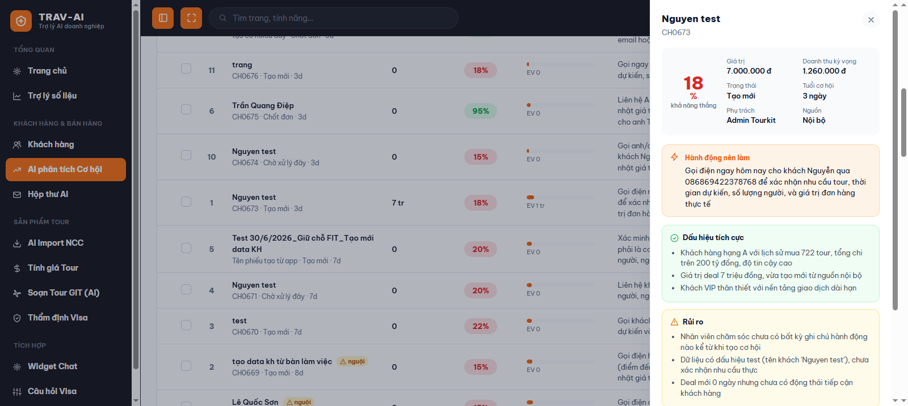
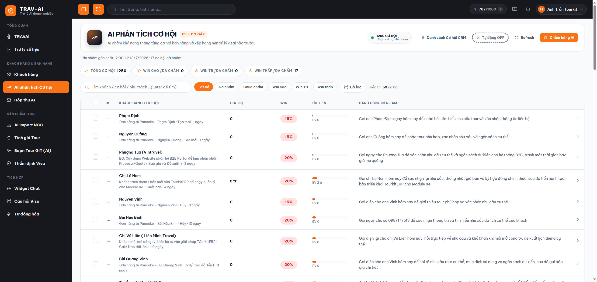
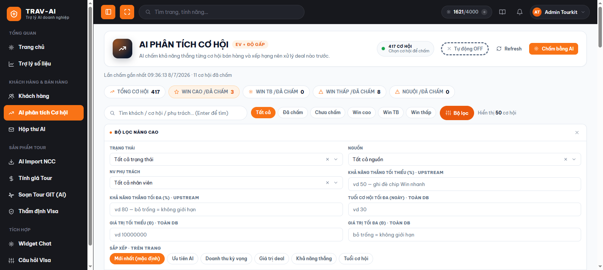

# Hướng dẫn sử dụng — Ưu tiên Deal (AI phân tích Cơ hội)

## 1. Tính năng này làm gì

"AI phân tích Cơ hội" giúp bạn biết **nên gọi khách nào trước** trong cả trăm cơ hội bán hàng (deal) đang mở. Bạn chọn một hoặc nhiều cơ hội, AI sẽ đọc toàn bộ lịch sử chăm sóc của Sale (ghi chú, phản hồi khách, tiến trình, giá trị deal...) rồi chấm ra **% khả năng chốt được deal**, xếp deal đó vào mức Cao / Trung bình / Thấp, và gợi ý luôn **1 việc cụ thể nên làm tiếp theo**.

Kết quả được xếp thành một bảng ưu tiên (kết hợp khả năng thắng, giá trị tiền và độ gấp của deal) — giúp bạn hoặc cả nhóm sale khỏi phải đoán, tập trung công sức vào deal có khả năng chốt cao nhất thay vì dàn trải đều cho tất cả.

## 2. Ai nên dùng

- **Nhân viên Sale** — muốn biết trong danh sách khách mình đang chăm, deal nào nên ưu tiên liên hệ hôm nay.
- **Trưởng nhóm / quản lý kinh doanh** — muốn rà soát cả pipeline, phát hiện deal tiềm năng đang bị bỏ quên, hoặc deal đã lâu chưa ai chăm sóc ("nguội").
- **Người điều phối/CSKH** — cần tra cứu nhanh 1 khách hàng cụ thể đang ở deal nào, trạng thái ra sao.

## 3. Hướng dẫn sử dụng từng bước

### Bước 1 — Mở trang "AI phân tích Cơ hội"

Ở menu bên trái, vào nhóm **"Khách hàng & Bán hàng"**, bấm mục **"AI phân tích Cơ hội"**. Trên điện thoại, bạn có thể bấm nhanh mục **"Deal"** ở thanh menu rút gọn phía trên. Bạn cần đã đăng nhập TourKit trước đó (dùng chung tài khoản đăng nhập với toàn bộ hệ thống, không cần đăng nhập riêng cho trang này).

> 📸 Cần chụp: menu bên trái với mục "AI phân tích Cơ hội" đang được bôi sáng (active).

### Bước 2 — Xem danh sách cơ hội

Trang hiện toàn bộ cơ hội bán hàng, mỗi dòng gồm: tên khách hàng, tên/mã deal, trạng thái, tuổi deal (bao nhiêu ngày), giá trị tiền, và kết quả AI đã chấm (nếu có) — % khả năng thắng, thanh mức độ ưu tiên, hành động nên làm. Phía trên có 5 ô số nhanh (KPI) cho biết tổng số cơ hội, số deal Win cao / Win trung bình / Win thấp, và số deal đang "nguội" (lâu ngày chưa ai chăm sóc).

Deal chưa được AI chấm sẽ hiện chữ "chưa chấm" thay vì %.

> 📸 Cần chụp: toàn màn hình bảng danh sách deal trên máy tính, có cột Win/Ưu tiên/Hành động nên làm, kèm dải KPI phía trên.

### Bước 3 — Chọn deal muốn AI chấm điểm

Tick vào ô vuông đầu mỗi dòng để chọn từng deal, hoặc tick vào ô vuông ở đầu bảng để chọn **tất cả deal đang hiển thị trên trang** (theo bộ lọc hiện tại). Số deal đã chọn hiện ngay trên đầu trang.

### Bước 4 — Bấm "Chấm [N] cơ hội"

Khi đã chọn ít nhất 1 deal, nút màu cam ở góc trên bên phải sẽ hiện chữ **"Chấm N cơ hội"** — bấm vào đó. Một hộp thoại xác nhận hiện ra, cho bạn xem trước số deal sẽ chấm, thời gian ước tính và số lượt AI sẽ dùng. Bấm **"Bắt đầu chấm"** để tiếp tục.

> 📸 Cần chụp: hộp thoại "Chấm N cơ hội bằng AI?" với các dòng Tổng deal / Sẽ gọi AI / Ước tính thời gian.

### Bước 5 — Theo dõi tiến trình chấm điểm

Một thanh tiến trình hiện ra với 3 giai đoạn: **Chờ → AI đang chấm → Xong**, kèm thanh phần trăm hoàn thành và danh sách các deal đang được AI xử lý. Bạn có thể bấm **"Dừng"** bất cứ lúc nào nếu muốn hủy giữa chừng.

> 📸 Cần chụp: thanh tiến trình Chờ/AI/Xong đang chạy dở, kèm khung "ĐANG GỌI AI" liệt kê vài deal.

### Bước 6 — Xem chi tiết 1 deal

Bấm vào bất kỳ dòng nào trong bảng để mở khung chi tiết bên phải, gồm: % khả năng thắng, giá trị deal, doanh thu kỳ vọng, trạng thái, tuổi deal, người phụ trách, nguồn khách; phía dưới là **hành động nên làm**, **dấu hiệu tích cực**, **rủi ro** và lý do AI đưa ra mức ưu tiên đó.

> 📸 Cần chụp: khung chi tiết deal mở bên phải màn hình, đủ các mục Khả năng thắng, Dấu hiệu tích cực, Rủi ro, Hành động nên làm.

### Bước 7 — Chấm lại khi cần

Nếu deal có diễn biến mới (Sale vừa gọi khách, khách vừa phản hồi...), mở chi tiết deal đó rồi bấm nút **"Chấm lại"** ở cuối khung chi tiết — AI sẽ đọc lại toàn bộ thông tin mới nhất và chấm điểm lại ngay.

### Bước 8 — Tìm và lọc nhanh

Dùng ô tìm kiếm phía trên để gõ tên khách / mã deal / tên nhân viên phụ trách rồi nhấn Enter. Bên dưới là các nút lọc nhanh: **Tất cả, Đã chấm, Chưa chấm, Win cao, Win TB, Win thấp** — bấm vào nút nào, danh sách sẽ tự lọc theo đúng nút đó.

> 📸 Cần chụp: thanh tìm kiếm + dãy nút lọc nhanh (Tất cả/Đã chấm/Chưa chấm/Win cao/TB/Thấp).

### Bước 9 — Lọc nâng cao

Bấm nút **"Bộ lọc"** để mở bảng lọc chi tiết hơn: **Trạng thái**, **Nguồn**, **Nhân viên phụ trách** (mỗi ô này đều có sẵn chỗ gõ chữ để tìm nhanh trong danh sách dài), khoảng % khả năng thắng tùy chỉnh, tuổi cơ hội tối đa, khoảng giá trị deal, và cách sắp xếp (Mới nhất, Ưu tiên AI, Doanh thu kỳ vọng, Giá trị deal, Khả năng thắng, Tuổi cơ hội). Chọn xong bấm **"Áp dụng"**.

> 📸 Cần chụp: bảng lọc nâng cao mở ra với các ô Trạng thái/Nguồn/NV phụ trách (đang gõ chữ tìm) + dãy nút Sắp xếp.

### Bước 10 — Bật "Tự động phân tích" (tuỳ chọn)

Nếu muốn hệ thống tự chấm giúp các deal chưa chấm mỗi khi bạn mở trang (không cần tự chọn + bấm tay), bấm nút **"Tự động OFF"** ở góc trên để chuyển thành **"Tự động ON"**. Từ lần sau, mỗi khi bạn vào trang mà đang có deal chưa chấm, hệ thống sẽ tự động chọn và chấm giúp bạn. Cài đặt này được nhớ riêng theo tài khoản của bạn.

## 4. Lưu ý quan trọng / giới hạn

- **AI chấm điểm dựa trên hành động thực tế của Sale**, không chỉ dựa vào giá trị deal hay thông tin khách. Một deal giá trị lớn nhưng chưa ai chăm sóc/ghi chú gì vẫn sẽ bị chấm điểm thấp — đây là chủ đích, để nhắc bạn "cần hành động" chứ không phải lỗi hệ thống.
- **Mỗi lần bấm "Chấm" hoặc "Chấm lại" đều là một lượt AI mới** — kể cả deal đã có điểm trước đó, khi bạn chọn lại và bấm chấm, hệ thống sẽ chấm lại từ đầu (không dùng lại kết quả cũ) để đảm bảo điểm luôn phản ánh đúng diễn biến mới nhất. Vì vậy đừng chấm lại quá thường xuyên nếu deal chưa có gì thay đổi.
- **Deal có trạng thái "Chốt đơn/Thành công" hoặc "Hủy/Từ chối" sẽ luôn được chấm điểm rất cao hoặc rất thấp** một cách gần như cố định — vì deal đã ngã ngũ, AI chỉ xác nhận lại kết quả, không cần đánh giá thêm.
- **Nhãn "nguội"** xuất hiện cạnh tên khách khi deal đó đã lâu chưa có ai tương tác/chăm sóc — nên ưu tiên liên hệ lại sớm.
- **Số thứ tự (#) ở đầu mỗi dòng chỉ có ở deal đã chấm điểm** — đây là thứ hạng ưu tiên tổng hợp (khả năng thắng + giá trị + độ gấp), không phải thứ tự tạo deal.
- Bộ lọc **Trạng thái / Nguồn / Khả năng thắng / Tuổi cơ hội / Giá trị** áp dụng trên toàn bộ dữ liệu (không chỉ trang đang xem); riêng mục **Sắp xếp** chỉ áp dụng cho các deal đang hiển thị trên trang hiện tại.
- Cần đã đăng nhập TourKit và có quyền xem cơ hội bán hàng thì mới thấy được dữ liệu; nếu phiên đăng nhập hết hạn, hệ thống sẽ yêu cầu bạn đăng nhập lại.

## 5. Câu hỏi thường gặp (FAQ)

**Q: Vì sao một deal khách hàng có vẻ tiềm năng lại bị chấm điểm "Win thấp"?**
A: AI ưu tiên nhìn vào hành động thực tế của Sale (đã chăm sóc bao nhiêu lần, gần nhất là khi nào, khách có phản hồi không). Nếu Sale chưa ghi chú gì hoặc đã lâu không liên hệ, điểm sẽ thấp dù khách/giá trị deal trông tốt — đây là lời nhắc bạn nên liên hệ lại, không phải đánh giá sai.

**Q: Bấm "Chấm lại" có tốn thêm lượt AI của công ty không?**
A: Có. Mỗi lần chấm (lần đầu hoặc chấm lại) đều tính là một lượt gọi AI mới, nên chỉ nên chấm lại khi deal thật sự có diễn biến mới.

**Q: Tôi tick chọn cả trăm deal cùng lúc được không?**
A: Ô "chọn tất cả" chỉ chọn các deal đang hiển thị trên trang hiện tại (tối đa theo số dòng/trang bạn đang xem, mặc định 50 dòng). Muốn chấm nhiều hơn, bạn cần sang trang tiếp theo và chọn lại.

**Q: Nút "Chấm bằng AI" bị mờ, không bấm được?**
A: Bạn cần tick chọn ít nhất 1 deal trước — nút chỉ sáng lên khi đã có deal được chọn.

**Q: Tìm nhân viên phụ trách trong bộ lọc nâng cao thế nào cho nhanh?**
A: Bấm vào ô "NV phụ trách", gõ vài chữ trong tên nhân viên — danh sách sẽ tự lọc theo đúng chữ bạn gõ, không cần cuộn tìm thủ công.

**Q: Vì sao có deal hiện dấu "nguội" nhưng lại không có trong nhãn Win nào?**
A: Nhãn "nguội" chỉ báo hiệu deal lâu ngày chưa được chăm sóc, độc lập với việc deal đã được AI chấm điểm hay chưa — deal chưa chấm điểm vẫn có thể hiện dấu "nguội" nếu đã lâu không có tương tác.

**Q: Bật "Tự động ON" rồi mà vào trang không thấy AI tự chấm gì cả?**
A: Có thể vì tất cả deal đang hiển thị trên trang đó đều đã được chấm điểm rồi — tính năng tự động chỉ chấm các deal đang ở trạng thái "chưa chấm".

**Q: Tôi có cần đăng nhập riêng cho trang này không?**
A: Không. Trang dùng chung phiên đăng nhập TourKit của toàn hệ thống — bạn đăng nhập một lần là dùng được mọi trang, kể cả trang này.

**Q: Kết quả chấm điểm có tự động gửi email nhắc nhân viên không?**
A: Việc nhắc/cảnh báo tự động cho deal "nguội" (nếu công ty bạn có bật) chạy ngầm ở một tính năng riêng ("Tự động hóa"), không phụ thuộc vào việc bạn có mở trang này hay không.
